# 2021 (Invictus)

## Potilastapaus

Vastaanotollesi terveyskeskuksen akuuttiajalle tulee potilas, joka on potenut akuuttia vatsakipua 2 päivää ja jonka anamneesi ja kliininen taudinkuva sopivat hyvin akuuttiin appendisiittiin. Laboratoriovastauksista huomaat kuitenkin, että sekä leukosyyttiarvo että CRP ovat molemmat viitealueella. Mielestäsi appendisiitti on

- a. silti hyvin todennäköinen 
- b. silti varsin todennäköinen 
- c. epätodennäköinen 
- d. mahdoton

  <button class="solution-button" data-label="Vastaus" data-hide-label="Piilota vastaus">
    Vastaus
  </button>
  

      c
      
Normaali leukosyyttiluku ja CRP-pitoisuus eivät täysin poissulje appendisiittia, mutta appendisiitti on aika epätodennäköinen sellaisessa tilanteessa. N. 1/100 aikuispotilaasta on leukosyytit ja CRP normaalit vaikka todettaisiin appendisiitti ja n. 6/100 lapsista leuk ja CRP normaalit, koska lasten immunologia hieman erilainen kuin aikuisilla. 
  

## Potilastapaus

60-vuotiaalla normaalikokoisella naisella on suunnitteilla happirikastinhoito vaikean COPD:n vuoksi, FEV1 1,0 litraa. Potilaalla todetaan oikeassa keuhkon ylälohkossa 1,5 cm maksimihalkaisijaltaan oleva tuumori, joka varmistuu sytologiassa keuhkon levyepiteelikarsinoomaksi (eli ei-pienisoluinen). Potilaan KEUHKOSYÖVÄN hoito on (valitse paras vaihtoehto)?

- a. Inhaloitava kortikosteroidi 
- b. Stereotaktinen sädehoito 
- c. Keuhkonsiirto 
- d. Oikean ylälohkon poisto ja onkologiset lääkehoidot

  <button class="solution-button" data-label="Vastaus" data-hide-label="Piilota vastaus">
    Vastaus
  </button>
  

      b

Ei-pienisoluisen keuhkosyövän ensisijainen hoito on leikkaus, joko keuhkolohkon tai keuhkon poisto. Radikaalileikkaus on mahdollinen n. 20–25 %:lle. Kirurgisen hoidon edellytyksiin kuuluu, että resektion jälkeen jäljelle jäävä FEV1 on oltava >1,0l. Potilas ei siis ole leikkauskuntoinen, koska leikkausriski on liian suuri FEV1:n ollessa ennen leikkausta 1,0 litraa. 

a: Inhaloitava kortikosteroidi ei ole syövän hoitokeino. 

b: Paikallisen keuhkosyövän leikkaushoitoon soveltumattomille voidaan käyttää korkea-annoksista kohdennettua, ns. stereotaktista, tuumorin sädehoitoa.

c ja d: Leikkaushoitoja, eivät sovellu tälle potilaalle, koska korkean leikkausriskin potilas. 

  

## Potilastapaus 

Miespotilaalla, jolla on akuutisti ilmentynyt tiheävirtsaisuus ja virtsankirvellys, sekä virtsassa seuraavat löydökset: U-Kemseul: eryt +++, U-sakka: eryt 4/nk, U-BaktVi E. coli yli 10E5. Hoidat hänet seuraavasti:

- a. Teen lähetteen erikoissairaanhoitoon päivystyksellisesti jatkoselvittelyihin. 
- b. Aloitat antibiootiksi Ditrim duplo 1×2 viikon ajaksi ja laitan potilaalle kestokatetrin. 
- c. Aloitat antibiootiksi Ditrim duplo 1×2 viikon ajaksi. 
- d. Aloitat antibiootiksi Ditrim duplo 1×2 viikon ajaksi ja kontrolloit U-Kemseul, U-sakka tutkimukset.

  <button class="solution-button" data-label="Vastaus" data-hide-label="Piilota vastaus">
    Vastaus
  </button>
  

      d

a: Pelkät virtsatieinfektiot eivät yleensä ole päivystyslähetteiden aihe. Potilaalla ei ole viitteitä tilan etenemisestä sepsikseen asti, joten potilasta voi hoitaa avoterveydenhuollossa. 

b: Ei ole tarvetta kestokatetrille, potilas pystyy käydä itse vessassa ja kyseessä ei ole virtsaumpi. 

c: Pelkkä antibioottikuuri ilman mitään muita toimenpiteitä voisi toimia, jos kyseessä olisi komplisoitumaton kystiitti. Komplisoitumaton kystiitti tarkoittaa satunnaista virtsatieinfektiota naisella, jolla ei ole riskitekijöitä. Täten äkillinen kystiitti voidaan 18-65-vuotiaalla naisella todeta puhelinhaastattelulla ja jos ei todeta vaikeahoitoisen VTI:n riskitekijöitä eikä hälyttäviä oireita / esitietoja -> hoito voidaan toteuttaa ilman laboratoriotutkimuksia. Hoitona yleensä lyhyt 3vrk kestävä antibioottihoito (esim. trimetopriimi, nitrofurantoiini tai pivmesillinaami). Komplisoitumatonta kystiittiä ei tarvitse seurata. 

d: Miehillä virtsatieinfektio on aina komplisoitunut, koska komplisoituneita virtsatieinfektioita ovat sellaiset, joissa potilailla on tekijöitä, jotka ennustavat tavanmukaisen lääkehoidon epäonnistumista. Komplisoituneen kystiitin hoitoon käytetään tavallisimmin trimetopriimia (160 mg 1 x 2) tai sulfa-trimetopriimia (esim. juuri Ditrim duplo 160/800 mg 1 x 2), mutta lopullinen hoitovalinta tehdään herkkyysmäärityksen mukaan; hoitoaika on tavallisimmin 7vrk. Eturauhasen ja kivespussin elinten tunnustelu on tarpeen, koska miesten VTI:ssä on usein mukana prostatiitti tai epididymiitti. 

Miesten infektiot vaativat urologisia jatkoselvittelyitä ja hoidon jälkeen on selvitettävä ja hoidettava samalla sen taustalla olevat syyt (esim. eturauhasen liikakasvu, krooninen eturauhastulehdus). Paras vaihtoehto tähän sopien on d, koska sentään siinä on jotain kontrollointia ja todennäköisesti myös olisi jatkoselvittelyä. 
  

## Toisen asteen pinnallinen palovamma

- a. ulottuu vain epidermikseen
- b. tarvitsee usein ihonsiirron
- c. on yleensä liekin aiheuttama
- d. paranee kahdessa viikossa arpeutumatta.

  <button class="solution-button" data-label="Vastaus" data-hide-label="Piilota vastaus">
    Vastaus
  </button>
  

      d

a: Vaurio rajoittuu epidermikseen ensimmäisen asteen palovammoissa. Iho on pinnaltaan kuiva, punoittava ja kosketusarka. Ihossa on turvotusta muttei rakkuloita. Nämä vammat paranevat 3–7 vuorokauden sisällä arpia jättämättä. Ensimmäisen asteen palovammaa ei lasketa mukaan potilaan palovammaprosenttiin palovamman laajuutta arvioitaessa.

b: Syvissä toisen ja kolmannen asteen vammoissa spontaani paranemistaipumus on heikko ja päätöksenteko leikkauksesta on usein helppoa, mutta keskisyvissä dermaalisissa toisen asteen vammoissa tarvitaan joskus 2–3 viikkoa seuranta-aikaa, jolloin odotetaan vamman lopullista rajautumista. 

Leikatut palovamma-alueet tulee aina peittää. Pienet palovammat voidaan leikata pois ja haava sulkea suoraan tai sitten käyttäen esimerkiksi paikallista iho-subkutiskielekettä. Tämä kuitenkin soveltuu käytettäväksi vain harvoin. Yleisin palovammahaavan peittoon käytetty menetelmä onkin autografti eli potilaan oma iho.

c: Pinnallinen 2. asteen palovamma on useimmiten kuuman nesteen aiheuttama

d: Toisen asteen eli dermaaliset palovammat rajoittuvat nimensä mukaisesti dermikseen eli verinahkaan. Pinnallisille dermaalisille vammoille ovat tyypillisiä ihon pintaan (epidermis ja pinnallinen kerros dermiksestä) syntyvät rakkulat, jotka usein syntyvät muutamien tuntien kuluessa vammautumisesta. Haavan pohja on vaaleanpunainen, kiiltäväpintainen, painettaessa siinä on nähtävissä nopea vitaalireaktio (capillary refill) ja vamma on hyvin kivulias. Nämä vammat paranevat paikallishoidolla 10–14 päivän kuluessa arpia jättämättä. Syvemmät vammat taas mahdollisesti voivat vaatia operatiivista hoitoa. 

Palovamma syvenee 48–72 tuntia vamman jälkeen. Tämän takia vamman syvyysarvio tulee tehdä uudelleen 2–3 vuorokauden kuluttua vammasta lopullisen syvyysarvion ja hoitosuunnitelman tekoa varten. 

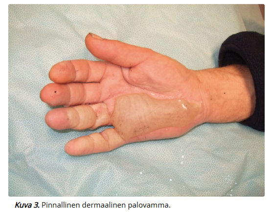
  

## Mitä tarkoittaa Breslow melanooman PAD-lausunnon yhteydessä?

- a. Melanooman vertikaalista paksuutta (millimetreissä) 
- b. Melanooman halkaisijaa ihon pinnalla (millimetreissä) 
- c. Melanooman kasvutapaa 
- d. Ihon kerrosta, jonne melanooma ulottuu (asteikolla I-V)

  <button class="solution-button" data-label="Vastaus" data-hide-label="Piilota vastaus">
    Vastaus
  </button>
  

      a

Breslow’n mitta (invaasion syvyys) on tärkein prognostinen tekijä, joka ennustaa melanooman metastasointia. Se mitataan epidermiksen granulaarisolukerroksen pinnasta syvimpiin melanoomasoluihin (Breslow’n mitta lasketaan vain invasiiviselle tuumoreille -> in situ-melanoomalle Breslow on 0 (yleensä ei ilmoiteta PAD-lausunnossa)). Melanooman TNM-luokituksessa T:n pääluokka määritetään Breslow’n mitan mukaan: <1mm (T1), 1-2mm (T2), 2-4mm (T3), >4mm (T4)

b: Melanoomia tutkittaessa ollaan kylläkin kiinnostuneita muutoksen halkaisijasta, mutta se ei ole sama kuin Breslow'n mitta. Ihon pigmenttimuutos on epäilyttävä melanooman suhteen, jos sen läpimitta on >6mm (yksi osa ABCDE-säännöstöstä). 

c: Melanooman kasvutapa on karkeimmin jaettavissa kahteen: radiaalinen (horisontaalinen ihon pintaa pitkin) ja vertikaalinen. Vertikaalinen kasvutapa eli invaasio syvemmälle ihoon altistaa metastaaseille. Tietyille melanooman kliinis-patologisille luokille on tyypillistä aikaisempi vertikaalinen kasvu (esim. nodulaarinen melanooma) ja toisille pidempi radiaalisen kasvun vaihe (esim. pinnallisesti leviävä tai lentigo maligna).  

d: Clarkin luokat (I-V) kuvaavat invaasion syvyyttä ihon kerrosten mukaan, mutta eivät ole ennusteellisesti yhtä luotettavia kuin Breslow’n mitta

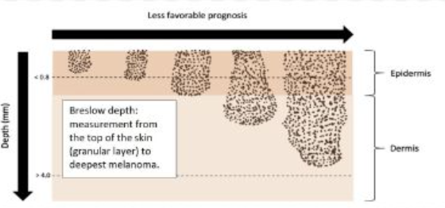

  

## Ompeleiden poistoaika

Olet poistanut 75-vuotiaalta naispotilaaltasi poskesta 1 cm kokoisen suspektin iholuomen diagnostisin marginaalein PAD-tutkimukseen. Milloin potilas käy ompeleiden poistossa?

- a. 10 vuorokauden kuluttua 
- b. 21 vuorokauden kuluttua 
- c. 7 vuorokauden kuluttua 
- d. 14 vuorokauden kuluttua

  <button class="solution-button" data-label="Vastaus" data-hide-label="Piilota vastaus">
    Vastaus
  </button>
  

      c

Ompeleiden kesto riippuu haavasta: koko, syvyys, kiristys. Riippuu myös potilaasta: ikä, aktiivisuus. Yleisesti ottaen: mitä paksumpi iho, sitä kauemmin ompeleita pidetään. 

Yleisohjeita ompeleiden kestoon on: Kasvot 5-7vrk, vartalo 7-14 vrk (selkä 2 vko, vatsa/rinta 1 vko), raajat 10-14 vrk, haavaruptuuralle alttiit alueet (esim. sääri) ad 2 vk, jalkapohja jopa 3 vk
  

## Potilastapaus 

Tk:n vuodeosastolle tulee 80-vuotias nainen, jolla on pitkälle edennyt dementia perussairautena ja tarvitsee apua kaikissa päivittäisissä toimissa. Potilas on otettu osastolle yleistilan laskun ja pyelonefriitin vuoksi. Liikkuminen on huonoa ja potilas on vuodepotilaana. Parin päivän osastohoidon jälkeen huomattiin sacrumin seudussa punoitusta sekä pinnallista ihorikkoa painehaavaan viitaten. Mikä on tärkein ja ensimmäinen hoito?

- a. Hyvä ravitsemus ja proteiinilisät 
- b. Haavan paikallishoito 
- c. Plastiikkakirurgin konsultaatio 
- d. Asentohoito ja painehaavapatja

  <button class="solution-button" data-label="Vastaus" data-hide-label="Piilota vastaus">
    Vastaus
  </button>
  

      d

Painehaava on paineen, venytyksen tai molempien yhdessä aiheuttama kudosvaurio, joka ilmenee painealueilla luisten ulokkeiden kohdalla, kuten istuinkyhmyn, ristiselän ja kantapäiden alueilla. Myötävaikuttavia tekijöitä painehaavan syntyyn ovat liikkumattomuus, ravitsemushäiriö, ruumiinlämmön lasku, vanhuus sekä paikalliset myötävaikuttavat kudosolot (verenkierron häiriöt, virheasennot). Hoidon tärkein osa-alue on paineen poistaminen alueelta; tässä ohjeina esim. asennonvaihdot 2-4h välein ja paineen vaihtavat patjat. 

a: Hyvä ruokavalio ja varsinkin proteiini ovat tärkeitä mm. haavan paranemisessa, mutta ne eivät ole ensimmäinen hoito eivätkä estä painehaavan pahenemista ilman muita temppuja. 

b: Haavan paikallishoito (suojaaminen ja tarvittaessa alueen puhdistaminen) on tärkeää, mutta jos asentohoitoa ei ole, niin millään ei ole väliä, koska painehaava vain pahenisi jatkuvan paineen takia. 

c: Plastiikkakirurgia tietysti voi konsultoida, mutta ei ole tarpeen lievässä pinnallisessa painehaavassa. 

d: Ehkäisyssä ja hoidossa on olennaisinta minimoida tai poistaa riskikohtiin kohdistuva paine (asentohoito, erikoispatjat, istuintyynyt). Painehaavapotilaalla käytetään AINA erittäin korkean riskin potilaille tarkoitettua patjaa. Kansainvälinen suositus jakaa makuualustat toiminnallisesti kahteen pääluokkaan: Reaktiiviset makuualustat reagoivat potilaan painoon, vartalon rakenteeseen ja liikkeeseen. Ne voivat olla tarvittaessa sähköllä toimivia tai esim. vaahtomuovisia makuualustoja. Aktiiviset makuualustat ovat sähköllä jatkuvasti toimivia, tyyppiesimerkkinä vaihtuvapaineiset makuualustat. Alla taulukko makuualustoista (ei tarvitse osata). 

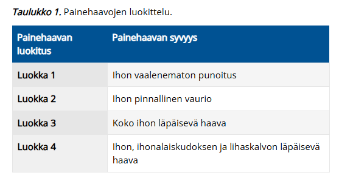
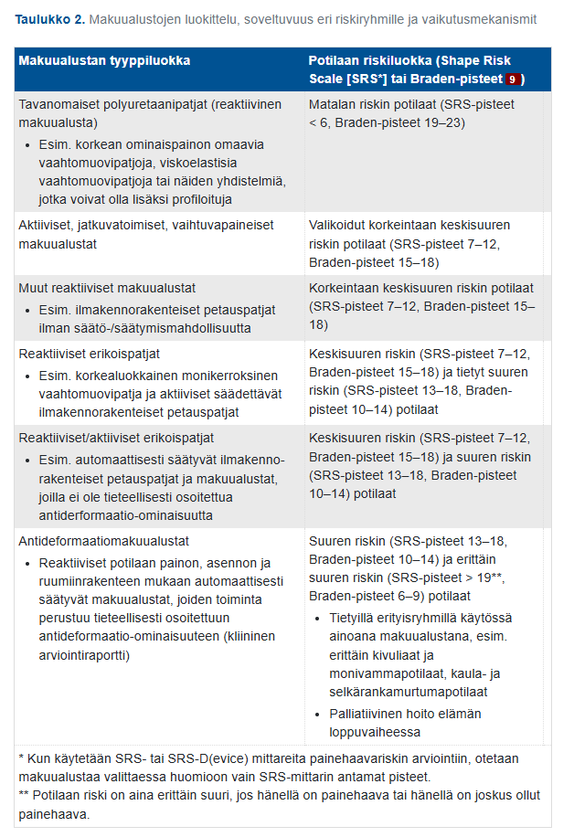

  

## Mikä seuraavista EI pidä paikkansa:

- a. Appendisiittiperforaatio ja peritoniitti on henkeä uhkaava tila 
- b. Fekoliittiappendisiitin hoito on lähtökohtaisesti operatiivinen 
- c. Komplisoitumaton appendisiitti voi parantua konservatiivisestikin 
- d. Periappendikulaariabsessi vaatii aina operatiivisen hoidon akuutissa vaiheessa

  <button class="solution-button" data-label="Vastaus" data-hide-label="Piilota vastaus">
    Vastaus
  </button>
  

      d

a: Totta, peritoniitti vaatii välitöntä leikkausta. 

b: Jos appendixin suulla todetaan fekoliitti (kovettunut ulostekertymä), niin se viittaa korkeaan komplisoitumisriskiin (usein jopa määritellään suoraan komplisoituneeksi) ja tämän takia hoidetaan yleensä leikkauksella. Mikäli potilaalla on voimakkaat oireet, kuumetta, suuri C-reaktiivisen proteiinin pitoisuus (CRP) tai TT:ssa komplisoitumiseen liittyviä riskitekijöitä kuten fekoliitti tai tuumori, tulisi potilas hoitaa aina leikkauksella. 

c: Totta, appendisiitti voidaan hoitaa konservatiivisesti antibioottihoidolla, jos diagnoosi on varmistettu ja komplikaatiot on poissuljettu TT:llä. 

d:Arviolta noin 4-10 %:lla potilaista on diagnoosivaiheessa kehittynyt umpilisäkkeen vieruspaise eli periappendikulaaripaise. Se syntyy kuolioituneen tai puhjenneen umpilisäkkeen seurauksena, kun elimistö pyrkii rajaamaan umpilisäkkeen ulkopuolelle leviävää bakteeri-infektiota. Periappendikulaarisen absessin jo kehityttyä hoito vaihtelee sairaaloittain ja on useimmiten aikaisessa vaiheessa konservatiivinen, vaikka onkin komplisoitunut tauti kyseessä. Mikäli periappendikulaariabsessi hoidetaan ensivaiheessa konservatiivisesti, yli 35-40-vuotiaalla potilaalla suositellaan umpilisäkkeen poistoa suunnitellusti myöhemmin, koska periappendikulaariabsessiin on todettu liittyvän selvästi suurempi umpisuolen/paksusuolen kasvainriski (5–20 %) etenkin yli 35-40-vuotiailla potilailla. 
  

## Potilastapaus 

22-vuotias mies on tullut edellisenä päivänä alkaneen rintapiston vuoksi ensiapuun. Muuten kokee vointinsa hyväksi, mutta kertoi aamun lenkillä jotenkin vedon olleen poissa. SaO2 huoneilmalla 98%, hengitys rauhallista ja vaivatonta. Auskultaatiossa vasemmalla on alentuneet hengitysäänet ja thx-kuvassa näkyy vasemmalla korkeintaan 1 cm ilmarinta apexissa. Mitä teet (valitse näistä mielekkäin vaihtoehto)?

- a. kotiutan potilaan 4 tunnin seurannan jälkeen ja otan kontrollikuvan seuraavana päivänä 
- b. teen neula-aspiraation ja otan kontrollikuvan ja otan potilaan osastolle 
- c. laitan suurimman ea:sta löytyvän pleuradreenin potilaalle ja otan osastolle 
- d. otan potilaan osastolle seurantaan ja kontrolloin kuvan seuraavana päivänä

  <button class="solution-button" data-label="Vastaus" data-hide-label="Piilota vastaus">
    Vastaus
  </button>
  

      a

Primaarinen spontaani ilmarinta (ilmarinta, joka ilmaantuu muuten tervekeuhkoiselle ilman traumaa) on tyypillisintä pitkillä ja hoikilla nuorilla miehillä. Ilmarinta on siis muistettava erityisesti nuoren aikuisen samoin kuin COPD-potilaan (sekundaarinen spontaani ilmarinta eli ilmaantuu muun keuhkosairauden päälle) äkillisen rintakivun ja hengenahdistuksen syynä. Keuhkokuva (mieluimmin PA-kuva seisten) on ensisijainen tutkimus diagnoosin varmistamiseksi, muita kuvantamisia tarvitaan vain harvoin. 

Hoito voi olla konservatiivinen (tilanteen seuranta) ja on mahdollinen avohoidossa (useimmiten ESH) pienessä primaarisessa spontaanissa ilmarinnassa, jos kaikki seuraavat ehdot täyttyvät:

1. potilas on muuten terve ja saturoi normaalisti (95% tai yli)
2. potilas on oireeton tai vähäoireinen
3. ilmarinta on kooltaan ≤ 15 % rintaontelon tilavuudesta, mikä vastaa ≤ 3 cm:n (joissain lähteissä alle 2,5cm) ilmasirppiä keuhkon yläosassa ilman lateraalista komponenttia (jos ilmarintaontelo ympäröi koko keuhkoa, se on jo suuri)
4. ilmarinta ei laajene seurannan aikana

Seurannassa otetaan keuhkokuvia toistetusti. Ensimmäinen otetaan viimeistään parin päivän sisällä (joidenkin ohjeiden mukaan ensin 4-6 tunnin kuluttua ktrl-thx ja taas heti seuraavana päivänä) ja seuraava usein viikon kohdalla ilmarinnan ilmaantumisesta. Tämän jälkeen keuhkokuva uusitaan vähintään viikoittain, kunnes ilmarinta on resorboitunut ja keuhko on täysin laajentunut (joidenkin ohjeiden mukaan vain tarv 1 kk päästä, jos yhä pieni ilmasirppi). Yleensä seuranta on perusteltua järjestää erikoissairaanhoidossa. Aktiivisemmat hoitotoimenpiteet ovat perusteltuja, jos oireilu lisääntyy tai ilmarinta laajenee. Ilmaontelon tilavuudesta imeytyy tyypillisesti n. 1.25 %-yksikön verran vuorokaudessa, eli 15 %:n ilmarinta häviää n. 12 vrk:ssa.

Jos potilas vaatii kajoavaa hoitoa, niin se on pleuradreeni ja imu 3vrk tarvittaessa toistaen. 

  

## Potilastapaus

69-vuotiaalla potilaalla lääkityksenä dutasteridi seitsemän vuoden ajan. Nyt virtsasuihkun voima heikko ja jäännösvirtsaa 1650 ml. Hoidan hänet seuraavasti

- a. kertakatetroit potilaan ja päästät hänet kotiin kehotuksella tulla tarvittaessa uudelleen. 
- b. laitat kestokatetrin, johon laitetaan venttiili. Potilas tyhjentää katetrin avaamalla venttiilin, kun tulee virtsahätä. 
- c. laitan kestokatetrin, joka yhdistetään pussiin ja potilas tulee 3 viikon kuluttua katetrin poistoon 
- d. lähetät hänet päivystyksenä erikoissairaanhoitoon.

  <button class="solution-button" data-label="Vastaus" data-hide-label="Piilota vastaus">
    Vastaus
  </button>
  

      c

Akuutin ja kroonisen virtsaummen välitön hoito on virtsarakon katetrointi. Ensisijaisesti käytetään luonnollista reittiä eli viedään virtsaputken kautta katetri virtsarakkoon. Mikäli tämä jostain syystä ei onnistu, on asetettava paikallispuudutuksessa vatsanpeitteiden läpi suprapubinen katetri.

Mikäli kyseessä on selvä ulkoisen syyn takia aiheutunut ohimennyt virtsaumpi, voidaan rakko ainoastaan kertakatetroida tyhjäksi ja sitten seurata, että virtsaaminen onnistuu. Mikäli kyseessä on komplisoitunut tila tai huomattava ylivenyttyminen (> 1000 ml), on parempi jättää kestokatetri potilaalle esimerkiksi 1–2 viikon ajaksi. Rakon huomattava ylivenyttyminen tarvitsee pidemmän ajan palautuakseen, joten kertakatetrointi ei riitä. Katetri laitetaan pussiin, ei venttiiliin — venttiiliä ei käytetä tällaisen retention yhteydessä, koska rakon tulee tyhjentyä vapaasti ilman painevaihtelua

Potilaan itse toteuttama toistokatetrointi voi myös tulla kyseeseen, mutta tämä vaatii ohjausta ja runsaasti kertakäyttökatetreja eikä täten yleensä ole helppo ratkaisu lyhyen päivystys- tai vastaanottohoidon yhteydessä. 
  

## Potilastapaus

59-vuotias aiemmin terve mies tulee aluesairaalan ensiapuun äkillisesti alkaneen kovan repivän retrosternaalisen kivun vuoksi, kivun alkaessa menettänyt hetkeksi tajuntansa. Tutkittaessa takykardinen 110/min, EKG:ssa sinusrytmi, ei johtumishäiriöitä tai ST-tason muutoksia. RR 190/95 mmHg. Pulssit symmetriset. Thx-kuvassa ei ilmarintaa, ei nestettä pleurassa, ei inkompensaatiota. Auskultoiden diastolinen sivuääni gradus 3/6 aorttaläppäalueelta. Mikä EI pidä paikkaansa?

- a. aortan -TT on syytä ottaa vahvan dissekaatioepäilyn vuoksi mikäli se on saatavissa nopeasti 
- b. B-tyypin dissekaatio voidaan hoitaa konservatiivisesti pyrkimällä alle normotension labetalolilla ja/tai nitroprussidilla 
- c. dissekaation ollessa kyseessä tulisi aloittaa labetaloli- ja/tai nitroprussidi-infuusio ja varmistaa, että verenpaineet saadaan normotensiivisiksi, vasta sitten voidaan potilasta lähteä siirtämään 
- d. A-tyypin dissekaatio tulee leikata viipymättä

  <button class="solution-button" data-label="Vastaus" data-hide-label="Piilota vastaus">
    Vastaus
  </button>
  

      c

a: Aortan dissekoituman tärkein diagnostinen testi on aortan varjoainetehosteinen TT, jos se on nopeasti suoritettavissa. Myös ultralla voidaan tutkia akuutissa vaiheessa (lähinnä tamponaation ja aorttaläpän toiminnan arviona), mutta se ei ole poissulkututkimuksena täysin luotettava. Dissekoitumaan viittaavat löydökset tulisi varmentaa tietokonekerroskuvauksella (TT), mutta kriittisessä tilassa oleva potilas, jolla varmentuu sydäntamponaatio, voidaan viedä suoraan leikkaussaliinkin. 

b: Stanford A-tyypin dissekoituman ensisijainen hoito on operatiivinen, kun taas B-tyypin dissekoituman ensisijainen hoito on konservatiivinen. Konservatiivisen hoidon tärkein osa on verenpaineen kontrolloiminen: tavoitetaso systolisessa paineessa on 100–120 mmHg ja sykkeessä n. 60/min. Nopea syke ja korkea verenpaine altistavat dissekoituman etenemiselle ja aortan ruptuuralle, liian alhainen verenpaine puolestaan pääte-elinten verenkiertovajeelle. Suonensisäinen natriumnitroprussidi, nitroglyseriini ja/tai labetaloli laskee tehokkaasti verenpainetta (labetaloli parempi jos syke >60, mutta verenpaine ei tavoitteessa ja nitroprussidi parempi, jos syke on jo valmiiksi matala, mutta verenpaine ei tavoitteessa). Konservatiivisesti hoidetun B-tyypin dissekoituman sairaalakuolleisuus on noin 10 %.

B-tyypin dissekoituma voidaan hoitaa kajoavasti, jos tila komplisoituu (esim. akuutti tai uhkaava ruptuura). Ensisijaisesti kyseeseen tulee endograftihoito (TEVAR), jolla peitetään tyypillisesti laskevan torakaaliaortan yläosassa sijaitseva intimakerroksen repeämä (entry tear). 

c:  Dissekoituman hoidossa tärkeää on nopea siirto sydänkirurgiseen yksikköön. Tärkein ensihoitotoimenpide akuuttia dissekoitumaa epäiltäessä on potilaan verenpaineen, syketason, kivun sekä pelon ja ahdistuksen hallinta suonensisäisellä lääkityksellä. Tavoitteena ei kuitenkaan ole sinänsä normotensio, vaan 100-120 mmHg systolista. Riittävä keskivaltimopaine on 60 mmHg ja systolinen painetaso 90 mmHg. **Jos potilaalla epäillään dissekoitumaa niin potilas voidaan siirtää sydänkirurgiseen yksikköön vaikka verenpaineet olisivatkin korkeat. Anna hypertensiiviset lääkkeet ja lähetä potilas menemään (load and go).** 

d: Totta. A-tyypin dissekoituman leikkaushoidon tavoitteena on korvata dissekoitunut osa nousevaa aorttaa verisuoniproteesilla, erityisesti alue, jolla intimakerroksen repeämä (entry tear) sijaitsee. Tällöin estetään veren antegradinen kulkeutuminen väärään luumeniin. Lisäksi varmistetaan, että nousevan aortan alueella ei tapahtuisi uutta repeämää eikä aorttaläpän tai koronaariostiumien uutta katastrofia. Jos aortan tyvi sinus Valsalvae -tasolla sekä aorttaläppä ovat rakenteellisesti ehjät, riittää yleensä suora putkiproteesi, joka ommellaan proksimaalisesti aortan sinotubulaarijunktion tasoon. Tämä on yleisin (noin 70 %) aortan dissekoituman leikkaustekniikka.

Aortan dissekoituman Stanford A -tyyppi = dissekoituma affisioi ainakin nousevaa aorttaa (voi olla myös laskevassa osassa)

Aortan dissekoituman Stanford B -tyyppi = dissekoituma affisioi vain laskevaa aorttaa

Aortan dissekoituman Stanford non-A-non-B -tyyppi = dissekoituma affisioi vähintään aortan kaarta, mutta ei nousevaa aorttaa

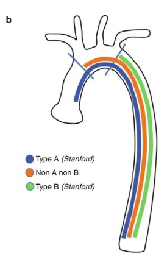

  

## Mittaat vastaanotolla potilaan ABI-indeksin. Arvoksi saat vasemmasta jalasta 0.92, oikealla arvo on normaali 1.0. Mikä väittämistä on oikein?

- a. Kyseisen potilaan kardiovaskulaarinen ennuste on ABI indeksin perusteella huono 
- b. Potilaan verenpainelääkitys lopetetaan, jotta vasemman jalan painetta saadaan korjattua 
- c. Potilaan ABI arvo vasemmalla on normaaliarvojen rajoissa 
- d. Potilaalle pitäisi aloittaa ABI mittauksen perusteella heti kolesterolilääkitys

  <button class="solution-button" data-label="Vastaus" data-hide-label="Piilota vastaus">
    Vastaus
  </button>
  

      c

Nilkka-olkavarsipainesuhteen (ABI) määrittäminen on pulssien palpoimisen ohella ASO-taudin tärkein tutkimus yleislääkärin näkökulmasta. ABI-mittaus tulisi suorittaa rutiinimaisesti tukkivaa valtimotautia epäiltäessä eikä potilasta tulisi lähettää erikoissairaanhoitoon ilman ABI-mittausta

Normaali ABI on yli 0.9 ja ABI-arvoa ≤ 0,9 pidetään yleisesti merkkinä alaraajan huonontuneesta valtimokierrosta (alle 0,90:n ABI-arvolla on 75 %:n herkkyys ja 86 %:n tarkkuus alaraajaiskemian diagnostiikassa, mutta herkkyys on huonompi diabeetikoilla ja vaikeaa munuaisten vajaatoimintaa sairastavilla valtimoiden seinämiä jäykistävän mediaskleroosin vuoksi). Normaali ABI-arvo ei sulje pois alaraajaiskemiaa, jos kliininen epäily on vahva. Tällöin tulee tehdä muita testejä diagnostiikan tueksi

Luotettavan viitealueen yläraja on 1,4. Tätä suuremmat arvot johtuvat usein mediaskleroosista (pseudohypertensio), mutta ne ovat myös merkki yleistyneestä valtimotaudista. 

Alle 0,4 ABI-arvo tai alle 50 mmHg:n nilkkapaine viittaa krooniseen raajaa uhkaavaan iskemiaan, mutta mittaustulos tulee suhteuttaa oireisiin ja löydöksiin.
  

## Kenelle seuraavista ohjelmoin kiireellisen gastroskopian?

- a. Uusi dyspepsia yli 50-vuotiaalla 
- b. Suolentoiminnan muutos 
- c. Närästys 30-vuotiaalla 
- d. Kirkas veri peräpäästä usean viikon ajan

  <button class="solution-button" data-label="Vastaus" data-hide-label="Piilota vastaus">
    Vastaus
  </button>
  

      a

Gastroskopia on aiheellinen, jos potilaalla on yli 50–60-vuotiaana (useimmissa lähteissä 55-60, mutta usein yli 50v otetaan tähän myös mukaan) ilmaantunut ylävatsavaiva tai hänellä on hälyttäviä oireita tai löydöksiä. 

b: Suolen toiminnan selvä ja muuttuminen on yleensä enemmän aihe kolonoskopialle. Esim. jos on suolen toiminnan selvä ja pitkäkestoinen (> 6 viikkoa) muuttuminen yli 50-vuotiaalla ja ulosteen hemoglobiinitesti (F-hHb) on raja-arvoinen (≥ 10 µg/g) tai positiivinen (> 25 µg/g), tehdään kolonoskopia. Samoin jos pitkittynyt ripuli (kesto > 4 viikkoa, > 3 löysää ulostetta/vrk) tai tulehduksellisen suolistosairauden epäily oireiden perusteella. 

c: Uusi närästys 30-vuotiaalla ilman hälyttäviä oireita voidaan hoitaa PPI-hoitokokeilulla 4-8vk 

d: Kirkas veri peräpäästä ilman selkeää proktologista syytä (esim. peräpukamat) on aihe ensisijaisesti kolonoskopialle, ei gastroskopialle

  

## Potilastapaus

Pienen terveyskeskuksen päiväpäivystykseen tulee 40-vuotias mies. Hänellä on alkanut edellisenä päivänä äkillinen, aaltomainen vasemman kyljen kipu, joka on voimistunut nyt niin, ettei hän pysty olemaan hetkeäkään paikalla. Epäilet virtsatiekiveä, koska potilaalla on niitä aikaiseminkin ollut. Potilas sanoo, että aikaisemmin yli 5mm:n kivet eivät ole tulleet itsenäisesti läpi. Mitä teet?

- a. Otat terveyskeskuksessa pvk, crp, krea, plv ja lähetät potilaan erikoissairaanhoitoon TT-tutkimukseen, koska kiven koko pystytään määrittämään luotettavasti ainoastaan TT-tutkimuksessa 
- b. Otat terveyskeskuksessa pvk, crp, krea, plv ja kipulääkitset potilaan. Jos potilas tulee kivuttomaksi ja laboratoriotutkimukset ovat normaalit, laitat potilaan kotiin kipulääkitysreseptein ja teet kiireettömän lähetteen urologian poliklinikalle 
- c. Lähetät potilaan erikoissairaanhoidon päivystykseen virtsateiden TT-tutkimukseen, koska kiven koko pystytään määrittämään luotettavasti ainoastaan TT-tutkimuksessa 
- d. Otat terveyskeskuksessa virtsateiden UÄ-tutkimuksen ja hoidat potilaan konservatiivisesti, jos kivi on alle 5mm:n kokoinen. Jos kivi on kookkaampi, lähetät potilaan erikoissairaanhoidon päivystykseen

  <button class="solution-button" data-label="Vastaus" data-hide-label="Piilota vastaus">
    Vastaus
  </button>
  

      b
      
Labroilla poissuljetaan infektio ja tarkistetaan munuaisten toiminta. Kuumeinen, yleisoireinen tai munuaisten toimintaan vaikuttava virtsatiekivi vaatii päivystyksellistä hoitoa. Kaikututkimus myös olisi hyvä tehdä avohoidossa (voi näyttää mm hydronefroosin ja jos se nähtäisiin, niin vaatisi päivystyksellistä hoitoa). Potilas on kivulias ja tarvitsee tämän takia kipulääkitystä. Jos kipu ohittuu ja labrat eivät osoita komplisoitumista, niin tilannetta voi jäädä seuraamaan ja tehdä kiireettömän lähetteen urologian poliklinikalle, jossa sitten voidaan miettiä esim. ESWL-hoitoa (extracorporeal shock wave lithotripsy) kiven ollessa suuri tai jos pienempi kivi ei poistu seurannassa.

a ja c: Virtsatiekivien ensisijainen diagnostinen tutkimus on kylläkin ilman varjoainetta kuvattava virtsateiden tietokonekerroskuvaus (vt-kivi-TT). Päivystykselliset toimet ovat kuitenkin liian aggressiivisia vastausvaihtoehtoja, jos potilas saadaan kivuttomaksi eikä punaisia lippuja (kuume, kohonnut krea, yksittäinen munuainen) ole todettavissa. 

d: Ultraäänessä osa munuaiskivistä erottuu, mutta kiven koon arviointi on epäluotettavaa. Virtsanjohdinkivet erottuvat huonosti. Vaikka kivi erottuisi ja olisi selkeästi yli 5mm, niin se ei silti vaatisi päivystyksellistä hoitoa ilman komplisoitumisen merkkejä. 
  

## Potilastapaus

Vastaanotollesi tulee uudestaan 70-vuotias nainen, jolla on toistuvasti tiheävirtsaisuutta ja virtsankirvellystä sekä toistetusti mikroskooppista hematuriaa. Virtsaviljelyssä ei edelleenkään ole bakteerikasvua. Mitä teet?

- a. Mikroskooppinen hematuria ei ole uroteelisyövän oire ja kirjoitat potilaalle kokeeksi antibioottikuurin
- b. Lähetät potilaan erikoissairaanhoitoon urologialle kystoskopiaan
- c. Teetät potilaalle virtsaelinten UÄ-tutkimuksen. Jos siinä on jotain poikkeavaa, lähetät potilaan erikoissairaanhoitoon urologialle kystoskopiaan
- d. Lähetät potilaan erikoissairaanhoitoon nefrologialle tarkempiin mikroskooppisen hematurian tutkimuksiin

  <button class="solution-button" data-label="Vastaus" data-hide-label="Piilota vastaus">
    Vastaus
  </button>
  

      b
      
a: Yleisin uroteelisyövän oire on verivirtsaisuus, jota on ainakin 85 %:lla rakkosyöpäpotilaista. Verivirtsaisuus voi olla makroskooppista eli silminnähtävää tai mikroskooppista eli virtsakokeen paljastamaa. Makroskooppisen hematurian mahdollinen väistyminen tai lieväasteisuus eivät poissulje pahanlaatuista uroteelikasvainta. Noin kolmanneksella rakkokasvainpotilaista on ärsytysoireita, kuten kivuliaisuutta virtsatessa, tiheä- ja yövirtsaisuutta sekä virtsapakon tunnetta.

Vaikka oireeton mikroskooppinen verivirtsaisuus voidaan usein jättää tutkimatta, kannattaa päätös tehdä yksilöllisesti riskitekijät huomioiden (katso alla olevista kuvista lähettämiskriteerit). 
      
b: Polikliininen kystoskopia eli virtsarakon tähystys on virtsarakkosyövän perustutkimus, jossa nähdään mahdollisten tuumorien lukumäärä ja niiden koko. Ylävirtsateiden kuvantaminen kaikututkimuksella tai yleisemmin TT-urografialla tehdään myös kaikille potilaille toteamisen jälkeen. Koko vartalon TT tehdään levinneisyysselvittelynä epäiltäessä invasiivista syöpää.

c: Jos potilaalla todettaisiin UÄ:ssä epäilyttävää, niin se kylläkin olisi aihe lisätutkimuksille, mutta kystoskopia on ilman UÄ:täkin aiheellinen. 

d: Mikroskooppisen hematurian selvittely on kylläkin usein aihe nefrologille lähettämiseen, mutta siihen tulee liittyä jotain munuaisten häiriöön liittyvää (esim. yleisoireet, proteinuria, heikentynyt GFR, kohonnut verenpaine varsinkin nuorella, anca-ab:t positiiviset tai epäily systeemitaudista)

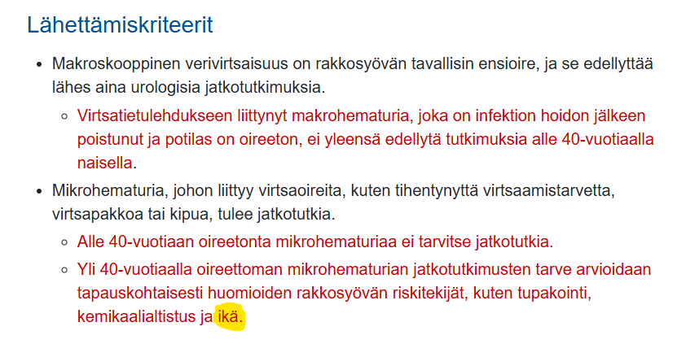
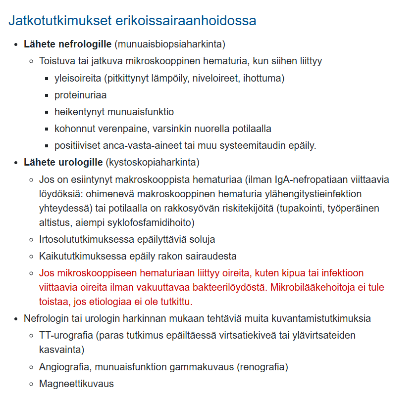
  

## Potilastapaus

30–vuotias mies on ajanut humalassa lyhtytolppaa päin. Toimit ensiavun lääkärinä ja tutkit potilaan. RR 105/85, pulssi 110/min, SaO2 40% lisähapella 85%, hengitysfrekvenssi 25/min. Palpoiden aristaa vasenta puolta rintakehästä ja se myös rutisee palpaatiossa, auskultaatiossa hengitysäänet vaimeat kauttaaltaan mutta melussa vaikea saada hyvin kuunneltua, otsalla kookas kuhmu ja laseraatioita, tajunnan taso alentunut siten, että örisee kivulle. Mikä on oikea järjestys toiminnalle?

- a. hätätorakotomia -> trauma-tt 
- b. pleuradreeni -> trauma-tt + pään TT -> tarvittaessa intubaatio 
- c. traumat-tt + pään TT -> intubaatio -> tarvittaessa pleuradreeni 
- d. natiivi-thx -> traumat-tt -> tarvittaessa pleuradreeni ja intubaatio

  <button class="solution-button" data-label="Vastaus" data-hide-label="Piilota vastaus">
    Vastaus
  </button>
  

      b
      
Korkeaenerginen trauma, joka on todennäköisesti johtanut kylkiluumurtumaan ja sitä kautta ilmarintaan. Palpaatiossa myös kuuluu rutinaa, joka viittaa subkutaaniseen emfyseemaan. Saturaation heikentyminen, tajunnan alentuminen ja heikentynyt hemodynamiikka viittaavat mahdollisesti kehittyvään tensiopneumothoraxiin, joka vaatii välitöntä kajoavaa hoitoa. Jos paineilmarintaa epäillään traumapotilaalla tai elvytetyllä potilaalla (hengitys vaikeutuu, todetaan paineilmarintaan viittaavia löydöksiä), on syytä hoitaa tila, vaikkei diagnoosia varmentavaa keuhkokuvaa olisi mahdollista ottaa. Välitön hoito voi olla neulatorakosenteesi, mutta se harvoin riittää (tulisi asettaa useita, jos haluttaisiin riittävän), jonka takia voikin usein asettaa suoraan pleuradreenin paikoilleen. 

Traumapotilas vaatii ilmarinnan hoidon lisäksi lisätutkimuksia, jotka korkeaenerginen tylppä vamma rintakehän alueella ja pään vammat huomioiden tulisi olla trauma-tt ja pään TT. Intubaatiota tulee myös vahvasti harkita, koska potilaan tajunta on alentumassa ja hengitysvaikeudet ovat selvät. 

a: Hätätorakotomialle ei ole aihetta. Sen selkeä indikaatio olisi, jos todettaisiin sydämenpysähdys penetroivan vamman jälkeen.

c-d: Potilaan kuvantaminen ennen mahdollisen tensiopneumothoraxin hoitoa viivästyttää pleuradreenin asettamista ja altistaa potilaan tilan pahenemiselle. Siksi ensin dekompressio / pleuradreeni, jotta hänet voidaan turvallisesti kuvata ja tarvittaessa intuboida.
  

## Potilastapaus

65-vuotiaalla rouvalla on hankalat peräpukamat, jotka on suunniteltu leikattaviksi (ei pelkät Barronin ligatuurat). Hänellä on kuitenkin 2 vuotta sitten laitettu mekaaninen mitraaliläppäproteesi (INR hoitoalue 2,5-3,5). Mikä pitää paikkansa?

- a. peräsuolen verenkierto on hyvä, eikä infektioriskiä ole yli vuoden vanhalla proteesilla mikäli se on mitraalipositiossa eli ei ab-profylaksin tarvetta, siltahoito pienimolekyläärisellä heparinilla kuitenkin tarvitaan 
- b. konsultoidaan kardiologia ja sydänkirurgia siitä voisiko mekaanisen proteesin vaihtaa biologiseksi 
- c. tauotetaan varfariinihoito ja tehdään toimenpide ab-profylaksiassa INR ollessa alle 2 
- d. tehdään toimenpide siltahoidossa ja ab-profylaksiassa

  <button class="solution-button" data-label="Vastaus" data-hide-label="Piilota vastaus">
    Vastaus
  </button>
  

      d

Varfariini on vaikea lääke ja sen ongelmat vielä korostuvat perioperatiivisesti. Suuren vuotoriskin toimenpiteissä tulee harkita ns. siltahoitoa eli varfariinin tauotusta ja LMWH-hoidon aloittamista pitämään antikoagulaatiota yllä leikkaukseen asti. Siltahoitoa voinee harkita, jos lääkitystauko on pitkä toimenpiteeseen liittyvän vuotoriskin takia ja/tai potilaalla on erityisen suuri tukosriski. Siltahoidon kriteerit ovat viime vuosina tiukentuneet, ja sitä suositellaan nykyisin ainoastaan suuren tukosriskin potilaille.

Potilaan mekaaninen mitraalitekoläppä on keskimääräisen tukosriskin riskitekijä (korkea riski, jos olisi aivoinfarktin riskitekijöitä samalla). Potilas ei siis suoraan kuulu korkean tukosriskin kastiin potilastapauksen perusteella, joten periaatteessa siltahoitoa ei välttämättä tarvittaisi. Kysymyksen tekovuotena kuitenkin siltahoito on todennäköisesti ollut selkeämmin indikoitua eikä ole tarvinnut tuoda esille potilaan muita riskitekijöitä.

a: Keinomateriaalitekoläpät ovat erityisen alttiita infektioille ja tämän takia limakalvoa rikkovissa toimenpiteissä vaaditaan antibioottiprofylaksia. 

b: Proteesia ei oltaisi todellakaan vaihtamassa peräpukamien leikkauksen takia.

c: Erityisesti jos potilaalla on mekaaninen tekoläppä tai muuten suuri tukosriski, varfariinihoitoa ei saa yleensä keskeyttää eikä keventääkään, ellei käytetä korvaavaa antikoagulanttia (LMWH:ta). Tämä ohje ei ole enää niin absoluuttisen pitävä, mutta kuitenkin hyvä perusohje pitää mielessä. 

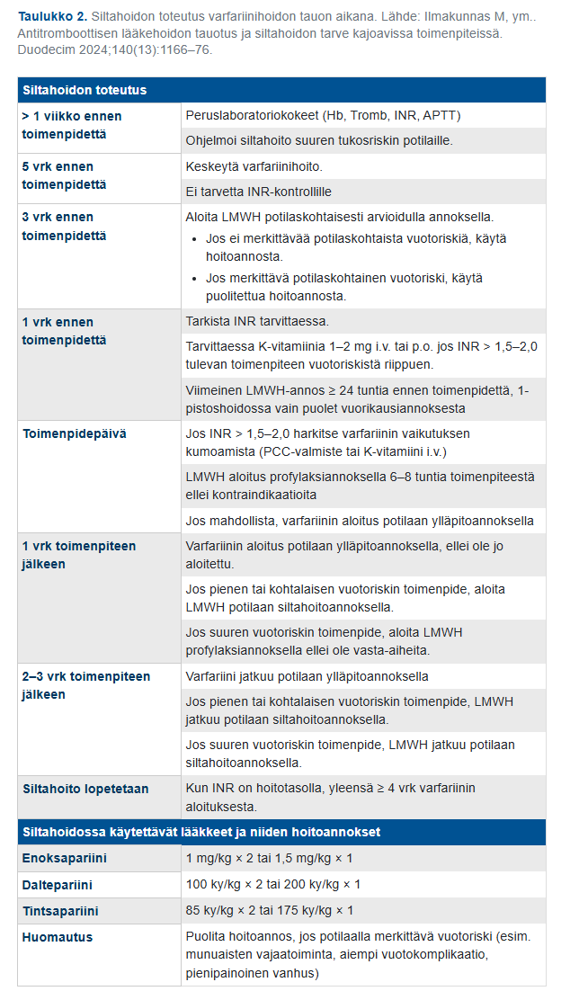
  

## Mikä väittämistä pitää paikkaansa?

- a. Alaraajan laskimovajaatoiminnan oireisiin ei tukisukalla ole mitään apua 
- b. Alaraajan laskimovajaatoiminnassa kyse on siitä, että pintalaskimojärjestelmän paine on koholla silloin kun ihminen on pystyasennossa 
- c. Tupakointi on alaraajan laskimovajaatoiminnan tunnettu riskitekijä 
- d. Alaraajojen laskimovajaatoiminta on aina harmiton, kosmeettinen vaiva. Siitä ei voi aiheutua terveydelle haitallisia oireita

  <button class="solution-button" data-label="Vastaus" data-hide-label="Piilota vastaus">
    Vastaus
  </button>
  

      b

Pintalaskimoiden vajaatoiminnan etiologia on tuntematon, mutta taustalla on inflammaatio, jonka pohjalta laskimoläpät eivät ole enää pitävät. Normaalisti pinnallisten laskimoiden normaali läppätoiminta estää laskimoveren takaisinvirtauksen (refluksi). Sulkeutuneet läpät katkaisevat laskimon sisällä olevan veripilarin muutaman sentin välein ja tämä vähentää hydrostaattista painetta. Läppien vajaatoiminnassa pintalaskimojärjestelmän paine on koholla ja tämä johtaa mm. laskimoiden turvotukseen (suonikohjut).

a: Käytännössä kaikille laskimovajaatoiminnasta (kannattaa huomioida kuitenkin dekompensoitunut sydämen vajaatoiminta ja kriittinen alaraajaiskemia vasta-aiheina) valittaville potilaille voi suositella kompressiohoitoa. **Kompressio ei estä taudin etenemistä, mutta helpottaa oireita.**

c: On jotain viitteitä siitä, että tupakointi voisi vaurioittaa laskimon seinämiä ja läppiä ja täten altistaa laskimovajaatoiminnalle, mutta tupakointi ei ole läheskään yhtä merkittävä riskitekijä laskimopuolen ongelmille kuin valtimopuolen ongelmille (arterioskleroosille). 

d: Väärin; Laskimovajaatoiminta voi johtaa mm. haavaumiin ja siten infektioihin, eikä ole aina harmiton.

  

## Teet triagea kirurgian päivystyksessä. Kaikki seuraavat tilat vaativat nopeaa toimenpideinterventiota, mutta mikä niistä on kaikkein kiireellisin:

- a. strangulaatioepäily 
- b. akuutti scrotum 
- c. täyttöön reagoimaton aorta-aneurysmaruptuura 
- d. raju kolekystiitti

  <button class="solution-button" data-label="Vastaus" data-hide-label="Piilota vastaus">
    Vastaus
  </button>
  

      c

Aneurysmaruptuura + ei vastetta nesteytykselle → suora hengenvaara. Kuolleisuus minuuteissa (ruptuurassa usein jopa kuolema välittömästi) riippuen ruptuuran tyypistä ja vakavuudesta, vaatii välitöntä leikkaussaliin vientiä. Tämä on selvästi kiireellisin kaikista. 

a: Strangulaatioepäily – erittäin kiireellinen, mutta ei lähes _välittömästi_ kuolettava kuten hoitamaton ruptuura

b: Akuutti scrotum (todennäköisesti testistorsio) – kirurginen päivystysleikkaus. Leikkaus tulee tehdä viiden tunnin kuluessa oireiden alkamisesta. 

d: Raju kolekystiitti – myös päivystyksellinen leikkaus, mutta ei samalla tavalla _välittömästi_ hengenvaarallinen kuin aortan aneurysmaruptuura
  

## Potilastapaus

Tk-päivystykseen tulee 68-vuotias miespotilas, jolla on anamneesissa metabolinen oireyhtymä. Potilaalle on kivespussin alueelle tullut vuorokauden aikana nopeaan tahtiin punoitusta ja muutamia hemorragisia rakkuloita. Aristaa selvästi palpaatiota. Potilaalla on korkea kuume ad 39 astetta. Lab.kokeissa Leuk 23, CRP 75. Mitä epäilet diagnoosiksi?

- a. Fournierin gangreena 
- b. Erysipelas 
- c. Epididymiitti ja orkiitti 
- d. Kivespussin selluliitti

  <button class="solution-button" data-label="Vastaus" data-hide-label="Piilota vastaus">
    Vastaus
  </button>
  

      a

Fournier'n grangreena on käytännössä kivespussin ja/tai välilihan alueen nekrotisoiva faskiitti. Usein taustalla on jokin perineumin trauma tai ihorikkoon johtava asia ja muita vakaville infektioille altistavia tekijöitä, kuten alkoholismi, DM ja obesiteetti (metabolinen oireyhtymä kuten potilaalla) tai immunosuppressio. Tilalle tyypillisiä oireita ovat alkuun selluliitin kaltainen tilanne (potilaalla punoitusta nopeaan tahtiin), jonka jälkeen merkittävä kipu (potilasta aristaa palpaatiossa), yleistilan lasku (potilaalla korkea kuume) ja lopulta nekroottisten alueiden ilmentyminen (potilaalla hemorragisia rakkuloita, jotka voivat viitata tähän). Tila sopii Fournier'n gangreenaan ja vaatii välitöntä hoitoa. 

Fournier'n gangreenin hoitolinjat ovat samanlaiset kuin kaasukuolion ja nekrotisoivan faskiitin: hoitona ovat radikaali kirurginen revisio ja laajakirjoinen antimikrobihoito sekä mahdollisesti ylipainehappihoito. Revisiossa kaikki kuolioitunut kudos poistetaan ja tehdään lisäksi tarvittavat laajat kudosavaukset tilan leviämisen selvittämiseksi ja hoitamiseksi. Usein on tarpeen tehdä paksusuoliavanne ulostekontaminaation poistamiseksi revidoidulta alueelta.

b: Pelkkä ruusu (erysipelas) ei oireilisi näin vakavana. 

c: Epididymiitti (lisäkivestulehdus) ja orkiitti (kivestulehdus) aiheuttaisivat oireita keskittyen kivespussin sisälle eikä niinkään aiheuttaisi kivespussin ihomuutoksia tai näin vakavia yleisoireita. 

d: Selluliitissa yleistila hyvä, mutta Fournier'n gangreenissa taas yleisoireita ja kipu suurempi. Aluksi Fournier'n gangreeni voi oireilla kuten kivespussin selluliitti, mutta edetessä yleistila laskee ja potilas menee septiseksi. 

  

## Akuutti haimatulehdus on patogeneettisesti

- a. autoinflammatorinen tauti 
- b. autodigestiivinen tauti 
- c. autoimmuunitauti 
- d. infektio

  <button class="solution-button" data-label="Vastaus" data-hide-label="Piilota vastaus">
    Vastaus
  </button>
  

      b

Akuutti pankreatiitti johtuu ennenaikaisesta haiman ruuansulatusentsyymien aktivoitumisesta ja sitä seuraavasta haiman autodigestiosta (eli parenkyymin itsetuhosta). Asinaarisoluissa tuotetut ruuansulatusentsyymit, kuten trypsinogeeni, vuotavat solujen ulkoiseen tilaan asinussoluvaurion seurauksena -> trypsinogeeni aktivoituu -> aktivoitunut trypsiini aktivoi muita vuotaneita entsyymejä, kuten elastaasin, lipaasin ja fosfolipaasin. Nämä entsyymit sitten aiheuttavat haiman parenkyymin nestemäistä hemorragista nekroosia ja peripankreaattisen rasvan rasvanekroosia. Kyseessä ei siis tyypillisesti ole infektion aiheuttama tila, vaan tulehdus on ns. steriiliä. 

a-c: Haimatulehdus voi olla autoimmuunipohjainen, mutta se on harvinainen ja ilmenee tyypillisesti kroonisena pankreatiittina. 

d: Pankreatiitti voi olla infektiivinen, mutta ne tapaukset ovat harvinaisia. 
  

## Potilastapaus

Tk-lääkärin vastaanotollesi tulee 50-vuotias nainen, joka on tuntenut oikeassa rinnassaan uuden kyhmyn. Rintojen ja kainaloiden palpaatiossa toteat oikean rinnan ylälateraalineljänneksen alueella aristamattoman, mobiilin, noin 2 cm kokoisen kiinteän resistenssin. Potilaan sisko ja äiti ovat sairastaneet vastaavassa iässä rintasyövän. Mikä on tärkein hoitolinja?

- a. Teet lähetteen kirurgille rintasyöpäepäilynä 
- b. Kehotat potilasta odottamaan aikaa seulontamammografiaan 
- c. Teet lähetteen geneetikolle perinnöllisyysselvitykseen 
- d. Ohjaat potilaan kiireelliseen rintojen mammografiaan ja ultraääniohjattuun paksuneulabiopsiaan

  <button class="solution-button" data-label="Vastaus" data-hide-label="Piilota vastaus">
    Vastaus
  </button>
  

      d

Rintasyövän kolmoisdiagnostiikka: (1) Rinnan inspektio ja palpaatio, (2) Kuvantamistutkimukset (mammografia ja sitä täydentävät menetelmät) ja (3) Paksuneulanäyte. Kaikkien näiden osa-alueiden tulee yksiselitteisesti viitata hyvänlaatuisuuteen, jotta muutosta voidaan jäädä vain seuraamaan. Epävarmaksi jäänyt muutos poistetaan.

a: Ei vielä lähetettä kirurgialle, sitä ennen tulee tehdä muut kolmoisdiagnostiikkaan kuuluvat perusdiagnostiset tutkimukset. 

b: Nyt ei enää jäädä odottamaan seulontamammografiaa, vaan tehdään lähetteet jatkotutkimuksiin. Potilas kylläkin on 50-vuotias, joten seulonta varmaan tulisi kohta (seulontaan kuuluu 50-69-vuotiaat naisen n. kahden vuoden välein), mutta ei odotella sitä. 
c: BRCA1/2-geeniselvitykset voivat olla myöhemmin aiheellisia potilaalla ja myös hänen sukulaisillaan, mutta eivät ole nyt heti tarpeellisia.

d: Kiireellinen mammografia ja UÄ-ohjattu paksuneulabiopsia kuuluvat kolmoisdiagnostiikkaan ja ovat tärkeimmät seuraavat toimenpiteet epäilyttävän palpaatiolöydöksen jälkeen. 
  

## Potilastapaus

Potilaalle on tehty 3pv sitten laparotomiateitse anteriorinen resektio ylärektumin karsinooman takia. Ei avanteita, suora suolisauma. Potilas kuumeilee, vatsa aristaa kauttaaltaan. Mikä alla olevista löydöksistä viittaa suoraan lekaasiin eli suolisauman pettämiseen?

- a. Vapaa ilma vatsaontelossa TT-kuvassa 
- b. CRP 200 
- c. Defance vatsanpeitteissä 
- d. Per rect annettu vesiliukoinen varjoaine karkaa sauman ulkopuolelle TT-kuvassa

  <button class="solution-button" data-label="Vastaus" data-hide-label="Piilota vastaus">
    Vastaus
  </button>
  

      d

Kirurgista komplikaatiota on epäiltävä, mikäli potilas ei toivu odotetusti tai vointi huononee leikkauksen jälkeen!  1 kk sisään leikattu vatsapotilas -> muista aina epäillä kirurgista komplikaatiota -> kirurgin konsultaatio. 

Saumalekaasi eli suolisauman pettäminen tapahtuu useimmiten 5. post-operatiivisena päivänä (POP) ja vaihteluväli yleensä n. 3-10 POP (on tietysti myös aikaisempia ja myöhäisempiäkin). 

Tärkein lekaasitutkimus on vesiliukoinen varjoaine-TT. Proksimaalinen (ruokatorvi/ventrikkeli) ja distaalinen (rektum, sigman alaosa) sauma ovat helpoimmat kuvantamiskohteet (proksimaaliset p.o. juottovarjoaineella ja distaaliset per rectum varjoaineella), mutta ohutsuoli ja proksimaalinen paksusuoli ongelmallisempia. Jos kuvantamisessa nähdään, että varjoainetta karkaa suolesta, niin tiedetään, että sauma pettää karkaamiskohdasta.

b: CRP arvo postoperatiivisesti ennustaa lekaasia, mutta ei ole suora osoitus siitä. Laparotomisessa leikkauksessa huippu-CRP voi vielä normaalissakin tilanteessa osua 3. päivän kohdalle. Muuten tulehdusmittareihin liittyen niin potilaalla on kuumetta >48h leikkauksesta, mikä viittaa infektiokompliaatioon (1-48h leikkauksesta lämpöily johtuu yleensä toimenpiteestä). 

c: Jokin muukin tekijä voisi aiheuttaa vatsanpeitteiden defancea. Kauttaaltaan aristavat vatsanpeitteet kylläkin viittaavat leikkauskomplikaatioon, mutta eivät ole suora osoitus suolisauman vuotamisesta. 

d: Vatsan alueen leikkauksen jälkeen näkyy yleensä vielä pitkäänkin ilmaa intra-abdominaalisesti normaalitilanteessakin. Laparotomian jälkeen ilmaa usein ad 1vk operaatiosta, tämänkin jälkeen voi olla pieniä määriä nähtävissä jopa 3vk kohdalla. Laparoskopian jälkeen intra-abdominaalinen kaasu häviää tyypillisesti n. 3 vrk:ssa. 
  

## Potilastapaus

60-vuotiaalle aiemmin terveelle miehelle on tehty Hartmanin toimenpide fekaaliperitoniittiin johtaneen sigman divertikkeliperforaation johdosta. Hän haluaisi kovasti avanteesta eroon. Kerrot hänelle, että:

- a. Hänelle joudutaan tekemään J-pussileikkaus 
- b. Avanne on pysyvä 
- c. Lenkkiavanne voidaan sulkea paikallisesti pienestä viillosta puolen vuoden kuluttua 
- d. Avanne pyritään sulkemaan aikaisintaan puolen vuoden kuluttua laparoskopia-/laparotomiateitse

  <button class="solution-button" data-label="Vastaus" data-hide-label="Piilota vastaus">
    Vastaus
  </button>
  

      d
      
Perforoituneen divertikuliitin, joka on aiheuttanut peritoniitin hoito on iv antibiootti ja päivystyksellinen leikkaus. Leikkauksessa poistetaan tulehtunut suolen osa, yleensä sigmasuoli. Lievimmissä tapauksissa ja hyväkuntoisilla potilailla suolen kontinuiteetti voidaan palauttaa, mutta useimmiten joudutaan turvautumaan paksusuolen pääteavanteeseen (Hartmannin leikkaus = poistetaan tulehtunut suolen osa, ommellaan peräsuolistumppi kiinni ja nostetaan suolen proksimaalinen osa pääteavanteeksi). Avanne suljetaan myöhemmässä vaiheessa elektiivisesti (joitakin kuukausia myöhemmin, yleensä aikaisintaan 6kk) tulehduksen rauhoituttua. 

a: J-pussi rakennetaan tyypillisesti haavaisen koliitin leikkauksessa. Peräaukon säästävä proktokolektomia ja ileoanaalinen suoliliitos yhdistettynä suolisäiliön rakentamiseen (IPAA) on nykyisin käytetyin leikkausmenetelmä haavaista koliittia sairastavilla potilailla. Toimenpiteessä siis ohutsuolen loppuosasta muodostetaan yleensä J:n muotoinen säiliö, ns. J-pussi, joka yhdistetään peräaukkoon (kuvat leikkauksen periaatteista alla). 

b: Avanne pyritään mahdollisuuksien ja potilaan toiveiden mukaan sulkemaan. Leikkaukseen liittyy kuitenkin noin 10-20 %:n vakavan komplikaation riski. 

c: Pääteavanteen sulkeminen suoritetaan ensisijaisesti laparoskooppisesti. Kyseessä ei siis Hartmannin toimenpiteen jälkeen ole lenkkiavanne (loop-avanne) kuten vastausvaihtoehdossa, vaan pääteavanne. 

Pääteavanteella tarkoitetaan sellaista avannetta, jossa on ainoastaan yksi suolen ulkoaukko eli luumen. Lenkkiavanteessa on kaksi luumenia. Vain proksimaalinen luumen tuottaa ulostetta ja distaalinen luumen toimii limafistelinä (limafisteli = pääteavanne, josta ei ole yhteyttä käytössä olevaan osaan suolistoa). Lenkkiavanne voidaan myöhemmin sulkea paikallisesti avanteen kohdalta tekemättä suurempaa leikkaushaavaa. Pääteavanteen yhdistäminen esimerkiksi peräsuolistynkään ei onnistu ilman isoa leikkausta. 

Pääte- ja lenkkiavanteen lisäksi on vielä ns. kaksipiippuinen avanne, jossa iholle nostetaan kaksi erillistä suolenpäätä. Vrt. lenkkiavanteeseen, jossa iholla olevat suolen päät ovat vielä yhteydessä toisiinsa pohjastaan, mutta kuitenkin ovat halkaistu auki iholle. Esimerkkikuvat avanteista alla. 

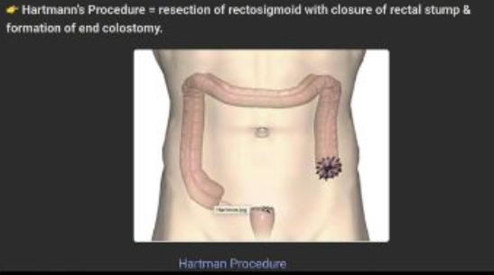

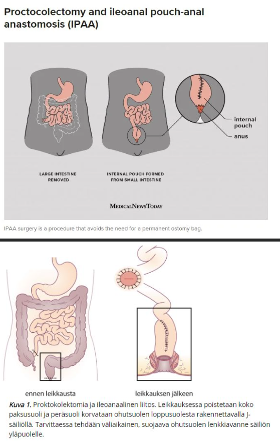
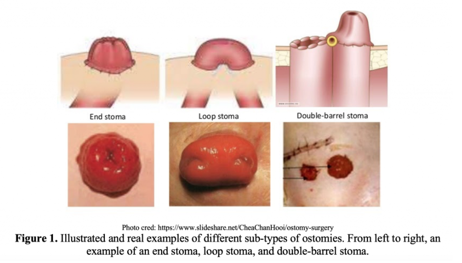
  

## Potilastapaus

Olet päivystävänä lääkärinä sairaalassa. Päivystykseen tulee kalpea, kipeän oloinen herra, jolla on kova selkään ja nivusiin säteilevä vatsakipu. Potilas pyörtyi ja heräämisen jälkeen hän koki voivansa huonosti. Myös kipu alkoi pyörtymisen yhteydessä. Miten EI pidä toimia?

- a. Mietin, että kuulostaa virtsatiekiveltä ja potilaalla onkin virtsassa eryt +. Anna potilaalle kipulääkereseptin ja kotiutan potilaan. Lisäksi kerron, että vaiva kyllä korjaantuu todennäköisesti, kun virtsatiekivet ovat tulleet pois virtsajohtimesta 
- b. TT-kuvauksessa on diagnoosina rupturoitunut abdominaaliaortan aneurysma. Tämän vuoksi kutsun paikalle verisuonikirurgian päivystäjän ja anestesiapäivystäjän. Lisäksi välitän tiedon potilaasta päivystysleikkausyksikköön. Anestesiapäivystäjää odotellessa potilas on verenpaineseurannassa. Korjaan verenpainetta vain, jos potilaan tajunnan taso alkaa huonontua. 
- c. Tutkin potilaan kiireisenä potilaana ja pyydän ultraäänitutkimuksen tai jos mahdollista kiireisen vatsan TT-kuvauksen. 
- d. TT-kuvauksessa on diagnoosina rupturoitunut abdominaaliaortan aneurysma. Tämän vuoksi kutsun paikalle verisuonikirurgian päivystäjän ja anestesiapäivystäjän. Lisäksi välitän tiedon potilaasta päivystysleikkausyksikköön

  <button class="solution-button" data-label="Vastaus" data-hide-label="Piilota vastaus">
    Vastaus
  </button>
  

      a
      
Vatsa-aortan aneurysman repeämälle (RAAA) tyypillistä on äkillisesti alkanut vatsakipu, joka säteilee selkään. Kipu voi joskus säteillä kylkeen, nivustaipeisiin, kiveksiin tai reiden yläosiin. Alkuvaiheessa voi oireena olla myös pyörtyminen (Jos repeäminen tapahtuu vatsaontelon takaiseen retroperitoneaalitilaan, vuoto ja kipu voi aiheuttaa ensin potilaan tajunnanmenetyksen, mutta vuoto voi tamponoitua ja potilas palaa sitten tajuihinsa tamponaation aiheuttaman vuodon vähenemisen seurauksena. Tila stabiloituu hetkeksi, kunnes vuoto taas jatkuu. Jos repeämä on aneurysman etuseinässä ja vuoto pääsee vapaaseen vatsaonteloon, potilas usein kuolee ennen kuin hän ehtii sairaalaan). Nämä kaikki sopivat potilaan tilanteeseen hyvin. 

b: Leikkausta edeltävä nesteresuskitaatio pyritään optimoimaan siten, että potilas on kontrolloidussa hypotensiossa (hypotensiivinen hemostaasi, systolinen verenpaine 50–70 mmHg) ja leikkaussaliin siirrytään mahdollisimman nopeasti. Tämän takia verenapinetta ei tarvitse korjata, ellei tajunnan taso lähde rommaamaan. Ennen leikkausta systolista verenpainetta ei ole tarkoituksenmukaista nostaa yli 90 mmHg:n. **Perussääntönä voidaan pitää, että jos potilas kommunikoi, verenpaine on hyväksyttävällä tasolla, vaikka se olisi kuinka matala tahansa.**

c: Vatsa-aortan anuerysmassa tehdään aina leikkaustekniikan päättämisen tueksi varjoainetehosteinen TT, ja tämä tehdään mahdollisuuksien mukaan myös rupturoituneessa AAAssa, koska vatsa-aortan repeämää epäiltäessä ultraäänitutkimus ei tyypillisesti ole riittävä. Hätätilanteessa kuitenkin ei aina ole aikaa/mahdollisuutta TT:lle ja ultra voi jäädä ainoaksi kuvantamistutkimukseksi. 

d: Rupturoituneet vatsa-aortat tyypillisesti leikkaa verisuonikirurgi. Anestesiapäivystäjä myös tietysti tarvitaan paikalle potilaan elintoiminnoista huolehtimiseen ja potilaan saattamiseen toimenpidevalmiiksi. Kaikki RAAA-potilaat otetaan TYKSissä hybridisaliin 14 sulkupallovalmiudessa (REBOA, resuscitative endovascular balloon occlusion of the aorta). Repeytynyt vatsa-aortan aneurysma hoidetaan periaatteessa samalla toimenpidetekniikalla kuin repeytymätön aneurysma eli suonensisäinen hoito tehdään, jos se on saatavissa ja potilaan anatomia soveltuu stenttiproteesin asennukseen. Suonensisäinen hoito voidaan tehdä paikallispuudutuksessa yhdistettynä sedaatioon. Toimenpiteessä stenttiproteesi avataan munuaisvaltimoiden alapuoliseen aorttaan sulkupallon alapuolelle, ja sulkupallo siirretään munuaisvaltimoiden alapuolelle stenttiproteesin sisään heti, kun se on mahdollista. 
  

## Mihin allaolevista EI liity pahanlaatuistumisen riskiä nykytiedon mukaan?

- a. Komplisoitumaton divertikuliitti 
- b. Barretin ruokatorvi 
- c. Tynkämaha 
- d. Colonin adenooma

  <button class="solution-button" data-label="Vastaus" data-hide-label="Piilota vastaus">
    Vastaus
  </button>
  

      a
      
Jos potilaalla on komplisoitunut divertikuliitti (absessi, peritoniitti, fisteli, suolitukos), niin tulee suorittaa jatkossa kontrollitutkimuksena kolonoskopia rauhallisessa vaiheessa (n. 1kk jälkeen akuutista tulehduksesta). Tulee varmistaa, ettei kyseessä ole paksusuolisyöpä, jonka olisi ajateltu olevan divertikuliitti TT-kuvassa. N. 10%:lla potilaista onkin oikeasti maligniteetti. Komplisoitumattomassa divertikuliittissa ei ole todettu olevan tällaista riskiä, jonka takia kontrollitutkimuksia ei tarvita. 

b: Barretin esofagukselle on tyypillistä ruokatorven alaosien mukoosan intestinaalinen metaplasia (ei-keratinisoiva kerrostunut levyepiteeli muuttuu non-siliaariseksi lieriöepiteeliksi, jossa on pikarisoluja). Tämä tapahtuu tyypillisesti vasteena pitkäaikaiselle refluksitaudille, kun ruokatorven mukoosa muuttuu paremmin hapokasta refluksia kestäväksi. 

Ruokatorven adenokarsinooma kehittyy lähes aina Barretin esofaguksen kautta (metaplasia-dysplasia-karsinoomasekvenssi). N. 3-5%:lla potilaista Barretin ruokatorvi voi edetä ruokatorven adenokarsinoomaksi eliniän aikana. 

c: Tynkämaha eli resekoitu mahalaukku (esim. lihavuusleikkaus) lisää riskiä mahasyövälle. Tyypillisesti ilmenee n. 15–20 vuoden kuluttua operaatiosta. 

d: Paksusuolen adenoomat ovat polyyppityyppi (toiset ovat hyperplastisia polyyppejä), jotka voivat adenooma-karsinoomasekvenssin kautta malignisoitua. Erilaisilla polyypeillä on eriasteiset malignisoitumisriskit, mutta niitä ei voi luotettavasti erottaa kolonoskopian yhteydessä toisistaan, jonka takia ne tyypillisesti pyritään poistamaan. Tavallisesti poisto tapahtuu endoskooppisesti polypektomialla slingalla (EMR eli endoskooppinen mukoosaresektio) tai biopsiapihdillä (ESD eli endoskooppinen submukosaalinen dissektio). 
  

## Potilastapaus

Potilasta on puukotettu noin 1 cm vasemman nännin alamediaalipuolelle pitkällä fileerausveitsellä. Tullessa ensiapuun RR 100/80, pulssi 110/min, SaO2 huoneilmalla 98%. Natiivi-thx –kuva on otettu akuuttihoitohuoneessa istuen ja siinä näkyy vähäinen ilmarinta noin 1,5 cm apexissa ja nestettä vasemmassa pleurassa nousten kutakuinkin mamillatasolle. Hemoglobiini on astrupissa 85. Potilaalla on varfariinihoito mekaanisen keinoläpän vuoksi ja INR on 4,5. Puuttumatta nyt muihin hoitolinjauksiin, mitä teet AK-hoidon suhteen?

- a. tauotan varfariinihoidon ja kontrolloin INR-arvon seuraavana päivänä 
- b. tauotan varfariinihoidon, annan hyytymistekijäkonsentraattia, kontrolloin INR-arvon annostelun jälkeen 
- c. tauotan varfariinihoidon, annan K-vitamiinia ja tarkistan INR –arvon annostelun jälkeen, aloitan LMWH –siltahoidon 
- d. potilaalla on indikaatio AK-hoidolle, en tauota

  <button class="solution-button" data-label="Vastaus" data-hide-label="Piilota vastaus">
    Vastaus
  </button>
  

      b
      
Potilaalla on läpäisevä rintakehävamma, alkavaa hemodynamiikan epästabiliteettia ja selvästi hemopneumothorax sekä hemoglobiinin laskua. Kyseessä on siis henkeä uhkaava verenvuoto ja varfariinivaikutus on kumottava nopeasti. 

Varfariinin nopea kumoaminen onnistuu hyytymistekijäkonsentraatilla (PCC, protrombiinikompleksikonsentraatti), joka kumoaa varfariinin n. 10-30 minuutissa. 

a: Aivan liian hidasta, koska potilas vuotaa nyt eikä enää huomenna jos vuoto jatkuu. 

c: Hitaammin varfariinin vaikutus voidaan kumota K-vitamiinilla (voidaan turvata oman hyytymistekijäsynteesin käynnistyminen 6–12 tunnin kuluessa; vaikutus voi myös alkaa aikaisemmin lähteestä riippuen n. 2h kohdalla). Tarvittaessa voidaan käyttää myös jääplasmaa. Tämä ei kuitenkaan näin vaarallisessa tilanteessa riitä vähentämään verenvuotoa. 

d: Potilaalla kylläkin on indikaatio AK-hoidolle ja tärkeäkin sellainen. Akuutti verenvuoto kuitenkin ottaa prioriteetin potilaan terveyden suhteen, jos potilas vuotaa hengenvaarallisesti.      
  

## Millaisin tervekudosmarginaalein suositellaan PAD:lla varmistetun melanooma in situn poistoa?

- a. 1-2 cm Breslow’sta riippuen 
- b. 1 cm 
- c. Diagnostinen marginaali 1-2 mm 
- d. 5 mm

  <button class="solution-button" data-label="Vastaus" data-hide-label="Piilota vastaus">
    Vastaus
  </button>
  

      d
    
Todetun melanooman tärkein hoito on melanooman poisto tai biopsia-arven re-ekskisio (0.5)1-2 cm marginaalilla Breslow-paksuuden mukaan. Syvyyssuunnassa poisto on aina faskiatasoon asti. Yleensä kyseessä on biopsia-arven re-ekskisio, koska melanooman diagnostinen näyte on yleensä koko ihomuutoksen poisto veneviillolla (vain liian laajat muutokset / hankalat anatomiset alueet biopsioidaan stanssibiopsialla). 
 

  

## Potilastapaus

Terveyskeskusvastaanotollesi tulee 25-vuotiaalla mies, koska hänen vasen kiveksensä on suurentunut ja kipeä. Tunnet palpoiden siinä patin. Et ole avain varma patin etiologiasta. Potilas vakuuttaa, että uskoo patin tulleen kaksi vuotta sitten, kun tipahti pyörän tangolle. Mitä teet?

- a. kontrolloit palpaatiolöydöksen 3-6kk:n päästä 
- b. laitat lähetteen laboratorioon hCG, LD, ja AFOS-tutkimuksia varten 
- c. tilaat kivespussin UÄ-tutkimuksen 
- d. saat ostopalveluna vatsan tt-tutkimuksen ja tilaat sen

  <button class="solution-button" data-label="Vastaus" data-hide-label="Piilota vastaus">
    Vastaus
  </button>
  

      c
    
Kivessyövät ovat länsimaissa 15-40-vuotiaiden miesten yleisin maligniteetti (vuodesta riippuen Suomessa n. 110-160 tapausta). Suurentunut kives ja palpoituva resistenssi herättää epäilyn kivessyövästä. Kivessyöpä on useimmiten kivuton, mutta kivuliaisuus ei ole harvinaista.  

Ensisijainen kivestuumorin selvittelyssä käytettävä tutkimus on UÄ; herkkyys on lähes 100%. Kaikkia kiveksensisäisiä palpoitavia muutoksia on pidettävä kivessyöpänä, kunnes toisin on osoitettu -> tilaa UÄ jos epäilet kiinteää kasvainta tai jos kliininen arvio kivespussin resistenssistä jää epävarmaksi. Kivessyöpäepäilystä ei oteta UÄ-ohjattua neulabiopsiaa (altistaa syövän leviämiselle), vaan UÄ-löydöksen viitatessa syöpään edetään usein suoraan radikaaliin orkiektomiaan (koko kiveksen ja siemennuoran poisto kalvostoinaan).

a: Kivessyöpäepäilyä ei voi jäädä seuraamaan pelkällä palpaatiolla, se vaatii UÄ-kuvantamisen. 

b: Kivessyövän diagnostiikassa on kylläkin apua syöpämerkkiaineista, mutta niitä ei oteta rutiinisti TK:ssa (normaalit merkkiainepitoisuudet eivät poissulje kivessyövän mahdollisuutta) eivätkä ne ole ensisijaisia _diagnostisia_ tutkimuksia (kuten UÄ). Tyypillisimmin mitattavat merkkiaineet verestä ovat AFP (alfafetoproteiini), HCG (istukkagonadotropiini) ja LDH (laktaattidehydrogenaasi). Nämä tutkitaan tyypillisesti erikoissairaanhoidossa ennen ja jälkeen orkiektomian ja myös seurannan yhteydessä. 

d: Mikäli ultraäänitutkimus viittaa vahvasti kiveksen maligniteettiin, on syytä tehdä levinneisyystutkimuksena vartalon tietokonekerroskuvaus (TT). Pelkällä vatsan TT:llä ei oikein ole roolia kivessyövän diagnostiikassa eikä varsinkaan ennen UÄ-tutkimusta. 
  

## Potilastapaus

67-vuotias mies tulee vaimonsa kanssa vastaanotolle, koska miehellä oli kolme viikkoa sitten yhden päivän kestänyt makroskooppinen verivirtsaisuus. Nyt virtsa on ollut täysin normaalin väristä. Miehellä ole ollut minkäänlaisia virtsaamisvaivoja verivirtsaisuuden aikana, eikä sen jälkeenkään. Mitä teet?

- a. Tuseeraan potilaan ja teen hänelle virtsaelinten UÄ-tutkimuksen. Jos tutkimuksessa havaitaan poikkeavaa, teen lähetteet erikoissairaanhoitoon urologialle. 
- b. Tuseeraan potilaan ja tilaan hänelle virtsan sytologia-tutkimuksen, joka perustuu patologin arvioon virtsaan irtoavista soluista. Jos tutkimuksessa havaitaan poikkeavaa, teen lähetteen erikoissairaanhoitoon urologialle. 
- c. Teen lähetteen erikoissairaanhoitoon urologialle. 
- d. Tuseeraan potilaan ja kehotan häntä tulemaan heti uudestaan, jos makrohematuria uusiutuu.

  <button class="solution-button" data-label="Vastaus" data-hide-label="Piilota vastaus">
    Vastaus
  </button>
  

      c
      
Yleisin uroteelisyövän oire on verivirtsaisuus, jota on ainakin 85 %:lla rakkosyöpäpotilaista. Verivirtsaisuus voi olla makroskooppista eli silminnähtävää tai mikroskooppista eli virtsakokeen paljastamaa. **Makroskooppisen hematurian mahdollinen väistyminen tai lieväasteisuus eivät poissulje pahanlaatuista uroteelikasvainta.** Makroskooppinen hematuria vaatii lähes aina urologisia selvittelyitä ja ensisijainen tutkimus on pääsääntöisesti kystoskopia (etsitään rakkosyöpää). 

a, b, d: Kaikissa vaihtoehdoissa urologiset jatkotutkimukset ja siten kystoskopia tapahtuvat vain tiettyjen ehtojen jälkeen. Tässä tapauksessa ei tarvitse enää löytää mitään muuta syytä kystoskopialle, koska sen indikaatio on jo täyttynyt (makroskooppinen hematuria, joka ei selity nuoren naisen virtsatieinfektiona). 

Potilaan tosin kyllä saa tuseerata, sillä sen ainoat kontraindikaatiot ovat, että tutkijalla ei ole sormea tai potilaalla ei ole rectumia.  

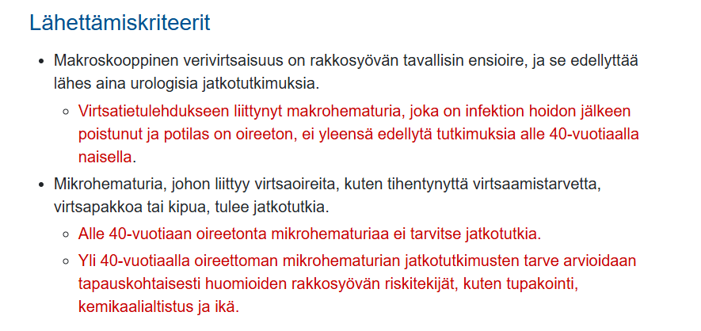

  

## Potilastapaus

78-vuotiaalla potilaalla virtsasuihkun voima heikentynyt, nokturiaa 3 kertaa, lisäksi urge-oiretta ja tunnetta, että rakko ei tyhjene kunnolla. PSA 5,6 ug/l vapaan prosenttiosuus 12%. Tuseeraten eturauhanen on suurentunut ja sileä. Aloitat potilaalle dutasteridin. Milloin kontrolloit, onko lääke auttanut?

- a. Puolen vuoden kuluttua lääkkeen aloittamisesta 
- b. Dutasteridin aloittamisen jälkeen ei tarvita kontrollia 
- c. Vuoden kuluttua lääkkeen aloittamisesta 
- d. Kuukauden kuluttua lääkkeen aloittamisesta

  <button class="solution-button" data-label="Vastaus" data-hide-label="Piilota vastaus">
    Vastaus
  </button>
  

      a

Potilaalla on hyvin todennäköisesti **eturauhasen hyvänlaatuinen hyperplasia (BPH).** Sille on tyypillistä "kerääntymisoireet" eli tihentynyt virtsaamistarve (pollakisuria), nokturia (yöllinen virtsaamistarve) ja pakkoinkontinenssi (urge-oire). Eturauhasen hyvänlaatuisen hyperplasian (BPH) kerääntymisoireiden taustalla on tavallisesti detrusorlihaksen hyperrefleksia johtuen suurentuneesta rakkopaineesta (prostata estää virtausta rakosta -> kohonnut paine rakossa) ja prostatahyperplasian aiheuttamien uretran muutosten aikaansaamasta sensorisesta ärsytyksestä. BPH:ssa ilmenee myös "tyhjennysoireita", joita ovat esim. virtsantulon viipyminen, heikentynyt virtsasuihku, ponnistelun tarve virtsatessa, virtsauksen keskeytyminen, rakon epätäydellisen tyhjenemisen tunne sekä vaikeimmassa tapauksessa jopa virtsaumpi. Palpaatiossa eturauhanen on kyhmytön, aristamaton ja suuri, jonka takia keskiuurretta voi olla vaikea tuntea. 

Komplisoitumattomien BPH-potilaiden virtsaamisoireita hoidetaan ensisijaisesti lääkehoidolla. Ensisijaisia lääkkeitä ovat alfasalpaajat (alfa-adrenoreseptoriantagonistit) ja 5-alfareduktaasin estäjät (5-ARI). Alfasalpaajat (esim. tamsulosiini tai alfutsosiini) vaikuttavat rentouttamalla prostaattisen virtsaputken ja virtsarakon kaulan sileää lihaksistoa. Ne lievittävät nopeasti oireita (hoitovasteen arviointi tyypillisesti n. 1-3kk kohdalla), lisäävät virtsasuihkun huippuvirtaamaa ja vähentävät jäännösvirtsan tilavuutta. 

5-alfareduktaasin estäjät (esim. dutasteridi tai finasteridi) vaikuttavat eturauhasen liikakasvuun estämällä testosteronin metaboloitumista dihydrotestosteroniksi (DHT), jolloin seerumin DHT:n pitoisuus pienenee. Tämä johtaa eturauhasen koon pienenemiseen ja oireiden lievittymiseen. Myös rakon ulosvirtauskanavan ahtauma pienenee eturauhasen koon pienentyessä. **5-ARI-lääkkeillä teho tulee hitaammin kuin alfasalpaajilla, jonka takia niiden vasteen arvioiminen suoritetaan myöhemmin (6kk kohdalla) kuin alfasalpaajilla.** 5-alfareduktaasin estäjiä (5-ARI) voidaan käyttää yhdessä alfasalpaajien kanssa, jolloin lääkkeiden teho paranee. _Jos olet hoitanut BPH-potilasta lääkkeellisesti 6kk PTH:ssa, mutta oireet ovat potilaalla vieläkin vaikeahkot, niin tee lähete ESH._

Potilaan PSA:sta huomio: Jos PSA on 2-15µg/l, niin lasketaan automaattisesti vapaa-PSA/kokonais-PSA-suhde, joka auttaa eturauhassyövän diagnostiikassa. Syöpäsolut tuottavat sitoutunutta PSA:a, jonka seurauksena suhde laskee ja tämä voi olla vihje eturauhassyövästä. Jos välillä 4-10 suhde <10%, on riski syövälle yli 50%. Jos suhde on >25%, niin riski alle 10%. Potilaan PSA:n ollessa 10-15% on riski n. 28%.

  

## Potilastapaus

Vastaanotollesi tulee potilas, joka on Kannasta lukenut sairauskertomuksiaan. Hän kysyy sinulta, millainen toimenpide hänelle on sairaalassa tehty. Toimenpiteenä Kannan tietojen mukaan on ollut rec: a. poplitea-a. dorsalis pedis CVA converted l. dx. Mikä seuraavista väittämistä on VÄÄRIN?

- a. Kerrot, että potilaan valtimo-ohitus oikealle on tehty omalla laskimosuonella 
- b. Kerrot, että ohitesuoni on ohituksen yhteydessä käännetty, jotta laskimoläpät eivät estä valtimovirtausta 
- c. Kerrot potilaalle, että nyt on tullut väärä käsitys. Oikeasti hänelle on tehty pallolaajennus kahteen oireisen oikeaan jalan suoneen 
- d. Kerrot, että ohitusleikkaus oikealle on tehty polvitaivevaltimosta jalkaterän pieneen valtimoon

  <button class="solution-button" data-label="Vastaus" data-hide-label="Piilota vastaus">
    Vastaus
  </button>
  

      c

Kannan tekstissä lukee siis, että on tehty ohitus (rec, reconstructio), polvitaivevaltimosta (a. poplitea) jalkapöydän valtimoon (a. dorsalis pedis) potilaan omaa laskimograftia käyttäen (CVA, cum venam autogenam), laskimo on käännetty (converted; läppiä ei siis tuhottu, mutta kääntäminen mahdollistaa sen, että läpät eivät estä virtausta. Jos olisi converted sijaan in situ, niin läpät olisi tuhottu) ja toimenpide on tehty oikealla (l. dx eli laterum dextrum; l. sin eli laterum sinistrum taas olisi vasen). 

a: Polven alapuolisiin valtimoihin tehtävissä ohituksissa ohitusmateriaalin valinta on ratkaiseva ja ensisijainen on potilaan oma laskimo (autologinen grafti), koska potilaan oma laskimo pysyy parhaiten auki ja infektioriski on pienempi. Vena saphena magna on aukipysyvyydeltään ylivoimainen (otetaan ensisijaisesti samasta alaraajasta kuin minne toimenpide tehdään); säären ja jalkaterän valtimo-ohituksissa tulisi aina käyttää potilaan omaa laskimoa

b: Pinnallisissa laskimoissa (kuten juuri todennäköisesti käytetyssä vena saphena magnassa) on läppiä, jotka estävät takaisinvirtausta (näiden läppien vajaatoiminta aiheuttaa laskimovajaatoimintaa ja johtaa mm. suonikohjuihin). Jos suonea ei käännettäisi tai läppiä tuhottaisi, niin läpät estäisivät virtausta toivottuun suuntaan eli valtimosuuntaan, kun laskimoa käytettäisiin ohitusgraftina. 

c: Tästä ei ole viitteitä tekstissä. Pallolaajennusta tulee harkita ensimmäiseksi hoitovaihtoehdoksi, kun kysymyksessä on lyhyt valtimomuutos tai potilaan elinajanennuste on lyhyt ja leikkausriski on suuri. Leikkausta (endarterektomia tai ohitusleikkaus) taas tulee harkita ensimmäisenä hoitovaihtoehtona pitkissä, diffuuseissa valtimomuutoksissa, kun polvitaivevaltimon ulosvirtausvaltimot ovat tukossa ja leikkausriski on kohtuullinen, kunhan potilaalla on ohitusmateriaaliksi sopiva laskimo. 

d: Vaskulaariset ohitusleikkaukset nimetään anatomisin perustein proksimaalisesta valtimosta distaaliseen valtimoon. Tekstissä lukee a. poplitea-a. dorsalis pedis eli ohitus on a. popliteasta ADP:hen. 
  

## Leikkaamattoman mahan okkluusion syynä on todennäköisimmin

- a. kiinnikkeet 
- b. sappikivi 
- c. sigmavolvulus 
- d. paksusuolisyöpä

  <button class="solution-button" data-label="Vastaus" data-hide-label="Piilota vastaus">
    Vastaus
  </button>
  

      d

Erityisesti vanhemman ihmisen leikkaamattoman mahan okkluusio on koolonkarsinooman aiheuttama, kunnes toisin osoitetaan. 

a: Länsimaissa ohutsuolen tukoksen (SOB) selvästi yleisin syy on kiinnikkeet, mutta ne tulevat tyypillisesti aikaisemmasta leikkauksesta. 

b: Sappikivi ei oikein aiheuta tyypillisesti suolen okkluusiota. On mahdollinen esimerkiksi sekundaarisena kolekystiitille, jonka yhteydessä tapahtuu sappirakon perforaatio duodenumiin ja muodostuu kolekystoduodenaalinen fisteli. Fisteliä pitkin suoleen pääsee suuri sappikivi, joka voi kulkea mm. iliokekaaliseen junktioon ja tukkia sen johtaen suoliobstruktioon (ns. sappikivi-ileus). 

c: Volvulus eli suolen kiertyminen oman suolilipeensä ympärille voi johtaa affisioituneen suolen alueen (yleisimmin sigma vanhuksilla; keskisuolessa pikkulapsilla ja cecumissa nuorilla aikuisilla) obstruktioon ja jopa infarktiin. Voi ilmentyä leikkaamattomassa vatsassa, mutta ei kuitenkaan ole todellakaan yleisin syy mahan okkluusiolle.
  

## Potilastapaus

Ensiapuun tulee 75-vuotias mies, jolla todetaan hankala virtsatietulehdus. Prostata on jkv suurentunut, mutta aristamaton ja kyhmytön, pehmeä. Potilas kertoo, että viime aikoina tullut ilmaa virtsatessa virtsaputken kautta. Potilaalle ohjelmoidaan ensisijaisesti:

- a. Virtsaelinten TT
- b. Kolonoskopia/Kolon TT 
- c. Päivystysleikkaus 
- d. Eturauhasselvittelyt

  <button class="solution-button" data-label="Vastaus" data-hide-label="Piilota vastaus">
    Vastaus
  </button>
  

      b

Pneumaturia eli ilma virtsassa viittaa vahvasti kolovesikaalifisteliin eli yhteyteen koolonista (tai muusta suolen osastakin mahdollisesti) rakkoon. Suolessa on ilmaa, joka pääsee fisteliä pitkin rakkoon ja tämä havaitaan ilmana virtsaputken kautta virtsatessa. Fisteli ilmenee myös toistuvina virtsatieinfektioina (bakteereita suolesta rakkoon) ja mahdollisesti jopa ulosteina virtsassa (tulee kysyä suoraan potilaalta). 

Yleensä tämän aiheuttajana on reikä sigman huipusta virtsarakkoon divertikkeliperforaation takia. Diagnostinen tutkimus on kolonoskopia tai koolonin TT-kuvantaminen. 

a: Ensisijainen syy on suolistoperäinen ja tämän takia tutkimuskin kohdistuu sinne. 

c: Päivystysleikkaukselle ei ole aihetta, ellei potilas ole septinen tai peritoniitissa

d: Ei aiheellinen nyt ensisijaisesti, koska prostata on kliinisesti normaali ja pneumaturia ei johdu prostatan ongelmista.
  

## Malignin melanooman diagnostisessa poistossa on tärkeintä

- a. poistaa muutos ja saada selville melanooman paksuus. 
- b. ulottaa poisto lihasfaskian tasoon. 
- c. saada mahdollisimman laajat marginaalit. 
- d. Kaikki kysymyksen vastausvaihtoehdot ovat oikein.

  <button class="solution-button" data-label="Vastaus" data-hide-label="Piilota vastaus">
    Vastaus
  </button>
  

      a
      
Melanooman diagnostisessa ekskisiossa tuumorimuutos poistetaan jo primaarivaiheessa kokonaan 1-2 mm:n kliinisin terveen kudoksen marginaalein veneviillosta ihonalaiseen rasvakerrokseen asti. Tämä lähetetään tutkimuksiin PAD-lausuntoa varten ja lausunnossa tärkein asia on Breslow'n mitta eli melanooman invaasion syvyys. 

b: Melanooman hoidollisessa poistossa on tärkeää poistaa muutos lihasfaskiaan asti, mutta diagnostisessa ekskisiossa poisto on niin, että mukana on vain hieman ihonalaista rasvaa. 

c: Marginaalit ovat n. millin pari, tavoitteena on siis saada koko muutos poistettua. Ei tarvitse alkaa suoraan mittailemaan marginaaleja, mutta kunhan silmämääräisesti koko muutos on poistettu, niin poisto on hyvä. 
  

## Potilastapaus

54-vuotiaalla potilaalla virtsasuihkun voima heikentynyt, nokturiaa 2 kertaa, ja tunnetta, että rakko ei tyhjene kunnolla. PSA 2,6 ug/l. Tuseeraten eturauhanen suurentunut ja sileä. Aloitat potilaalle tamsulosiinin. Milloin kontrolloit, onko lääke auttanut?

- a. Puolen vuoden kuluttua lääkkeen aloittamisesta 
- b. Vuoden kuluttua lääkkeen aloittamisesta 
- c. Tamsulosiinin aloittamisen jälkeen ei tarvita kontrollia 
- d. Kuukauden kuluttua lääkkeen aloittamisesta

  <button class="solution-button" data-label="Vastaus" data-hide-label="Piilota vastaus">
    Vastaus
  </button>
  

      d

Käyty jo aikaisemmassa hyvin samanlaisessa kysymyksessä asia läpi, joten katso sieltä, jos haluat verrata vastausta dutasteridin kontrollointiaikaan (n. 6kk päästä). Tamsulosiini on alfasalpaaja (selektiivinen alfa1-reseptorin antagonisti; samoin myös alfutsosiini) ja se vaikuttaa selvästi nopeammin kuin 5-alfareduktaasin estäjät (esim. dutasteridi tai finasteridi), mutta se ei pienennä eturauhasen kokoa. Alfasalpaajat vaikuttavat rentouttamalla prostaattisen virtsaputken ja virtsarakon kaulan sileää lihaksistoa ja tämän takia vaikutus ilmenee nopeasti. Vasteen kontrollointi voidaan täten tehdä n. kuukauden kuluttua. 

  

## Potilastapaus

Vastaanotollasi on perusterve 35-vuotias mies, jolle on reiden alueelle kasvanut vuoden sisällä noin 7 cm halkaisijaltaan oleva kivuton pehmytkudospatti. Muutos on varsin tarkkarajainen ja kliinisesti sopisi lipoomaan. Miten toimit?

- a. Teen lähetteen erikoissairaanhoitoon 
- b. Teen lähetteen ultraäänitutkimukseen ja pyydän paksuneulabiopsian 
- c. Sovin kontrollikäynnin puolen vuoden päähän 
- d. Poistan lipooman ja otan PAD-näytteeksi

  <button class="solution-button" data-label="Vastaus" data-hide-label="Piilota vastaus">
    Vastaus
  </button>
  

      a

Mikäli pehmytkydoskasvain on mobiili, pehmeä, hitaasti kasvanut, ihonalainen ja alle 5 cm:n läpimittainen, se on hyvin todennäköisesti hyvänlaatuinen. Jos taas nämä eivät täyty ja muutos on kliinisesti pahanlaatuinen (kuten tässä, koska kasvanut nopeasti ja on >5cm), niin ei voi jäädä pelkälle seurantakannalle, vaan tulee tehdä lähete plastiikkakirurgille.

b: Jos muutos olisi kliinisesti poikkeava eli <5cm, mutta ei mobiili tai nopeakasvuinen, niin voitaisiin tehdä kaikukuvaus ja sen perusteella jatkaa. Jos UÄ:ssä muutos olisi ihonalainen ja hyvänlaatuinen, niin se voitaisiin poistaa TK:ssa, jos se vaikuttaisi helposti poistettavalta. Pahanlaatuisuuden merkkien ollessa läsnä UÄ:ssä tehtäisiin lähete plastiikkakirurgille. 

c: Muutos ei ole kliinisesti hyvänlaatuinen, joten ei voi ehdottaa pelkkää seurantalinjaa. 

d: Kliinisesti pahanlaatuiset pehmytkudoskasvaimet tulee lähettää ESH. 

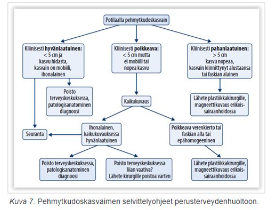
  

## Potilastapaus

62-vuotias mies tulee vastaanotollesi. Hänellä on verenpainetauti ja tyypin 2 diabetes. Kolme kuukautta sitten kirjoitit hänelle sildenafil-reseptin erektiohäiriöön. Kertoo, että auttoi erektioon kohtalaisen hyvin, mutta ei voi käyttää lääkettä, koska saa siitä kovan päänsäryn. Seksuaalisuus on hänelle erittäin tärkeää ja hän toivoo ratkaisua. Mitä teet?

- a. Päänsärky ei ole tyypillinen haittavaikutus sildenafiilille ja kannustat potilasta jatkamaan sen käyttöä 
- b. Esittelet miten geelimuotoista PGE1-analogia käytetään ja kirjoitat siitä hänelle reseptin 
- c. Lähetät potilaan erikoissairaanhoitoon 
- d. Esittelet miten pistettävää PGE1-analogia käytetään ja kirjoitat siitä hänelle reseptin

  <button class="solution-button" data-label="Vastaus" data-hide-label="Piilota vastaus">
    Vastaus
  </button>
  

      b

Useimmiten erektiohäiriöiden ensisijainen lääkkeellinen hoito on PDE5-estäjä, kuten sildenafiili (lyhytvaikutteisempi) tai tadalafiili (pitkävaikutteisempi). Näitä voi myös mahdollisesti yhdistellä vaikeassa erektiohäiriössä (esim. siltsua 100mg ennen yhdyntää ja pitkävaikutteisempi tadalafiili 5mg päivittäin pohjalla). 

Jos nämä eivät auta tai ovat vasta-aiheisia (esim. potilas käyttää nitraatteja; lääkkeillä on synergistinen vaikutus ja voi aiheuttaa vaarallisen tasoista vasodilataatiota ja verenpaineen romahtamisen) tai ilmenee merkittäviä haittoja (yleisimpiä ovat juuri vasodilataation liittyvät päänsärky, huimaus, verenpaineen lasku ja naaman punoitus), niin voidaan kokeilla paikallisesti annosteltavia lääkkeitä. Näitä ovat esim. intrakavernoottinen injektiohoito tai siittimen kärkeen annosteltava voide (molemmat yleensä alprostadiilia eli synteettistä prostaglandiini E1:tä); näiden vaikutus ei riipu seksuaalisesta kiihottumisesta. **Geelin ruiskuttaminen kärkeen voi olla helpompaa opettaa ja miellyttävämpää käyttää, joten sitä voi miettiä ensisijaisena näistä;** se vain ei ole aivan yhtä tehokas kuin injektiohoito, joka on kaikkein tehokkain lääkehoito erektiohäiriöön. Jos injektiohoidon päätyy määräämään potilaalle, niin se tulisi kerran toteuttaa vastaanotolla ja antaa tarkat ohjeet injektioiden suorittamiseen.

a: Päänsärky on tyypillinen haittavaikutus ja jos se häiritsee potilasta, niin voidaan yrittää toisiakin hoitokeinoja, kuten juuri paikallishoitoa alprostadiililla. 

c: Potilasta voi hyvin vielä yrittää hoitaa perusterveydenhuollossa, kunhan vain tietää mitä on määräämässä. 

d: Intrakavernoottinen injektiohoito on äärimmäisen tehokas erektiohäiriön hoitokeino, mutta se vaatii opettamista ja geelihoitoa voi olla helpompaa kokeilla aluksi. 

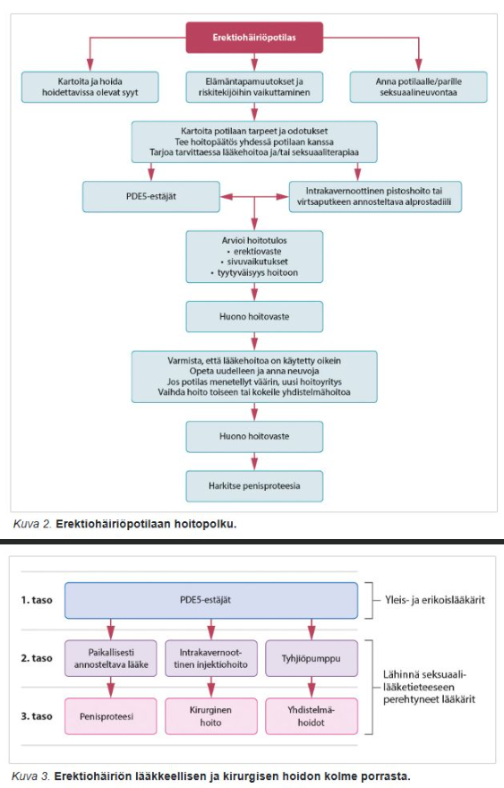
  

## Virtsaretention vuoksi laitan miespotilaalle seuraavanlaisen virtsakatetrin:

- a. kysymyksen kaikki vaihtoehdot ovat oikein 
- b. käyräkärkinen Ch16 Lofric-katetrin 
- c. pyöreäkärkinen Ch16 silikonikatetri, jonka balongiin 10 ml glyseroliliuosta 
- d. pyöreäkärkinen Ch22 silikonikatetri, jonka balongiin 10 ml glyseroliliuosta

  <button class="solution-button" data-label="Vastaus" data-hide-label="Piilota vastaus">
    Vastaus
  </button>
  

      c

Virtsaretention vuoksi usein asetetaan kestokatetri eli balongillinen katetri (täytetty balongi estää katetrin poistumisen rakosta). Kestokatetrin pää on tyypillisesti pyöreä- ja suorakärkinen (Nelaton), mutta voi myös olla käyrän muotoinen eli ns. Tiemann-kärki. Aikuiselle tyypillisesti valitaan Ch 14-16-kokoinen katetri (12 matalimmillaan; huuhteluun tarvittavat kolmitiekatetrit väh. 18 ja usein Ch20–24) ja balongi täytetään 10% glyserolilla (pallon koko vaihtelee katetrin mukaan 5-10 ml:sta 30-50 ml:aan, määrä on merkitty katetripakkaukseen; glyserolia on saatavissa valmiissa 10ml ruiskuissa). 

b: Lofric-katetrit ovat kertakatetreja

d: Mitä isompi katetrin Ch-numero (Charriére), niin sitä paksumpi katetri on. Ch-luku kertoo katetrin ympärysmitan millimetreissä. Katetrin ulkohalkaisija saadaan jakamalla ympärysmitta kolmella, esimerkiksi Ch24-koon katetri on halkaisijaltaan noin 8 mm. French-yksiköt (Fr) tarkoittavat samaa. Tyypillisesti kaksitiekatetrit ovat kooltaan Ch12–16 ja huuhteluun tarvittavat kolmitiekatetrit Ch20–24.
  

## Mikä vastaus on VÄÄRIN? Alaraajan laskimovajaatoiminnan hoidon selkeä indikaatio on:

- a. Alaraajan laskimovajaatoiminnan hoitoon ei ole ehdottomia indikaatioita vaan pintalaskimoiden hoito on aina kosmeettista
- b. Säären laskimoperäinen haava, joka on parantunut kompressiosidonnalla 
- c. Säären alaosan pigmenttimuutokset, jotka liittyvät pintalaskimovajaatoimintaan 
- d. Säären konservatiiviseen hoitoon reagoimaton laskimoperäinen haava

  <button class="solution-button" data-label="Vastaus" data-hide-label="Piilota vastaus">
    Vastaus
  </button>
  

      a

Laskimovajaatoiminta voi aiheuttaa huomattavia komplikaatioita ja näiden hoitaminen ja estäminen on tärkeää. Myös komplisoitumatonta laskimovajaatoimintaakin voidaan siis hoitaa, jos potilaalla on merkittävää haittaa vajaatoiminnasta. Riippumatta siitä tarvitseeko potilas lopulta kajoavaa hoitoa, niin kompressiohoito tulee aloittaa välittömästi PTH:ssa ennen ESH:n arviota. 

Kajoavan hoidon aiheita ja aiheita lähetteelle verisuonikirurgialle ovat merkittävä päivittäinen haitta, komplisoitunut tauti (C4-C6), vuotavat suonikohjut tai toistuvat pintalaskimotukokset/yksi laaja pintalaskimotukos. 

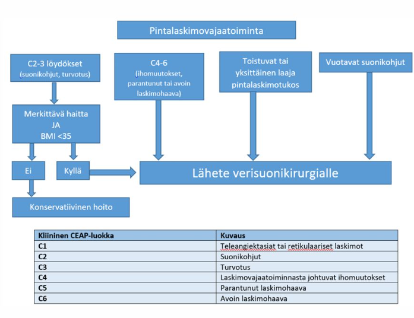
  

## Potilastapaus

58-vuotiaalla miehellä on kehittynyt ruma kliinisesti basalioomaksi sopiva max. 3 mm halkaisijaltaan muutos vasempaan hartiaan. Potilas on muutoin sangen terve, mutta jo vuosia sitten on asennettu mekaaninen aorttaläppäproteesi ja potilaalla on varfariinihoito. INR on pysynyt tasaisena jo vuosikymmenen tasolla 2-3 ja on tämänaamuisessa laboratoriokokeessa 2,1. Miten toimit?

- a. otan ohutneulabiopsian muutoksesta 
- b. tauotan varfariinin, aloitan siltahoidon ja poistan muutoksen veneviillosta noin 5mm marginaalilla INR:n ollessa alle 1,2 
- c. poistan muutoksen veneviillosta PAD:ksi noin 5mm marginaalilla ja ompelen tiiviisti ihon kiinni 
- d. teen päivystyslähetteen plastiikkakirurgialle

  <button class="solution-button" data-label="Vastaus" data-hide-label="Piilota vastaus">
    Vastaus
  </button>
  

      c
      
Pienen basaliooman voi poistaa terveyskeskuksessa ja hoitaa alusta loppuun itse. Hoito on ensisijaisesti 5mm makroskooppisilla marginaaleilla poisto veneviillosta. Tulee muistaa varmistaa PAD-vastaus ja puhtaat marginaalit. Jos sait koko muutoksen poistettua PAD:n mukaan ja leikkeessä on terveet marginaalit, niin hoito oli siinä. Seurantaakaan ei tarvitse, jos marginaalit olivat riittävät. Jos kyseessä on ollut suuren uusiutumisriskin (high grade) basaliooma tai ei-kirurgisesti hoidettu basaliooma, seuranta suunnitellaan harkinnan mukaan hoitavassa yksikössä. Jos basaliooma on leikkauksessa poistettu epätäydellisesti, pitää uusiutumisen ehkäisemiseksi suorittaa joko arven poistoleikkaus tai tilanteen mukaan ei-kirurginen hoito. Pelkkä seuranta ei ole näissä tapauksissa hyväksyttävää. 

a: Basalioomasta ei oteta ohutneulabiopsiaa. Muutoksen poisto kokonaisuudessaan on paras. Jos poisto ei onnistu, niin koepalaksi riittää 3–5 mm:n stanssipala, mutta jos kyseessä on pieni, kliinisesti selvä basaliooma esimerkiksi vartalolla, kannattaa tuumori poistaa kerralla kokonaan riittävin marginaalein. 

b: Potilas on varfariinilla, mutta INR 2,1 on terapeuttinen ja ihokirurgia voidaan turvallisesti tehdä varfariinia tauottamatta, kun kyseessä on pieni pinnallinen toimenpide.

d: Basaliooma ei ole päivystyksellistä hoitoa vaativa asia. Tyvisolusyöpä on käytännössä ystävällisin syöpä, minkä voi saada, koska se ei käytännössä koskaan metastasoi (alle 1% riski). Se vaatii kuitenkin hoitoa, ei vain päivystyksellisesti ESH:ssa. 
  

## Potilastapaus

Potilaalle on tehty oik. puolen hemikolektomia karsinooman takia laparoskooppisesti. Postoperatiivisesti 5 pv leikkauksesta nousee kuume ja vatsa kipeytyy. Leuk 14,6, CRP 150, thx kuvassa basaalisesti atelektaasia vasemmalla. Statuksessa Tax 39, Vatsa aristaa kauttaaltaan, jkv hengenahdistusta. Epäilet ensisijaisesti:

- a. Abskessia 
- b. Virtsatulehdusta 
- c. Lekaasia 
- d. Pneumoniaa

  <button class="solution-button" data-label="Vastaus" data-hide-label="Piilota vastaus">
    Vastaus
  </button>
  

      c

Viidennen päivän ”postoperatiivinen pneumonia” vai sittenkin lekaasi? Saumalekaasi eli suolisauman pettäminen tapahtuu yleisimmin 5. POP (vaihteluväli yleensä 3.- 7. (-10.) POP; myös aikaisempia ja myöhäisempiä). 5. päivän pneumonia onkin siis saumalekaasi, kunnes on toisin todistettu. 

Lekaasin oirekuva voi olla hämäävä ja skaalaltaan laaja, mutta potilaan korkea kuume, koholla olevat tulehdusarvot, diffuusi vatsakipu ja muutenkin yleistilan lasku viittaavat parhaiten lekaasiin ottaen huomioon 5. päivää sitten tapahtuneen hemikolektomian. Yleensä tämä tila johtaa uusintaleikkaukseen. 
  

## Potilastapaus

62-vuotias mies tulee vastaanotollesi, koska haluaa, että hänen PSA arvonsa mitataan. Hänellä ei ole virtsaamisen oireita ja hänen PSA arvoaan ei ole koskaan mitattu? Mitä teet?

- a. Kerrot, että PSA-seulontaa ei suositella ja eväät pelkän PSA-mittaamisen. Tuseeraat potilaan. Jos hänellä tuntuu kyhmy, mittaat PSA:n. Muuten kieltäydyt mittaamisesta. 
- b. Selvität, onko miehellä lähisuvussa eturauhassyöpää. Kerrot, että PSA saattaa olla hyvälaatuisista syistä koholla ja hän saattaa joutua turhaan urologin vastaanotolle, jossa otetaan mahdollisesti koepalat eturauhasesta. Toisaalta tiedät kertoa, että eturauhassyöpä ei välttämättä aiheuta mitään oireita. Jos potilas keskustelun jälkeen haluaa edelleen PSA-mittaukseen, tuseeraat potilaan ja mittaat PSA:n. 
- c. Kerrot, että PSA-seulontaa ei suositella ja eväät PSA:n mittaamisen. 
- d. Selvität, onko miehellä lähisuvussa eturauhassyöpää. Jos ei ole, kerrot, että PSA-mittaus aiheuttaa vain haittaa ja sitä ei tämän vuoksi suositella. Vetoat ylihoitoon ja et näin ollen suostu PSA-mittaukseen. Jos potilaalla on selvästi sukurasitus eturauhassyövälle, tuseeraat potilaan ja mittaat PSA:n.

  <button class="solution-button" data-label="Vastaus" data-hide-label="Piilota vastaus">
    Vastaus
  </button>
  

      b

Suomessa ei ole kansallista eturauhassyövän seulontaohjelmaa ja PSA-arvoa hyödyntävä oireettomien potilaiden seulonta on edelleen kiistanalaista. Testin suurin ongelma ovat harmia aiheuttamattomien syöpien löytymisestä johtuva ylidiagnostiikka ja siihen liittyvät turhat hoidot ja komplikaatiot (esim. erektiohäiriöt ja inkontinenssi). Jos oireettoman miehen PSA-testausta harkitaan, hänelle pitää kertoa eturauhassyövän varhaiseen toteamiseen liittyvistä hyödyistä ja haitoista; ÄLÄ OTA OIREETTOMALTA POTILAALTA PSA-MITTAUSTA KERTOMATTA POTILAALLE AIKOMUKSESTASI JA SEN SEURAUKSISTA (älä sekoita PSA-testin käyttöön osana kliinistä tutkimusta potilaalla, jolla voidaan epäillä eturauhassyöpää). Jos potilas keskustelun jälkeen haluaa edelleen PSA-mittaukseen, tuseeraa potilas ja mittaa PSA. Älä suosittele PSA-testiä oireettomille yli 70-vuotiaille tai miehille, joilla on eliniänodotetta merkittävästi lyhentävä sairaus

a: PSA-seulontaa ei kannata rutiininomaisesti evätä sitä haluavilta, koska siitä voi myös olla merkittäviä hyötyjä potilaan kannalta. Parhaimmassa tapauksessa voidaan löytää kapselin ulkopuolelle levinnyt tai muuten suuren etenemisriskin omaava eturauhassyöpä, jonka radikaali kirurginen tai sädehoito saattaisi parantaa ja siten pelastaa potilaan hengen. Hyvin matala arvo voi myös toimia mieltä rauhoittavana löydöksenä, jos potilas stressaa eturauhassyöpämahdollisuudesta; syöpää ei kuitenkaan koskaan voida varmuudella poissulkea.

Vastauksessa on se osa oikein, että tuseeraat potilaan ja mittaat PSA:n jos kyhmy tuntuu, mutta PSA:ta ei tarvitse suoraan evätä, vaikka kyhmyä ei tuntuisikaan.

c: Ei voi yksiselitteisesti sanoa, että PSA-seulontaa ei suositella. Monet lääkärit ja urologit ovat alkaneet kääntyä PSA-seulonnan kannattajiksi viime vuosina. 

d: Sama ongelma kuin A; ei siis tarvitse näin suoraan evätä PSA:n mittaamista. 
  

## Kilpirauhasen poiston eli totaalityreoidektomian indikaationa on

- a. Kaikki kysymyksen vastausvaihtoehdot ovat oikein. 
- b. kilpirauhasen karsinooma 
- c. molemminpuolinen struuma 
- d. hypertyreoosi

  <button class="solution-button" data-label="Vastaus" data-hide-label="Piilota vastaus">
    Vastaus
  </button>
  

      a
      
Kilpirauhaskirurgian indikaatiot ovat mm. seuraavat: 

Syöpä

Ohutneulabiopsiassa syöpäepäily (onb lk III)

Struuman aiheuttamat paineoireet

Retrosternaalistruuma

Uusiutunut hypertyreoosi 

Hypertyreoosin radiojodihoito ei sovi. Esimerkiksi lääkehoidosta huolimatta uusiutunut Basedowin tauti voidaan siis hoitaa radiojodihoidolla (RAI) tai tyreoidektomialla (koko kilpirauhasen poisto). RAI ei sovi, jos potilaalla on silmäoireita, koska hoito voi pahentaa niitä. Kts. muut aiheet ja vasta-aiheet taulukosta alla

Kosmeettinen haitta

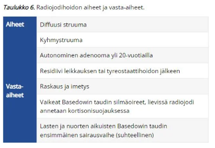
  

## Potilastapaus

Olet terveyskeskuksen päiväpäivystäjä ja vastaanotollesi tulee 64-vuotias mies, jolla on tullut akuutti virtsaumpi. Toto 38.8 C. CRP 9, leuk 5.6, krea 78. U-Kemseul: eryt -, leuk -, nitr -, PSA 25. Katetroit potilaan ja katetripussiin tulee heti 800ml kirkasta virtsaa. Päästät hänet kotiin katetrin kanssa. Potilas pitää katetria kaksi viikkoa pussilla, jonka jälkeen hän tulee katetrin poistoon ja virtsakululliseen kontrolliin. Potilas on erittäin huolestunut PSA-arvosta. Mitä teet jatkossa?

- a. Tuseeraat potilaan, teetät virtsaelinten UÄ-tutkimuksen, mittaat PSA uudelleen 2vkon päästä ja laitat lähetteen erikoissairaanhoitoon urologialle, jos ultraäänessä eturauhanen on kookas ja/tai PSA on edelleen koholla 
- b. Tuseeraat potilaan ja mittaat PSA uudelleen 1kk päästä ja laitat lähetteen erikoissairaanhoitoon urologialle, jos PSA on edelleen koholla 
- c. Tuseeraat potilaan ja laitat lähetteen erikoissairaanhoitoon urologialle. 
- d. Tuseeraat potilaan, mittaat PSA uudelleen 2vkon päästä ja laitat lähetteen erikoissairaanhoitoon urologialle, jos PSA on edelleen koholla

  <button class="solution-button" data-label="Vastaus" data-hide-label="Piilota vastaus">
    Vastaus
  </button>
  

      b
      
PSA:ta voi nostaa monet hyvänlaatuiset asiat. Tärkeimpiä ovat VTI, eturauhastulehdus, virtsaumpi, suuri prostata ja katetrointi. Jos koholla olevan PSA-arvon taustalla epäillään sekundaarista syytä (esim. nyt tässä tapauksessa virtsaumpi ja vielä katetrointi ja katetrin poisto nyt vastaanotolla), kontrolloidaan PSA 4 vkon kuluttua. 
  

## Potilastapaus

Vastaanotollesi tulee 69-vuotias potilas, jolla on distaalisessa sääressä n. 5 x 3 cm kokoinen pinnallinen, keltaisen fibriinikatteen peittämä, kostea ja kivuton säärihaava. Molemmissa alaraajoissa on pitting-ödeemaa säären yläkolmannekseen saakka. ADP ja ATP palpoituvat. Mikä on tärkein hoito?

- a. Ihonsiirto 
- b. Kosteutta imevä paikallinen haavanhoitotuote 
- c. Turvotuksen hoito 
- d. Konsultaatio verisuonikirurgille

  <button class="solution-button" data-label="Vastaus" data-hide-label="Piilota vastaus">
    Vastaus
  </button>
  

      c

Potilaalla on pinnallinen ja kivuton kostea haava distaalisessa sääressä. Haavan lokaatio ja kuvailtu ulkonäkö sekä laaja pitting-ödeema molemmissa alaraajoissa vievät ajatukset klassiseen laskimoperäiseen säärihaavaan. Alaraajapulssit palpoituvat poissulkien merkittävän alaraajojen tukkivan valtimotaudin.

Tärkein hoito laskimovajaatoiminnassa on aloittaa heti kompressiohoito, joka hoitaa turvotusta ja mahdollistaa haavan paranemisen. Kompressiohoidolle on hyvin vähän vasta-aiheita ja pääasiassa tulee huomioida, onko potilaalla dekompensoitu sydämen vajaatoiminta (ei haluta pahimmassa vaiheessa työntää kaikkia nesteitä ylös keuhkoihin pahentaen tilannetta) tai kriittistä alaraajaiskemiaa (ei tarvitse mitata ABI-arvoja rutiinisti ennen kompressiohoidon aloittamista, kuten joissain lähteissä sanotaan, vaan voi aloittaa kompressiohoidon ja seurata, että aiheuttaako se ongelmia. Tällä potilaalla vielä on merkittävä ASO-tauti poissuljettukin, niin ei tarvitse siitä huolehtia). 

Kompressiohoidoksi voidaan aloittaa aluksi monikerrostukisidonta ja jos potilas on liikuntakykyinen niin aloitetaan vähäelastisella sidonnalla.  

a: Ihonsiirto voi tulla kyseeseen, jos haava kroonistuu optimaalisesta kompressiohoidosta huolimatta. 

b: Mikään paikallinen hoito ei hoida laskimovajaatoimintahaavaa ilman kompressiohoitoa. 

d: Kompressiohoito voidaan aloittaa ilman verisuonikirurgin konsultaatiota. 

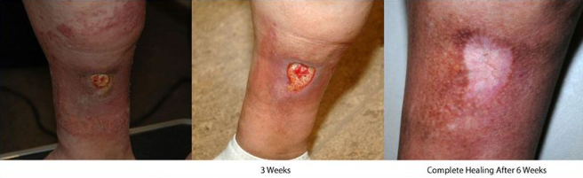
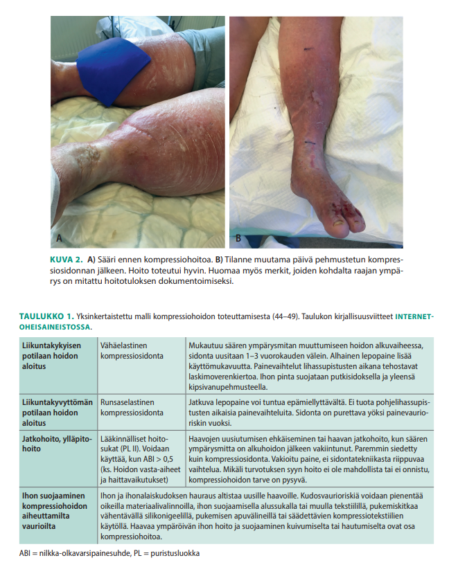
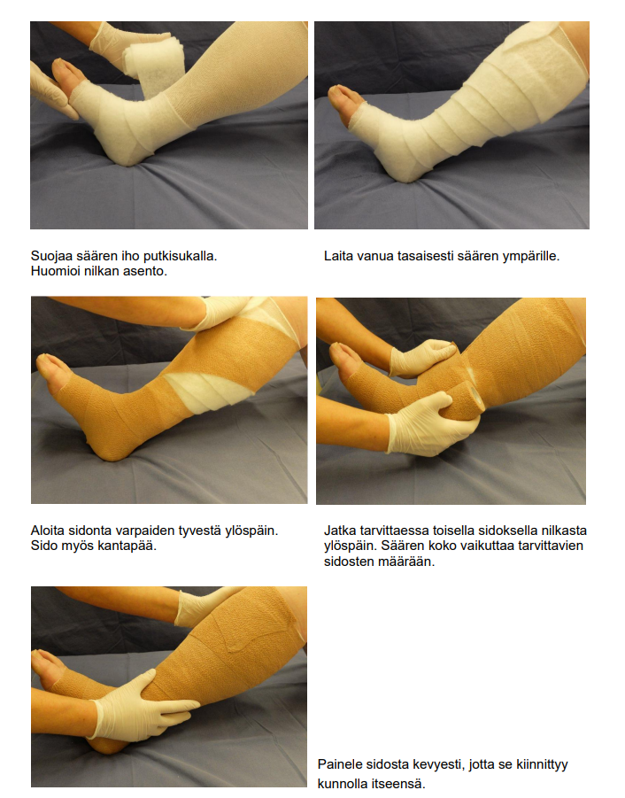
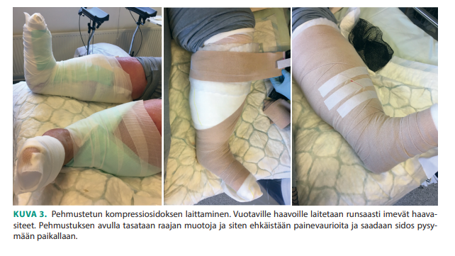
  

## Potilastapaus

Potilaalla todettu edellisellä viikolla haimasyöpä ja siihen liittyen maksametastaasi. Ei aiempia leikkauksia. Nyt potilas tulee päivystykseen keltaisuuden vuoksi. UÄ:ssä todetaan sappistaasi. Ensisijaisesti potilas tulee ohjata:

- a. ERC-toimenpiteeseen 
- b. PTC-toimenpiteeseen 
- c. laparoskopiaan 
- d. laparotomiaan

  <button class="solution-button" data-label="Vastaus" data-hide-label="Piilota vastaus">
    Vastaus
  </button>
  

      a

Haimasyöpä voi obstruktoida sappiteitä ja sitä kautta aiheuttaa sappistaasin ja obstruktiivisen ikteruksen. Haimakasvaimen aiheuttaman sappitietukoksen ensisijainen hoito, jos tuumorin leikkaushoito ei ole indikoitua (palliatiivinen hoito) tai potilasta ei voida nopeasti leikata, on tukoksen laukaiseminen endoskooppisessa retrogradisessa kolangiografiassa (ERC) asetettavalla stentillä. 

b: Tukoksen toissijainen laukaisumenetelmä on ihon ja maksan läpi sappiteihin radiologisesti läpivalaisussa asetettava dreeni (PTD; perkutaaninen transhepaattinen dreeni, asetetaan PTC-teitse (perkutaaninen transhepaattinen kolangiografia))

c-d: Jos potilas leikattaisiin kasvaimen vuoksi nopeasti, turhaa stenttausta pyritään välttämään, koska se lisää leikkauksen jälkeisten komplikaatioiden riskiä. Tässä tapauksessa potilaalla on jo kuitenkin maksametastaaseja eikä hän todennäköisesti ole leikkaushoidon piirissä.
  

## Kuinka monta prosenttia kolorektaalikarsinoomista löytyy tuseeramalla?

- a. n. 30% 
- b. n. 5% 
- c. n. 10% 
- d. n. 20%

  <button class="solution-button" data-label="Vastaus" data-hide-label="Piilota vastaus">
    Vastaus
  </button>
  

      d

Koska noin 40% paksu- ja peräsuolen syövistä sijaitsee nimenomaan peräsuolen alueella, on tuseeraus nopea ja helppo tapa varmistaa peräsuoli syöpäkasvaimen tai verenvuodon osalta. Tuseerauksella voidaan kuitenkin todeta vain hyvin selvät tapaukset ja suolen loppuosan syövät, joten diagnostisointimenetelmänä uuden suolistosyövän löytymisen suhteen, se on kovin rajallinen. Kaikista paksu- ja peräsuolen syövistä pelkästään tuseeraamalla pystytään löytämään 20 – 25 %. Peräsuolen kasvaimista arviolta n. 30% on löydettävissä tuseeraamalla. 

Hyvin näätä kysymys kylläkin, koska data vaihtelee lähteestä toiseen ja sillä ei ole käytännön eroa onko määrä nyt 20% vai 30%, koska tuseeraat potilaan suoliston sairautta epäillessäsi riippumatta tarkasta prosenttimäärästä.  
  

## Mikä seuraavista ei ole alaraajan pintalaskimovajaatoiminnan hoitomuoto?

- a. Sairaan päärungon termoablaatio (laser- tai Rf-tekniikka) 
- b. Sairaan laskimon ohitusleikkaus 
- c. Sairaiden laskimoiden skleroterapia 
- d. Sairaiden suonten poisto ja refluksireitin sulku kirurgisesti

  <button class="solution-button" data-label="Vastaus" data-hide-label="Piilota vastaus">
    Vastaus
  </button>
  

      b

Kajoavan hoidon vaihtoehtoja ovat EVTA, UGFS tai avokirurgia. 

a: EVTA ((endovascular thermal ablation) eli termoablaatio) on nykyään ensisijainen kajoava hoitomenetelmä pinnallisen laskimopäärungon vajaatoiminnassa ja on käytännössä korvannut avokirurgian. Se voidaan suorittaa laserablaationa (EVLA, endovenous laser ablation) tai radiotaajuusablaationa (FRA, radiofrequency segmental thermal ablation, rf-tekniikka eli radiofrekvenssitekniikka). Ensisijaisena näistä voidaan pitää laserablaatiota. 

Termoablaatiossa hoidettava laskimo punktoidaan ja laserkuitu uitetaan sisään. Se viedään vajaatoimintamuutosten läpi proksimaaliselle puolelle safenofemoraalisen tai safenopopliteaalisen junktion distaalipuolelle pitäen turvamarginaalin syvään laskimoon. Hoidettavan laskimon ympärille injusoidaan puudutus. Peruutellessa ulos laseroidaan suonta, mikä johtaa laskimon endoteelin vaurioon ja johtaa pintalaskimon fibrotisoitumiseen kiinni, jolloin se ei enää voi aiheuttaa vajaatoiminta-oireita. Merkittävä osa termoablaatioista voidaan toteuttaa poliklinikkaoloissa. Erityistä jälkiseurantaa ei tarvita, ja potilas voi mobilisoitua heti. Komplikaatiot ovat harvinaisia ja tärkein tiedostaa on syvä laskimotukos, jonka takia hoito on vasta-aiheinen raskaana oleville, aktiivisen pintalaskimotukoksen aikana ja syvien laskimoiden obstruktiossa sekä niille, joilla on avoin foramen ovale (mahdollisuus paradoksiselle embolialle, kun laskimotrombi pääsee avoimen foramen ovalen kautta vasempaan eteiseen ja valtimoverenkiertoon).

b: Laskimoiden ohitusleikkaus ei ole indikoitua laskimovajaatoiminnan hoidossa. 

c: Jos pintalaskimoiden termoablaatio ei ole teknisesti mahdollinen esimerkiksi hoidettavan laskimon mutkaisuuden takia, valitaan muu hoitomenetelmä, joka on yleensä vaahtoskleroterapia (UGFS, ultrasound guided foam sclerotherapy), jos kyseessä on suhteellisen pienet suonet. Hoitotulokset heikkenee mikäli suonen koko > 6 mm -> pääasiassa soveltuu pienten suonien hoitoon. Vaahtoskleroterapia toimii siten, että sklerosoiva vaahto syrjäyttää veren laskimosta, vaurioittaa endoteelin, aiheuttaa laskimon tromboosin ja lopulta fibrotisoitumisen. 

d: Jos termoablaatio ja vaahtoskleroterapia on suljettu pois, valitaan avoleikkaus (High ligation and stripping). 

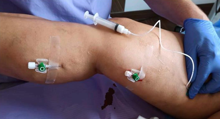
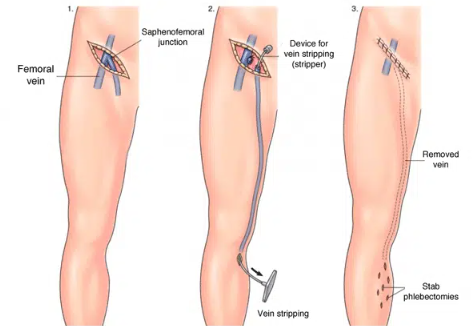
  

## Potilastapaus

Vastaanotollesi tulee 69-vuotias potilas, jolla on distaalisessa sääressä n. 5 x 3 cm kokoinen pinnallinen, keltaisen fibriinikatteen peittämä, kostea ja kivuton säärihaava. Molemmissa alaraajoissa on pitting-ödeemaa säären yläkolmannekseen saakka. ADP ja ATP palpoituvat. Mikä on todennäköisin säärihaavan etiologia?

- a. Martorellin ulkus 
- b. Laskimoperäinen haava 
- c. Neuropaattinen haava 
- d. Iskeeminen haava

  <button class="solution-button" data-label="Vastaus" data-hide-label="Piilota vastaus">
    Vastaus
  </button>
  

       b
       
Kyseessä on sama potilas kuin aikaisemmassa kysymyksessä, jossa mietittiin, mitä hänelle kuuluisi tehdä. Potilaalla on pinnallinen ja kivuton kostea haava distaalisessa sääressä. Haavan lokaatio ja kuvailtu ulkonäkö sekä laaja pitting-ödeema molemmissa alaraajoissa vievät ajatukset klassiseen laskimoperäiseen säärihaavaan. Alaraajapulssit palpoituvat poissulkien merkittävän alaraajojen tukkivan valtimotaudin.

a: Hypertensiivinen säärihaava eli Martorellin haava on epätavallinen mutta ei harvinainen säärihaavan muoto. Martorellin haava on pitkään huonossa hoitotasapainossa olleen verenpainetaudin komplikaatio 40-80-vuotiailla potilailla, joista osa sairastaa myös diabetesta. Kliininen kuva on selkeä ja tunnusomainen: kyseessä on erittäin kivulias pinnallinen nekroottinen haava, jossa on purppuran punainen reunus. Paraneminen on yleensä hidasta. 

Martorellin haavan taustalla on mikroangiopatia. Verenpainetautia sairastavilla on suuri ääreisvaltimoiden vastus huolimatta normaalista nilkka-olkavarsipainesuhteesta. Tämä johtuu pienten valtimoiden ahtautumisesta tai tukkeutumisesta. Seurauksena on kudosperfuusion vähentyminen, paikallinen iskemia sekä haavoja ja kipua. Pienet valtimot eivät reagoi normaalisti laajenemalla, mikä johtaa jopa ihon infarkteihin. 

c: Neuropaattinen haava on tyypillinen diabeetikoilla johtuen distaalisesta polyneuropatiasta. Diabeetikon jalkahaava sijaitsee tyypillisesti nilkan distaalipuolella alueilla, joihin kohdistuu painetta. Polyneuropatian takia potilas ei kuitenkaan tunne paineen aiheuttamaa iskemiaa alueella, mikä johtaa lopulta haavaan. Noin puolessa diabeettisista haavoista on alentunut verenkierto myös osatekijänä. Tärkeimpiä tekijöitä diabeetikoiden haavoissa ovat siis verisuonien ahtautuminen ja siten kudosiskemia sekä diabeteksen neuropatia, joka peittää iskemian oireita. 

d: Kriittinen iskemia voi aiheuttaa spontaanisti/vähäpätöisen vamman takia alaraajahaavan, jonka tyypillinen lokalisaatio on distaaliset kärkijäsenet ja/tai painealueet (esim. kantapää tai päkiät, malleolukset (erityisesti lateraalinen)). Valtimoperäiset haavat ovat myös yleensä tarkkarajaisempia ja pienempiä ja syvempiä kuin laskimoperäiset haavat. 

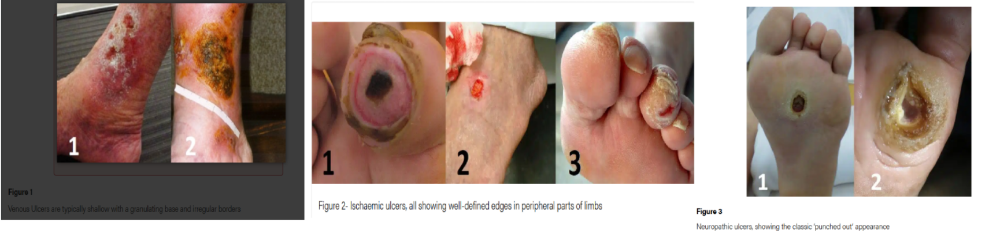

  

## Potilastapaus

Vastaanotollesi terveyskeskukseen tulee 65-vuotias mies. Hänelle on tehty eturauhassyövän vuoksi eturauhasen radikaali poistoleikkaus kolme vuotta sitten ja olet leikkaavan yksikön ohjeiden mukaisesti mitannut PSA-arvon vuosittain. Viimeisimmässä kontrollissa PSA 0.25. Mitä teet?

- a. Teet virtsaelinten UÄ-tutkimuksen ja koska poistetun eturauhasen kohdalla ei näy poikkeavaa, mittaat PSA:n vuoden kuluttua ohjeiden mukaisesti 
- b. Mittaat PSA:n vuoden kuluttua ohjeiden mukaisesti 
- c. Lähetät potilaan erikoissairaanhoitoon 
- d. Tuseeraat potilaan ja koska kyhmyjä ei tunnu, mittaat PSA:n vuoden kuluttua ohjeiden mukaisesti

  <button class="solution-button" data-label="Vastaus" data-hide-label="Piilota vastaus">
    Vastaus
  </button>
  

       c
       
Radikaalin prostatektomian jälkeen PSA-arvon odotetaan olevan mittaamattomissa (< 0,1 µg/l) 2 kuukauden kuluttua leikkauksesta. Tyypillisesti PSA-arvo määritetään 3 ja 6 kuukauden kuluttua leikkauksesta, sen jälkeen 6 kuukauden välein kolmanteen vuoteen asti ja sen jälkeen vuosittain. **Avoterveydenhuollon seurannassa yksittäinenkin PSA-arvon suureneminen mitattavaksi radikaaliprostatektomian jälkeen on indikaatio lähetteelle erikoissairaanhoitoon.**

a: Potilaan eturauhassyöpä on todennäköisesti uusiutunut, UÄ ei riitä nyt. 

b ja d: PSA on noussut ja eturauhassyöpä on todennäköisesti uusiutunut, ei voi jäädä seuraamaan PSA-arvoja. Tilanne on erilainen, jos syöpä oltaisiin hoidettu sädehoidolla. Sädehoidon jälkeen biokemiallisena uusiutumisena pidetään PSA-arvon suurenemista 2 µg/l hoidon jälkeistä alinta arvoa (nadir) suuremmaksi. Määritelmä koskee myös potilaita, jotka ovat saaneet hormonaalista hoitoa. Kun potilas siirtyy perusterveydenhuollon seurantaan, tulee potilasasiakirjoihin kirjata erikoissairaanhoitoon lähettämisen raja-arvo. 
  

## Suturaatiolangan vahvuus

Olet poistanut 45-vuotiaalta miespotilaaltasi selästä lapaluun kohdalta 1 cm kokoisen suspektin iholuomen diagnostisin marginaalein PAD-tutkimukseen. Mikä on sopiva sulamattoman langan vahvuus ihon sulkua varten?

- a. 3-0 
- b. 8-0 
- c. 5-0 
- d. 2-0

  <button class="solution-button" data-label="Vastaus" data-hide-label="Piilota vastaus">
    Vastaus
  </button>
  

       a

Ommellangan ominaisuuksia ovat vetolujuus, vahvuus ja läpimitta. Vetolujuudella tarkoitetaan langan lujuutta vetävää voimaa vastaan. Näitä ominaisuuksia määritetään eniten käytössä olevalla USP- eli United States Pharmacopeia -normilla. USP on numeerinen määrite, esimerkiksi 3-0, 2-0, 1-0, 0, 1. Tämän normin mukaisesti langan paksuus kerrotaan numerokoodilla eli mitä enemmän nollia koodissa on, sitä ohuempi ommellanka on kyseessä. Esimerkiksi 4-0-langasta käytetään puhekielessä nimitystä ”neljän nollan” ja 5-0:sta ”viiden nollan” lanka. Mitä suurempi langan koodi on, sitä pienempi vetolujuus sillä on (esim. 10-0 on todella pieni vetolujuus ja soveltuu vain mikrokirurgiaan). 

Perusohjeita lankojen käytölle on (ainakin dioissa näin, eri lähteissä hieman erilain):

10-0 …8-0 mikrokirurgia

6-0 kasvot

5-0 kasvot, kaula, käsi

4-0 peruslanka -> vartalo, raajat

3-0 päänahka, jalkapohja, selkä

2-0 lihaksiin tai faskiaan 

1-0, 0, 1, 2, …
  

## On tehty totaali gastrektomia diffuusin ventrikkelikarsinooman takia. Leikkaus ollut makroskooppisesti radikaali. Lopullisessa PAD-vastauksessa mainitaan, että poisto on R1-tasoinen. Se tarkoittaa, että

- a. Imusolmukepoisto on riittämätön 
- b. Kasvain on täysin pois 
- c. Imusolmukepoisto on riittävä 
- d. Kasvain kasvaa mikroskooppisesti preparaatin katkaisulinjaan

  <button class="solution-button" data-label="Vastaus" data-hide-label="Piilota vastaus">
    Vastaus
  </button>
  

       d

Syöpien leikkaushoidossa poiston jälkeen voidaan arvioida resektion (R) tasoa. Diffuusin ventrikkelikarsinooman hoidossa tavoitellaan täydellistä poistoa eli R0.

R0 = kaikki kasvainkudos poistettu

R1 = mikroskooppista tuumorikasvua jäljellä resektiolinjassa

R2 = makroskooppista tuumorikasvua jäljellä
  

## Potilastapaus

Perusterve 40-vuotias mies. Vasen alavatsakipu 3 pv. Yleiskunto hyvä, lievää lämpöilyä, ei selvää defancea. Leuk 13, CRP 50. TT:ssä komplisoitumaton akuutti divertikuliitti. Aloitatko antibiootit? Entä tarvitaanko diagnoosin varmistamiseksi rauhallisen vaiheen kolonoskopiaa?

- a. Antibiootit kyllä, ei kolonoskopiaa 
- b. Ei antibiootteja, ei kolonoskopiaa 
- c. Molemmat tarvitaan 
- d. Ei antibiootteja, kolonoskopia kyllä

  <button class="solution-button" data-label="Vastaus" data-hide-label="Piilota vastaus">
    Vastaus
  </button>
  

     b  

Jos potilaalla on komplisoitumaton divertikuliitti, niin se voidaan hoitaa oireenmukaisesti (NSAID + parasetamoli) ilman antibioottia. Jos kyseessä on potilaan ensimmäinen divertikuliitti (kuten nyt tässä), niin diagnoosi tulee varmistaa TT:llä. Jos taas uusiutunut lievällä tyypillisellä taudinkuvalla, niin ei tarvitse TT:tä ja voidaan hoitaa oireenmukaisesti ilman lisädiagnostiikkaa. Paastoa tai ruokarajoituksia ei tarvita, vaan potilas voi syödä vapaasti. Mikäli oireet eivät helpota parissa päivässä tai vointi heikkenee, tulee diagnoosia tarkentaa TT:lla ja tarvittaessa aloittaa antibiootti. 

a: Antibiootti kannattaa varovaisuusperiaatteen mukaan aloittaa raskaana olevilla tai jos potilaan immuunipuolustus on heikentynyt esimerkiksi solunsalpaajahoidon, immuunipuolustusta muokkaavan lääkityksen, maksakirroosin tai diabeteksen takia. Antibiootti, joka kattaa tavallisimmat suolistopatogeenit, voidaan toteuttaa Suomessa useimmiten kefalosporiinin ja metronidatsolin yhdistelmällä. Hoito määräytyy potilaan yleistilan mukaan. Perusterveydenhuollossa hoitona on suun kautta otettavat kefaleksiini 500 mg x 3 ja metronidatsoli 400 mg x 3. Erikoissairaanhoidossa aloitetaan suonensisäisesti kefuroksiimi 1,5 g x 3 ja metronidatsoli 500 mg x 3. Yleensä viikon hoito riittää

c: Molemmat tarvitaan, jos kyseessä on komplisoitunut divertikuliitti. Komplisoitunut divertikuliitti vaatii hoidoksi aina vähintään i.v. antibiootin (yleensä kefuroksiimi ja metronidatsoli) ja joskus myös jopa leikkauksen tai joidenkin paiseiden tapauksessa dreneerauksen. Komplisoituneen divertikuliitin jälkeen kontrollitutkimuksena tulee suorittaa kolonoskopia rauhallisessa vaiheessa (n. 1kk jälkeen akuutista tulehduksesta), jotta voidaan varmistaa, ettei kyseessä ole paksusuolisyöpä. Komplisoitumattomassa divertikuliitissa mitään kontrolleja ei tarvita. 

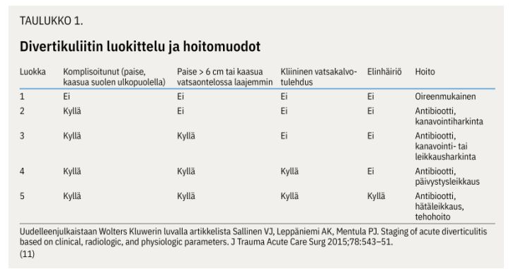
  

## Aortan B-tyypin dissekaation hoidossa seuraavista EI pidä paikkaansa:

- a. B-tyypin dissekaatio voi dilatoitua ja rupturoitua vuosia ensi-ilmaantumisen jälkeen 
- b. B-tyypin dissekaatio on vähemmän yleinen kuin A-tyypin dissekaatio 
- c. valtaosa B-tyypin dissekaatioista joudutaan leikkaamaan hätäleikkauksena tai vähintään lähipäivinä 
- d. laskeva aortta voidaan hoitaa stentillä

  <button class="solution-button" data-label="Vastaus" data-hide-label="Piilota vastaus">
    Vastaus
  </button>
  

     c

Komplisoitumattoman B-tyypin dissekoituman hoito on ensisijaisesti lääkkeellinen verenpaineen hallinta. B-tyypin dissekoituma komplisoituu akuutissa vaiheessa noin **16 %:ssa** tapauksista (ei siis valtaosassa), ja tällöin on kajoava hoito perusteltu. 

a: Totta. Tämän takia dissekoitumapotilaita seurataan sairaalahoidon jälkeenkin. Tehdään aortan TT tai MK (MK nuoremmille) 3 kk, 6 kk ja 12 kk dissekoitumasta, jonka jälkeen vuosittain ainakin 5 v ajan. Elinikäinen kuvantamisseuranta on yleensä perusteltu, mutta väliä voi harventaa 2–3 vuoteen, jos tilanne on ollut vakaa viiden vuoden ajan. Dissekoituman jälkeen osalle potilaista kehittyy toimenpidehoitoa vaativa aortan dilataatio 5 v:n kuluessa, joten seuranta on tärkeää. Seuranta toteutetaan leikanneessa yksikössä tai oman alueen sairaalassa leikanneen yksikön ohjeiden mukaan. 

b: Stanfordin A-tyypin dissekoituma on yleisin. Se on myös vaarallisempi.

d: Ensisijaisesti komplisoituneen B-tyypin dissekoituman hoidossa kyseeseen tulee endograftihoito eli stentti (TEVAR, Thoracic Endovascular Aortic Repair), jolla peitetään tyypillisesti laskevan torakaaliaortan yläosassa sijaitseva intimakerroksen repeämä (entry tear). 

A-tyypin dissekoituman hoito on taas ensisijaisesti operatiivinen ja tehdään avoleikkauksessa (tavoitteena on korvata dissekoitunut osa nousevaa aorttaa verisuoniproteesilla, erityisesti alue, jolla intimakerroksen repeämä (entry tear) sijaitsee). Jos aortan tyvi sinus Valsalvae -tasolla sekä aorttaläppä ovat rakenteellisesti ehjät, riittää yleensä suora putkiproteesi, joka ommellaan proksimaalisesti aortan sinotubulaarijunktion tasoon. Tämä on yleisin (noin 70 %) aortan dissekoituman leikkaustekniikka.

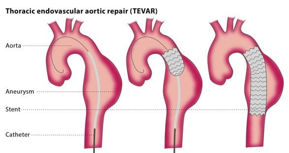

  

## Rintasyövän kirurgisen hoidon yleisin leikkaustekniikka on

- a. Halstedin radikaali mastektomia 
- b. ihoa säästävä mastektomia ja välitön rintarekonstruktio 
- c. resektio ja vartijaimusolmukebiopsia 
- d. ablaatio ja vartijaimusolmukebiopsia

  <button class="solution-button" data-label="Vastaus" data-hide-label="Piilota vastaus">
    Vastaus
  </button>
  

     c
     
Rintasyövän tavallisin kirurginen hoitomuoto on siis rinnan säästävä leikkaus eli resektio (breast conserving surgery). Tehdään siis vartijaimusolmuketutkimus, lumpektomia (partiaalinen mastektomia) ja lopuksi sädehoito. Sädehoito vähentää paikallista uusiutumisriskiä jäljelle jääneessä rauhaskudoksessa ja on siten olennainen osa rinnan säästävää hoitoa.

a: William Halsted (1852-1922) oli kirurgi, joka alkoi hoitaa rintasyöpäpotilaitaan poistamalla rinnan ja kainalon imusolmukkeiden kokonaan. Näiden lisäksi poistettiin myös pectoralislihakset. Halstedin potilaista oli elossa 51 % kolme vuotta leikkauksen jälkeen, mikä oli massiivinen kehitys aikaisempiin hoitoihin verrattuna. Halstedin doktriini siitä, että laaja leikkaus olisi rintasyöpäpotilaille aina välttämätön oli pitkään syvälle juurtunut käsitys, mutta 1970-luvulta lähtien ensin luovuttiin ”radikaalista” rinnan poistosta (Maddenin mastektomia, pectoralikset säästettiin) ja sitten myöhemmin tutkimuksilla osoitettiin rintaa säästävän leikkauksen turvallisuus. 

b: Tavallisin indikaatio ihoa säästävälle mastektomialle on laaja DCIS ja halu tehdä välitön rintarekonstruktio. Välittömässä rintarekonstruktiossa syöpäleikkaus eroaa tavallisesta mastektomiasta siten, että rinnan oma iho säästetään kokonaan tai pääosin. Soveltuu esim. rintasyövälle altistavan geenimutaation kantajalle riskiä vähentävänä toimenpiteenä tai hyväennusteiselle rintasyövälle, jossa kuitenkin halutaan poistaa koko rintakudos. 

Välitön rintarekonstruktio = rakennetaan uusi rinta samassa leikkauksessa kuin rinta poistetaan 

Myöhäisrekonstruktio = potilaalle on tehty rintasyövän vuoksi rinnan ablaatio ja sen jälkeen annettu liitännäishoidot syöpätaudeilla ja vasta näiden hoitojen jälkeen tehdään rekonstruktio

d: Rinnan poisto eli mastektomia eli ablaatio on aiheellinen, jos invasiivinen rintasyöpä tai duktaalinen karsinooma in situ (DCIS) on niin laaja, että säästävällä leikkauksella ei saavuteta joko riittäviä tervekudosmarginaaleja tai hyväksyttävää esteettistä tulosta. Mastektomia tulee tehdä myös, jos potilas toivoo sitä vielä sen jälkeen, kun hän on saanut perusteellisen informaation leikkausmenetelmistä ja niiden eduista sekä haittapuolista. Mastektomia tulee myös tehdä, jos kyseessä on inflammatorinen rintakarsinooma (ei hoideta osapoistolla). 

Lisäksi mastektomiaa on harkittava, mikäli sädehoitoa ei voida toteuttaa (säästävässä leikkauksessa leikkauksenjälkeinen sädehoito on tärkeä osa hoitoa). Tällaisia syitä ovat aiemmin annettu sädehoito (aiempi rintasyöpä tai Hodgkinin tauti), varhaisraskaus, tietyt autoimmuunisairaudet tai potilaan haluttomuus käydä sädehoidossa. Sädehoito pienentää paikallisen uusiutumisen riskiä myös iäkkäillä, mutta jos iäkäs potilas ei jaksa käydä sädehoidossa, se voidaan myös jättää pois hoitosuunnitelmasta. 
  

## Potilastapaus 

Vastaanotollesi tulee potilas, joka on käynyt sappikivitautioireiden vuoksi tilaamassasi ultraäänitutkimuksessa. Sattumalöydöksenä lausunnossa kerrotaan, että potilaalla on abdominaaliaortan aneurysma, jonka maksimihalkaisija on 3.5 cm. Mikä potilaalle kerrotuista tiedoista ei pidä paikkaansa?

- a. Vaikka pullistuma jatkuu yli 10 cm matkalla, ei pullistuneen osan pituudella ole merkitystä pullistuman ennusteeseen. Pullistuneen valtimon halkaisija määrittää suonen puhkeamisen riskin
- b. Teillä on pullistunut valtimo, jonka vuoksi lähetän teidät ambulanssilla heti päivystykseen 
- c. Tupakoinnin lopettamisella on suotuisa vaikutus myös pullistuneen ison valtimon ennusteeseen 
- d. Näin pieni pullistuma ei vielä vaadi kirurgista toimenpidettä. Seuraamme pullistumaa nyt säännöllisesti ja jos pullistumassa tapahtuu merkittävää kasvua, niin sitten harkitaan pullistuman hoitoa kirurgisesti

  <button class="solution-button" data-label="Vastaus" data-hide-label="Piilota vastaus">
    Vastaus
  </button>
  

     b
     
Näin pieni vatsa-aortan aneurysma ei ole ruptuurariskissä eikä potilaalla ole sen suhteen oireitakaan. Ei siis tarvitse lähettää potilasta päivystykseen, vaan voidaan jatkaa seurantalinjalla muutoksen suhteen (tässä tapauksessa läpimitan perusteella n. 2-3 vuoden välein). 

a: Vatsa-aortan aneurysman (AAA) ruptuurariskin määrittää enimmäisläpimitta ja sen perusteella hoitopäätökset tehdään. AAAn määritelmä on >30mm läpimitta (eli 1,5x normaalin läpimitan). Käytännön toimenpiderajaksi on asetettu 55 mm miehillä (50 mm naisilla), sillä tätä pienemmät aneurysmat repeävät harvoin.

c: Vatsa-aortan aneurysma (AAA) -potilaille on aina aiheellista seuraavat noninvasiiviset hoidot: tupakoinnin lopettaminen, elintapaohjeet (ml. liikunta- ja ruokavalio-ohjeet), verenpaineen hoito, statiinilääkitys, verihiutaleiden estäjälääkitys (ASA). Tärkein riskitekijä on tupakointi ja lähes 90 % aneurysmapotilaista tupakoi tai on tupakoinut jossain vaiheessa elämää. Tupakointi suurentaa paitsi vatsa-aortan aneurysman ilmaantuvuutta myös sen kasvunopeutta ja repeämisriskiä.

d: Käytännön toimenpiderajaksi on asetettu 55 mm miehillä (50 mm naisilla), sillä tätä pienemmät aneurysmat repeävät harvoin. Tämän ulkopuolella muutosta kyllä seurataan ja jos vatsa-aortan aneurysman (AAA) kasvu on yli 10 mm vuodessa, tulee potilas lähettää verisuonikirurgiseen yksikköön (normaalisti aneurysma kasvaa n. 2-4mm vuodessa). Seuranta suoritetaan TK:ssa vatsan UÄ-tutkimuksella. 

  

## Potilastapaus

Vastaanotollesi tulee potilas, joka on Kannasta lukenut sairauskertomuksiaan. Toimenpiteenä Kannan tietojen mukaan on ollut rec: a. poplitea – a. dorsalis pedis CVA converted. Potilas on hiukan epävarma, toimenpiteen jälkeisistä elämäntapaohjeista. Mikä seuraavista ohjeista ei paranna potilaan ennustetta?

- a. Sairaalasta määrätty kolesterolilääke parantaa valtimotaudin ennustetta 
- b. Nyt kun teidät on ohitettu ja haavatkin on parantuneet, voitte jatkaa tupakointia, mikäli tupakoimatta olo tuntuu vaikealta 
- c. Toimenpiteen jälkeen liikkuminen ja erityisesti kävely on hoitotuloksen kannalta hyväksi 
- d. Sairaalassa aloitettu Primaspan-lääkitys on pysyvä lääkitys ja ehkäisee sydän- ja verisuonisairauksien ilmaantumista

  <button class="solution-button" data-label="Vastaus" data-hide-label="Piilota vastaus">
    Vastaus
  </button>
  

     b
     
Tupakointi ei tietystikään paranna potilaan ennustetta. 

Potilas on siis sama, jonka kantatekstiä jo tulkittiin aikaisemmassa kysymyksessä. Hänelle on tehty ASO-taudin takia ohitusleikkaus käyttäen laskimograftia. 

a ja d: Oireellisesta ASO-taudista kärsiville tulisi vähintään aloittaa aina statiini ja ASA. Suurentuneen vuotoriskin vuoksi ei preventiomielessä aloiteta ASA, jos potilaalla on jo käytössä AK tai muu antitrombootti muista syistä.

c: ASO-taudin hoito-ohje on aina **"stop smoking, start walking".** Tämä pätee myös kajoavasti hoidettujen kanssa. 
  

## Potilastapaus

56-vuotiaalla potilaalla on kivespussi suurentunut. Toteat transilluminaatiossa oikealla puolella kivespussissa selkeän vaaleanpunaisen/oranssisen löydöksen. Potilas ei bakteerikammoisena halua erikoissairaanhoitoon vaan toivoo hoitoa terveyskeskuksessa. Hoidan hänet seuraavasti?

- a. punktoin mahdollisen nesteen kivespussista 
- b. punktoin mahdollisen nesteen kivespussista ja laitan tilalle puudutusainetta 
- c. lähetän potilaan kivespussin ultraäänitutkimukseen kivessyövän poissulkemiseksi 
- d. punktoin mahdollisen nesteen kivespussista ja laitan tilalle puudutusaineen ja etoksisklerolin sekoitusta

  <button class="solution-button" data-label="Vastaus" data-hide-label="Piilota vastaus">
    Vastaus
  </button>
  

     d
    
Potilaalla on todennäköisesti hydroseele eli vesikives, jossa tunica vaginaliksen eli kiveksen tuppikalvon viskeraali- ja parietaalikalvojen väliin on  kehittynyt nestekertymä. Kyseessä ei ole pahanlaatuinen muutos, mutta se tulee tunnistaa ja osaa hoitaa tarvittaessa. Sen diagnoosiin ei tarvitse ultraääntä (ellei ole epäselvyyksiä) ja voidaan diagnosoida palpaatiolla ja transilluminaatiolla (valaisemalla kivespussi valolla ja tarkistelemalla, miten valo kulkee sen läpi). 

Oireetonta hydroseeleä ei välttämättä tarvitse hoitaa, mutta mikäli vesikiveksestä aiheutuu oireita, hoito on perusteltua. 

Ensisijainen hoitokeino pienessä (<2.5dl) nestekertymässä on punktio ja skleroterapia. Pelkkä nesteen poisto punktoimalla ei ole tehokasta, sillä neste palautuu nopeasti. Tämän vuoksi punktioon tulee yhdistää skleroterapia. Skleroterapiassa tyhjennyksen jälkeen tunica vaginaliksen sisään ruiskutetaan lääkeainetta (esim. polidokanoli+lidokaiini), joka aiheuttaa tunica vaginaliksen kiinnittymisen kivekseen ja estää näin vesikiveksen uusiutumisen. Jotta liima voisi pitää, kivespussia ulkoisesti tukevien housujen käyttö kuuluu keskeisesti välittömään jälkihoitoon.

Kookkaan tai toistetun skleroterapian jälkeen uusiutuvan vesikiveksen hoito on kirurginen. Tällöin tunica vaginalis avataan ja nesteontelo tyhjennetään. Tämän jälkeen tunica vaginalis voidaan poistaa lisäkiveksen reunojen myötäisesti, kääntää lisäkiveksen taakse (Winkelmanin leikkaus) tai rypyttää ompeleilla (Lordin leikkaus).

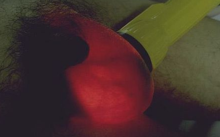

  

## Olet keskussairaalan päivystyksessä kirurgian eval-sijaisena, ja ensihoitohuoneeseen tuodaan huonokuntoinen monivammapotilas. Minkä seuraavista tutkit ensimmäiseksi:

- a. thoraxin 
- b. abdomenin ja lantion 
- c. kaularangan 
- d. neurologisen statuksen

  <button class="solution-button" data-label="Vastaus" data-hide-label="Piilota vastaus">
    Vastaus
  </button>
  

     a
    
ABCDE-periaatetta miettien: Airway, Breathing ... -> näistä vaihtoehdoista thorax ensimmäisenä 

Kaularanka myös tietysti tärkeä ja siihen usein on jo valmiiksi asetettu kauluri traumapotilaille. 

Abdomenin ja lantion alueella voi olla verenvuotoja. Abdomenin vuodot FASTilla, lantion vuodot voi näkyä hematoomina ja kannattaa epäillä lantiomurtumissa. 

Neurologinen status kuuluu myös asiaan, mutta ei ole ensimmäinen asia, joka huolestuttaa. 
  

