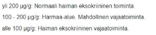
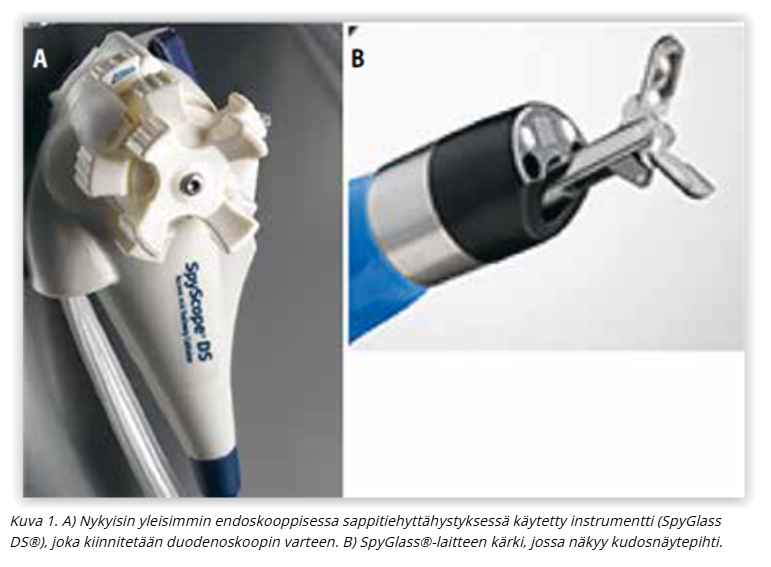
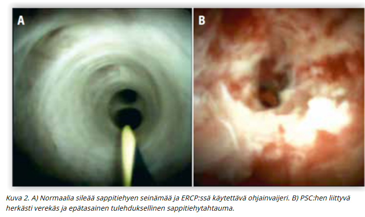
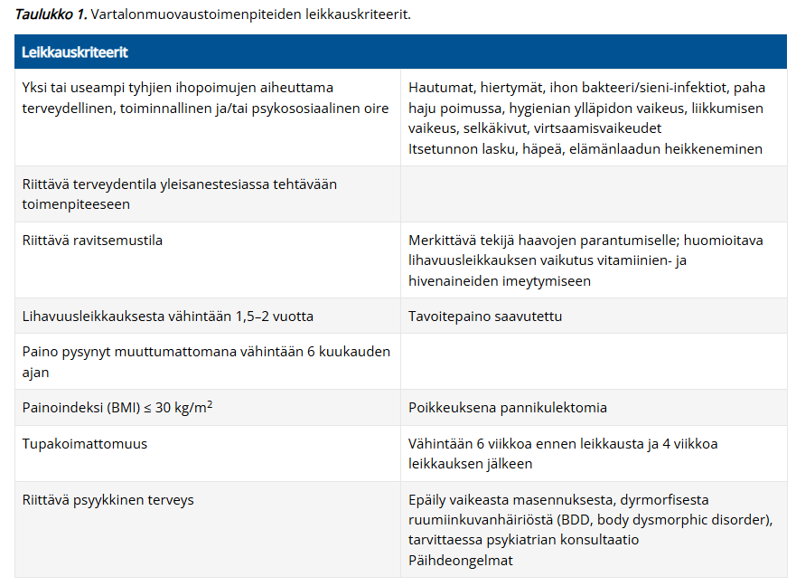
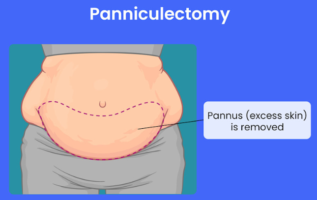
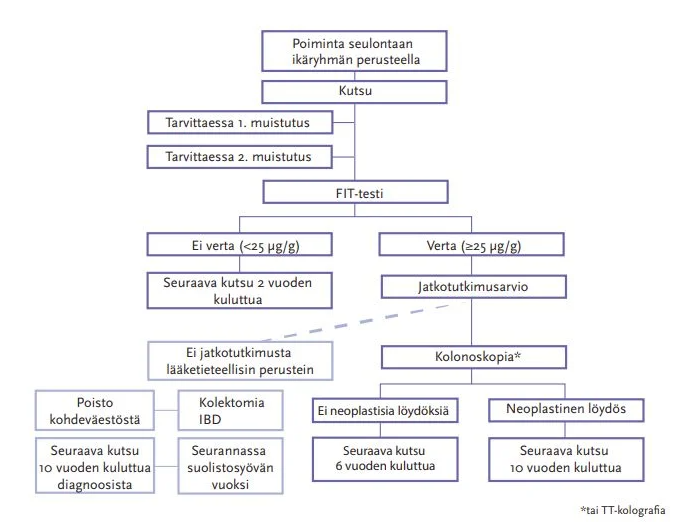
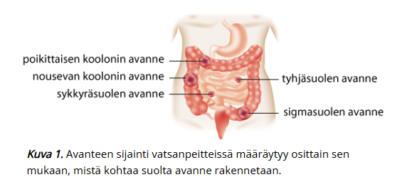
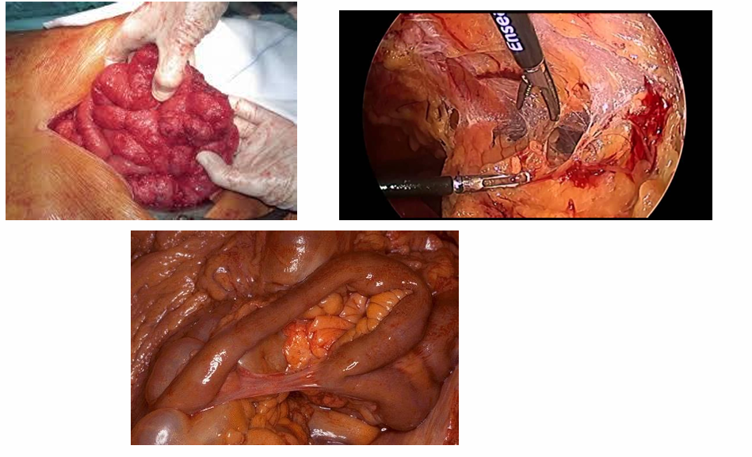

# 2023 (Vividus)

Taas puuttuu usein vaihtoehdot ja monesti on vain mainittu kysymyksen aihe eikä kysymyksenasettelua ole kirjoitettu tarkemmin. Jonkin verran myös aikaisempia tärppejä, joita ei nyt ole tähän taaskaan laitettu, koska ne on käyty jo edellisissä kappaleissa läpi. 

## Epäilet potilaalla kroonista pankreatiittia. Mikä laboratoriokokeen tulos viittaisi tähän?

- a. Ulosteen matala elastaasi 
- b. Ulosteen korkea elastaasi
- c. Seerumin matala amylaasi
- d. Seerumin korkea amylaasi

  <button class="solution-button" data-label="Vastaus" data-hide-label="Piilota vastaus">
    Vastaus
  </button>
  

     a

Elastaasi on haiman erittämä sidekudosta hajottava entsyymi, joka poistuu suolesta muuttumattomana ulosteessa. Voidaan käyttää tutkimaan haiman eksokriinista toimintakykyä.

Kroonisessa pankreatiitissa haiman eksokriiniset osat (ja myös endokriinisetkin -> sekundaarinen diabetes) tuhoutuvat, mikä johtaa siihen, että ruoansulatusentsyymejä ei enää tuoteta normaaleja määriä -> F-Elast1 laskee. Ruuassa ja eri entsyymivalmisteissa ei esiinny elastaasi 1:stä, joten ne eivät vaikuta analyysin tuloksiin.

Voimakas vesiripuli voi laimentaa ulosteen elastaasi 1 -pitoisuuden ja antaa vääriä positiivisia tuloksia eksokriinisen vajaatoiminnan suhteen

  

## Mitä kautta kroonisen pankreatiitin operatiivinen hoito yleensä suoritetaan?

- a. Endoskopia 
- b. Laparoskopia 
- c. Avoleikkaus 
- d. Kroonisen pankun hoidossa ei toimenpiteillä ole sijaa

  <button class="solution-button" data-label="Vastaus" data-hide-label="Piilota vastaus">
    Vastaus
  </button>
  

     a

Invasiiviseen hoitoon päädytään, jos potilaalla on hallitsemattomia ylävatsakipuja siitä huolimatta, että hän ei käytä alkoholia. Nykyisin suurin osa kroonisen haimatulehduksen aiheuttamista haimatiehyen striktuuroista tai komplikaatioista, kuten pseudokystista tai haimafisteleistä, hoidetaan endoskooppisella retrogradisella kolangiopankreatografialla ja tarvittaessa esim. stenttauksella.

b, c: Kirurginen hoito, jos endoskooppinen hoito epäonnistuu tai on riittämätön

d: Kroonisen pankreatiitin hoito voidaan jakaa konservatiiviseen hoitoon, johon kuuluvat muun muassa haiman vajaatoiminnan hoito ja kivun lääkehoito, sekä kajoavaan hoitoon. Kroonisen pankreatiitin hoito on ensisijaisesti konservatiivinen. Tärkeintä on lopettaa alkoholin käyttö ja tupakointi, jotta kroonisen tulehdusreaktion eteneminen hidastuu. Ateriat kannattaa jakaa useaan osaan sekä rajoittaa rasvojen ja haimaentsyymejä estävien kuitujen määrää. Eksokriinista vajaatoimintaa hoidetaan aterioiden yhteydessä kapseleina otettavilla haimaentsyymeillä (esim. creon). Endokriininen vajaatoiminta aiheuttaa usein aluksi vain vähän oireita. Sitä tulee epäillä herkästi seurannassa, jotta diabeteksen hoito voidaan aloittaa ajoissa.

Kroonisen pankreatiitin vaikein oire on usein hankalahoitoinen kipu, jota voidaan joutua lääkitsemään opioideilla. Myös pregabaliini, antioksidantit, vitamiinivalmisteet ja haimaentsyymivalmisteet voivat lievittää kipua. Viimeksi mainitut vähentävät haiman omaa entsyymituotantoa ja haimanesteen eritystä, mikä voi laskea tiehytpainetta.

Mutta myös operatiivisella hoidolla on sijansa, joten vaihtoehto on väärin. 
  

## Spyglass -operaatio, miten tehdään? 

- a. Endoskopia 
- b. Laparoskopia 
- c. Laparotomia 
- d. Peräsuolen kautta näkökontrollissa

  <button class="solution-button" data-label="Vastaus" data-hide-label="Piilota vastaus">
    Vastaus
  </button>
  

     a

Sappitietähystys (kolangioskopia) on osoitettu hyödylliseksi epäselvien sappiteiden ahtaumien diagnostiikassa ja hankalasti poistettavien sappitiekivien hoidossa.

Uuden sukupolven sappitietähystin (SpyGlass, Boston Scientific) tuli markkinoille 2008. Tämä tähystin viedään sappiteihin pohjukaissuolen tähystimen kautta endoskooppisen retrogradisen kolangio-pankreatografian (ERCP) yhteydessä. Tähystimessä on neljään suuntaan kääntyvä kärki, erilliset kanavat optiikalle, ohjainvaijerille ja huuhtelulle sekä 1,2 mm:n läpimittainen työskentelykanava, jonka kautta voidaan viedä näkökontrollissa sappi- tai haimatiehyeen kudosnäytepihdit (SpyBite) ja sähköhydraulinen kivenmurskain (EHL).

  

## Mikä tuumori maksassa yleisin?

Ei vaihtoehtoja, mutta tässä yleisimmät maksamuutokset: 

Maksan pesäkemuutokset ovat useimmiten hyvänlaatuisia. Parantuneiden kuvantamismenetelmien ansiosta maksasta löydetään paikallismuutoksia jopa 20 %:lta tutkituista. Heistä viidesosalla muutos on pahanlaatuinen.

- Yleisiä hyvänlaatuisia pesäkemuutoksia ovat fokaalinen rasvoittuminen (ei usein lasketa), yksittäiset kystat, hemangioomat (yleisin solidi tuumori) sekä fokaalinen nodulaarinen hyperplasia (FNH). Riippuen lähteestä hemangioomat voivat olla suorastaan yleisin maksan pesäkemuutos, joissain taas kystat ovat hieman yleisempiä kuin hemangioomat. 
- Maksan yleisin pahanlaatuinen muutos on metastaasi (n. 90% maligniteeteista on metastaaseja). Yleisin maksan primaarinen syöpä on hepatosellulaarinen karsinooma (HCC) ja toiseksi yleisin on maksan sisäisistä sappiteistä lähtenyt kolangiokarsinooma. 

## ED-potilastapaus 

Potilas tulee muun syyn takia tk-vastaanotolle, ja lopuksi ottaa puheeksi erektiovaikeudet. Potilaalla reilusti ylipainoa, tupakoi jne. Kertoo ottaneensa kaverilleen määrättyä sildenafiilia ja saanut tästä apua. Pyytää reseptiä tästä, mitä teet? 

Ei vaihtoehtoja, tässä mahdollinen toimintatapa: 

- Arvioi vasta-aiheet, kartoita anamneesi/taustasairaudet/riskitekijät tarkemmin (potilaalla ainakin ylipainoa ja tupakoi). Jos ei vasta-aiheita, niin kirjoita resepti ja ohjaa elämäntapamuutokset (tupakoinnin lopettaminen, laihdutus...) sekä tarvittavat jatkotutkimukset (HbA1c, gluk, lipidit, pvkt, testo). 
  - Tyypillisin vasta-aihe ensisijaiselle lääkehoidolle eli sildenafiilille on samanaikainen nitraattien käyttö (sildenafiilin on todettu lisäävän nitraattien verenpainetta alentavaa vaikutusta; sen vuoksi sen samanaikainen käyttö typpioksidien luovuttajien (kuten amyylinitriitti) tai nitraattien kanssa on kontraindisoitu). 

Suositusannos on 50 mg otettuna tarvittaessa noin tunti ennen aiottua seksuaalista toimintaa.

## Akuutti vatsa – mikä on huolestuttavin löydös suoliäänten auskultaatiossa? 

- a. Hiljaiset suoliäänet
- b. Vilkkaat suoliäänet 
- c. Kilahtelevat suoliäänet 
- d. Suoliäänten auskultaatiolla ei ole merkitystä sillä vain palpaatiolla saadaan tietoa

  <button class="solution-button" data-label="Vastaus" data-hide-label="Piilota vastaus">
    Vastaus
  </button>
  

     a

Akuutissa vatsassa hiljaiset tai puuttuvat suoliäänet ovat huolestuttavin löydös, koska ne viittaavat mahdollisesti peritoniittiin ja paralyyttiseen ileukseen tai vaikeaan iskemiaan. 

b ja c: Vilkkaat tai kilahtelevat äänet voivat esiintyä (aikaisessa) mekaanisessa obstruktiossa. Myöhemmässä vaiheessa suolen väsyttyä voi obstruktiossakin esiintyä olemattomat suoliäänet. 

d: Suoliäänillä on tilanteen arviossa ja päättelyssä merkitystä, vaikka diagnostiikka ei todellakaan perustu pelkästään niihin.
  

## Potilaalla tulee virtsatessa ilmaa virtsaputkesta. Mitä epäilet?

Ei vaihtoehtoja, mutta koita vastata ilman vinkkejä 

  <button class="solution-button" data-label="Vastaus" data-hide-label="Piilota vastaus">
    Vastaus
  </button>
  

     Kolovesikaalifisteli
     
Pneumaturia eli ilma virtsassa viittaa vahvasti kolovesikaalifisteliin eli yhteyteen koolonista (tai muusta suolen osastakin mahdollisesti) rakkoon. Suolessa on ilmaa, joka pääsee fisteliä pitkin rakkoon ja tämä havaitaan ilmana virtsaputken kautta virtsatessa. Fisteli ilmenee myös toistuvina virtsatieinfektioina (bakteereita suolesta rakkoon) ja mahdollisesti jopa ulosteina virtsassa (tulee kysyä suoraan potilaalta). 

Yleensä tämän aiheuttajana on reikä sigman huipusta virtsarakkoon **divertikkeliperforaation** takia. Diagnostinen tutkimus on kolonoskopia tai koolonin TT-kuvantaminen. 
  

## Yleisin rintasyöpätyyppi

Ei vaihtoehtoja, mutta tässä rintasyöpien luokittelusta tärkeimmät: 

Rintasyövät jaetaan invasiivisiin (yleisempiä) ja ei-invasiivisiin:

- Invasiivisista yleisimmät ovat **duktaalinen (tiehytperäinen)** (n. 70%) ja lobulaarinen (rintarauhasperäinen) (n. 20%)
- Muita on mm. tubulaarinen, papillaarinen, musinoottinen

Ei-invasiivisia (in situ karsinooma) on duktaalinen karsinooma in situ (DCIS) (ja lobulaarinen intraepiteliaalinen neoplasia (LIN)) 

- DCIS on invasiivisen duktaalisen karsinooman esiaste, lähtenyt atyyppisestä duktaalisesta hyperplasiasta (ADH) -> DCIS -> invasiivinen duktaalinen karsinooma
- LIN kuvailee atyyppistä lobulaarista hyperplasiaa (ALH) ja lobulaarista karsinoomaa in situ LCIS), jotka eivät ole pahanlaatuisia muutoksia, vaan osoitus suurentuneesta riskistä sairastua jommankumman rinnan duktaaliseen tai lobulaariseen karsinoomaan

**Bonustietoa:**

Rintasyövät voidaan myös jaotella eri tavalla kuin histologisesti alla mainittujen kolmen tekijän perusteella: 

- syöpäkasvaimen ilmentämät hormonireseptorit (ER ja/tai PR)
- epidermaalisen kasvutekijän reseptori 2:n (HER2) onkogeenimonistuma
- jakautumisaste (Ki67 korkea vai matala)

Rintasyövät voidaan jakaa näitä käyttämällä neljään molekylaariseen ja geneettiseen alatyyppiin: luminaalinen A (yleisin), luminaalinen B, kolmoisnegatiivinen (triplanegatiivinen/basal like) ja HER2-positiivinen

- Hoitokäytännössä yleensä puhutaan hormonireseptoripositiivisista (luminaalinen A ja luminaalinen B), HER2-positiivisista ja kolmois- eli triplanegatiivisista
- Luminaalisissa A karsinoomissa ER ja/tai PR on positiivinen, HER2 on negatiivinen ja Ki67 on matala
- Luminaalisissa B karsinoomissa ER ja/tai PR on positiivinen, HER2 on positiivinen tai negatiivinen, mutta Ki67 on korkea. 
- Kolmoisnegatiivisissa karsinoomissa ER ja PR ovat molemmat negatiivisia, HER2 on negatiivinen ja Ki67 on ei-merkityksellinen
- HER2-positiivisissa/-rikastuneissa karsinoomissa ER ja PR ovat molemmat negatiivisia, HER2 on positiivinen ja Ki67 on ei-merkityksellinen
- Duktaalisia ja lobulaarisia karsinoomia voi olla kaikissa molekulaarisissa alatyypeissä

Alatyyppi ohjaa syövän onkologista hoitoa

- Hormonireseptoripositiivisilla hyvä vaste antiestrogeenisille lääkkeille, kuten tamoksifeenille
- HER2-positiivisilla hyvä vaste HER2-proteiinin monoklonaaliselle vasta-aineelle (trastutsumabi eli Herceptin)
- Kolmoisnegatiivisilla hoitona tavallisesti immunologinen lääkehoito (immuunivasteen vapauttajat, mm. PD-L1-estäjälääke

Ennuste vaihtelee alatyyppien välillä: 

- Ennusteeltaan paras on luminaalinen A-tyyppi, johon kuuluvat kasvaimet ovat yleensä hyvin erilaistuneita, vahvasti estrogeenireseptoripositiivisia ja HER2-onkogeeninegatiivisia. Luminaalinen B-tyyppi on ennusteeltaan A-tyyppiä huonompi ja nopeakasvuisempi. HER2-positiivinen rintasyöpä on aiemmin ollut ennusteeltaan huono, mutta nykyisten täsmälääkkeiden ansiosta sen ennuste on parantunut. Huonoin ennuste on basaalisella tyypillä, jonka kasvaimet ovat huonosti erilaistuneita ja niin sanottuja kolmoisnegatiivisia, eli hormonireseptori- sekä HER2-negatiivisia.

## Nekroottinen varvas: miten toimit

Ei vaihtoehtoja. 

Vastaus riippuu siitä, mistä syystä varvas on nekrotisoitunut ja mikä on potilaan vointi. Todennäköisesti kysymyksessä on kuitenkin ollut krooninen raajaa uhkaavaa iskemia (jos potilaalla nekroottinen varvas tai haava yli 2vk), jossa kudosvaurio (haava tai kuolio) sijaitsee tyypillisesti varpaiden kärjissä tai luu-ulokkeen kohdalla. 

- Jos potilas on muuten hyvävointinen (ei sepsikseen viittaavaa todettavissa) eikä raajassa ole infektion merkkejä niin mikrobilääkettä eikä päivystyksellistä hoitoa rutiinisti tarvita. 
  - Tutki siis potilas huolella (varsinkin alaraajapulssit, ABI, alaraajavoimat/-sensoriikka yms.) ja tee kiireinen lähete verisuonikirurgialle (Jos haavauman ja jo nyt nekroosin syyksi on jo todettu iskemia, niin lähete tulee tehdä välittömästi ilman hoitokokeilua). Optimaalinen kardiovaskulaaristen riskitekijöiden hoito aloitetaan välittömästi lähetteen teon yhteydessä kokonaisennusteen parantamiseksi.
  
Kriittinen iskemia vaatii aina revaskularisaation (ehkä ei jos on vuodepotilas ja päätetään palliatiivinen linjaus). ASO-taudin kajoava hoito on joko kirurgista (endarterektomia tai ohitusleikkaus) tai suonensisäistä (pallolaajennus (percutaneous transluminal angioplasty, PTA) ja stenttaus (metalliverkon asentaminen laajennettuun suonisegmentin sisälle) ja trombolyysihoidot) ja samassa toimenpiteessä voidaan käyttää molempia hoitomuotoja (ns. hybriditoimenpide). 

## Palovammojen hoito

Ei vaihtoehtoja, tässä palovammoista tiivistelmä: 

**Ensihoito:**

- Tapahtumapaikalla tärkein ensimmäinen toimenpide on palovammaa aiheuttavan altistuksen lopettaminen. Tämän jälkeen tulee viipymättä hälyttää lisäapua hätäkeskuksesta, jos kyseessä on iso tapaturma tai vakava loukkaantuminen. 
- Palovamma-aluetta viilennetään mahdollisuuksien mukaan. Paras vaihtoehto on suihkuttaa haava-aluetta juoksevalla 15–20-asteisella vedellä 20–30 minuutin ajan. Tärkeää on kuitenkin välttää potilaan jäähtymistä, joten lumihankeen menoa tai jääkylmää vettä tulee välttää, ennen kaikkea lapsipotilailla.

**Lääkärinä primääritilanteessa:** 

- Poista rakkulat — pohja on arvioitavissa paremmin
- Jos kyseessä on lievä palovamma ja oletat, että se ei tarvitse leikkaushoitoa -> aloita hopeahoito (mepilex ag tmv.) ja kontrolloi tilanne PTH:ssa 2-5vrk kohdalla syvenemisen toteamiseksi
  - Palovamma syvenee 48–72 tuntia vamman jälkeen. Tämän takia vamman syvyysarvio tulee tehdä uudelleen lopullisen syvyysarvion ja hoitosuunnitelman tekoa varten. 
- Jos kyseessä on pieni mutta syvä (leikkaushoito) — aloita hopea ja tee plastiikkakirurgialle lähete 1-7 vrk
- Jos kyseessä on laaja palovamma joka vaatii välittömiä toimenpiteitä/sijaitsee kriittiseillä anatomisilla alueilla tai vaatii tehohoitoa/nesteresuskitaatiota —> Plastiikkakirurgian päivystäjä ja osastohoito
- Jos kyseessä on lievempi palovamma mutta potilas on kohtuuttoman kipeä — konsultoi plastiikkakirurgian päivystäjää —> osastohoito mahdollisesti

**Lyhyesti palovammojen laajuuden ja syvyyden arvioinnista:**

- Palovamman laajuus arvioidaan käyttäen 9 %:n sääntöä (rule of nines). Pienten läiskäisten vamma-alueiden arviointia varten voidaan käyttää niin sanottua "kämmensääntöä", jossa potilaan oma käsi sormet yhdessä vastaa noin 1 % potilaan kehon pinta-alasta.
  - Eroaa lapsipotilailla
  - Yli 20% palovamma (lapsilla 10%) on systeemisairaus ja vaatii erityisosaamista sekä tehohoitoa = laaja palovamma
- Syvyyden mukaan palovammat on perinteisesti jaoteltu kolmeen eri vaikeusasteeseen. Toisen asteen dermaalinen palovamma voidaan kuitenkin vielä jakaa kolmeen eri syvyysluokkaan. 
  - Ensimmäisen asteen palovammoissa (esim. tyypillinen auringonpolttama iho) vaurio rajoittuu epidermikseen. Iho on pinnaltaan kuiva, punoittava ja kosketusarka. Ihossa on turvotusta muttei rakkuloita. Kapillaarireaktio nopea. Nämä vammat paranevat 3–7 vuorokauden sisällä arpia jättämättä. Ensimmäisen asteen palovammaa ei lasketa mukaan potilaan palovammaprosenttiin palovamman laajuutta arvioitaessa.
  - 2A-asteen palovamma (pinnallinen dermaalinen): tyypillisiä ihon pintaan (epidermis ja pinnallinen kerros dermiksestä) syntyvät rakkulat, jotka usein syntyvät muutamien tuntien kuluessa vammautumisesta; Haavan pohja on vaaleanpunainen, kiiltäväpintainen, painettaessa siinä on nähtävissä nopea vitaalireaktio (capillary refill) ja vamma on hyvin kivulias. Nämä vammat paranevat paikallishoidolla 10–14 päivän kuluessa arpia jättämättä.
  - 2B ja 2C (keskisyvä ja syvä dermaalinen): pohja on tumma ja läiskittäin kalpea. Kapillaarireaktio ja ihotunto puuttuvat -> kipu on vähäisempää kuin pinnallisessa dermaalisessa vammassa. Paranemistaipumus konservatiivisesti hoidettuna huono (keskisyvät voivat ehkä parantua spontaanisti). 
  - 3 asteen vamma: Haavapinnat ovat vaaleita tai ruskeita, kuivia, tunnottomia ja nahkamaisia. Tunnoton, kivuton ja kapillaarireaktiota ei ole. 

Syvyyden arvioimisesta tärkeintä muistaa on se, että se tulee kontrolloida (2-5vrk ish), koska palovamma syvenee ensiarvion jälkeen. Alkuvaiheessa pinnallinen voi siis syventyä sen verran, että spontaani paraneminen ei enää ole mahdollista. 

**Syvän palovamman kirurginen hoito**

Palovamman kirurgisen hoidon tavoitteena on tunnistaa leikkaushoitoa vaativat palovammat ja leikata ne riittävän ajoissa. Syvissä toisen ja kolmannen asteen vammoissa päätöksenteko on usein helppoa, mutta keskisyvissä dermaalisissa toisen asteen vammoissa tarvitaan joskus 2–3 viikkoa seuranta-aikaa, jolloin odotetaan vamman lopullista rajautumista. 

- Pienemmissä palovammoissa on usein mahdollista tehdä palovamman poistoleikkaus, eksisio, ja palovamman peittäminen samassa istunnossa. Laajemmissa palovammoissa (> 15 %) leikkaus tehdään usein useammassa vaiheessa, jossa ensin tehdään palovamman eksisio ja tilapäinen peitto. Lopullinen haavojen peittäminen omaihosiirteillä tehdään sitten vaiheittain riippuen palovamman laajuudesta.
- Leikatut palovamma-alueet tulee aina peittää. Pienet palovammat voidaan leikata pois ja haava sulkea suoraan tai sitten käyttäen esimerkiksi paikallista iho-subkutiskielekettä. Tämä kuitenkin soveltuu käytettäväksi vain harvoin. Yleisin palovammahaavan peittoon käytetty menetelmä onkin autografti eli potilaan oma iho. Ihosiirre otetaan sieltä, mistä se on parhaiten saatavilla, kuitenkin mahdollisuuksien mukaan huomioiden esteettiset ja toiminnalliset ottokohtaan liittyvät asiat, kuten siirteen väri (kasvojen iho on eriväristä kuin reiden iho) ja ottokohdan jättämä arpi.
  - Allografteja eli elinluovuttajalta saatua ihoa käytetään laajoissa palovammoissa väliaikaisena peittona.

**Vakava palovamma:**

Aikuisella yli 20 % kehon pinta-alasta käsittävässä vammassa permeabiliteetihäiriö leviää koko elimistöön johtaen lisääntyneeseen nestetarpeeseen ja yleistyneisiin turvotuksiin ja hoitamattomana palovammasokkiin. Lapsipotilailla laskimonsisäinen nestehoito on aiheellinen jo palovammoissa, jotka käsittävät kehon pinta-alasta 10 % tai enemmän. 

- Tämän vuoksi laajan palovamman hoidon kulmakivenä on riittävä nesteytys.
- Palovammapotilaan nestehoidossa seurataan useimmiten modifoitua Parklandin kaavaa eli 3 ml × paino (kg) × palovamman laajuus (%). Puolet kaavasta laskettavasta nestemäärästä annetaan ensimmäisen 8 tunnin kuluessa vamman sattumishetkestä ja loput siitä seuraavan 16 tunnin aikana.
  - Ennen oli alkuperäinen Parklandin kaava, jossa kaavassa oli 3ml tilalla 4ml ja tämä johti helposti potilaan ylinesteytykseen

Kivunhoito on tärkeää ja alkuvaiheessa kivunhoitoon soveltuu parhaiten suonensisäisesti annostellut opioidit kuten oksikodoni tai fentanyyli. 

Syvän palovamman alueelle muodostuu panssarimainen, joustamaton kudos, eskar. Sirkulaarinen eskar raajojen alueella voi johtaa alla olevan kudoksen verenkierron salpaantumiseen ja iskemiaan, jolloin raajan elinkelpoisuus voi olla uhattuna. Rintakehän alueella eskar voi johtaa hengitystiepaineiden nousuun ja potilaan ventilaation huononemiseen. Vatsan alueella eskar voi aiheuttaa vatsaontelon sisäisen paineen nousun ja johtaa suoli-iskemiaan ja munuaistoiminnan huononemiseen.

- Jos nesteytys, kivunhoito, raajojen kohoasento yms ei auta, niin tarvitaan eskarotomia, jossa syvä palanut kudos halkaistaan
- Eskarotomiat voidaan tehdä vuodeosasto-olosuhteissa tai teho-osastolla, kunhan on varauduttu verenvuodon hoitamiseen esimerkiksi diatermialla. Syvissä lihaskalvoon asti ulottuvissa palovammoissa ja sähköpalovammoissa tarvitaan usein myös faskiotomiat, ja nämä on syytä tehdä leikkaussalissa yleisanestesiassa.

Laajojen palovammojen hoito on keskitetty Suomessa HUSin palovammakeskukseen

- Jokaisessa laajan päivystyksen sairaalassa tulee kuitenkin olla valmius vaikeastikin loukkaantuneen palovammapotilaan hoitamiseen ensimmäisen 24–72 tunnin ajan vamman sattumisesta

## Mitä abdominoplastia tarkoittaa? 

Ei vaihtoehtoja, mutta tässä vastaus:

Abdominoplastiassa eli **riippuvatsan korjausleikkauksessa** ("tummy tuck") poistetaan alavatsan roikkuva ihopoimu (jää usein merkittävän painonlaskun merkiksi). Tavoitteena on palauttaa vatsanpeitteiden ihon venyttymistä edeltänyt anatomia.

- Leikkaustekniikoita on useita, yleisimmin käytetty on kyljestä kylkeen viilto pubiksen yläpuolella ja ylimääräinen iho-ja pehmytkudos poistetaan. Napa jätetään kiinni faskiaan ja nostetaan iholle erillisestä viillosta (napaplastia). Suorien vatsalihasten erkauma (rektusdiastaasi) voidaan korjata abdominoplastian yhteydessä lihaskalvon ompelemisella (rektusplikaatio) tai käyttämällä verkkoa.
  - Abdominoplastia voidaan tehdä myös fleur de lis -tyyppisesti, jolloin perinteisen abdominoplastian lisäksi poistetaan vatsan keskilinjan ihoylimäärä erillisen pitkittäisen leikkausviillon avulla. Lopputuloksena on tällöin alavatsalla kulkevan horisontaalisen arven lisäksi keskiviiltoarpi.
  - Alavartalon kohotusleikkauksessa (bodylift/ belt lipektomia, circumferential abdominoplasty) poistetaan alavatsan ihopoimun lisäksi kylkien ja alaselän alueilla olevat roikkuvat poimut (voivat pahimmillaan haitata istumista tai ulostamista). 

Jos potilaalla on kookas ja painava alavatsapoimu, joka aiheuttaa toistuvia selluliitteja, kroonista haavautumista ja imunestekiertohäiriötä tai vaikeuttaa liikkumista, voidaan potilaalle harkita **pannikulektomiaa.** _Toimenpide soveltuu potilaille, jotka ovat monisairaita tai joilla on merkittävä obesiteetti, jolloin abdominoplastian leikkauskriteerit eivät painoindeksin suhteen täyty._

- Toimenpiteessä riippuvatsa poistetaan amputaation tapaan, jolloin napa dislokoituu kaudaalisesti tai se poistetaan kokonaan. Tällaisessa toimenpiteessä ei huomioida vartalon muodon esteettisiä tarpeita eli kosmeettinen lopputulos on huonompi.
- Harvinainen toimenpide ja tapauskohtainen arvio 

## Abdominoplastian tavallisimmat komplikaatiot

Ei vaihtoehtoja, mutta tässä tärkeimmät: 

Vartalonmuovausleikkausten jälkeiset komplikaatiot ovat yleisiä laajoista leikkausalueista, leikkauksen kestosta ja mahdollisista liitännäissairauksista johtuen. Myös venyttyneen ihon paranemiskyky on heikentynyt verrattuna ei-venyttyneeseen ihoon. **Komplikaatioita esiintyy jopa 50 %:lla leikatuista.** Suurin osa komplikaatioista on kuitenkin pieniä ja paranee paikallishoidoilla. Yleisimpiä ovat: 

- Serooma
- Aukileet
- Infektiot
- Akuutti vuoto
- Hematooma
- Navan nekroosi
- Kivuliaisuus tai tunnottomuus
- Tromboemboliset komplikaatiot (harvinaisia)

## Lippaluomien leikkausindikaatio

Dermatochalasis eli lippaluomi tarkoittaa yläluomen ihoylimäärää +/- rasvaa. Laskeutuu silmäluomen päälle ja voi peittää näkökenttää, aiheuttaen näköhaittaa tai väsyneen ilmeen

- Hyvänlaatuinen muutos
- Erotettava ptoosista eli riippuluomesta, jossa yläluomi laskeutuu ja peittää näkökenttää. Nopeasti edennyt toispuolinen ptoosi vaatii neurologin kiireellisen arvion (oculomotorius pareesi, myasthenia gravis, carotisdissekaatio…). Seniili riippuluomi johtuu yleensä levator-lihaksen toiminnan vajeesta tai venymisestä. 
  - Riippu- ja lippaluomi voivat esiintyä yhdessä 
  
Hoitona on leikkaus. Lippaluomen yläluomileikkauksessa poistetaan yläluomen alueelle muodostunut ylimääräinen ihopoimu ja tarvittaessa muotoillaan alla olevaa rasvaa. **Blefaroplastia = silmäluomileikkaus.** Riippuluomen leikkauksessa erilaisia tekniikoita. 

- Raskas yläluomi aiheuttaa väsyneen ilmeen, mutta näkökentän eteen laskeutuessaan lippaluomipoimu aiheuttaa myös toiminnallisen ongelman. Tällöin tilanne rinnastetaan sairaudeksi, jolloin leikkaus voidaan toteuttaa julkisessa sairaanhoidossa.
- Julkisella yleisinä yläluomen kirurgian kriteereinä voidaan pitää: 
  - Toiminnallinen näkökykyhaitta (kompensatorinen otsajännitys voi esim aiheuttaa estolääkitystä vaativan migreenin)
  - MRD-1 mitta <2mm (MRD = Margin-reflex distance. Iho peittää näkökenttää tulemalla alle 2 mm:n päähän mustuaisen valoheijasteesta/optiselta akselilta)

## Potilaalla selkeä virtsatiekivikohtaus + CRP 85 ja lämpö 38,5. → Miten toimit?

Ei vaihtoehtoja, mutta tässä tärkeimpiä pointteja: 

Diagnostiikka: 

- Virtsatiekivikohtauksessa U-BaktVi, U-KemSeul ja P-Krea tarkistetaan; myös CRP, PVKT, Ca-Ion, Uraat, U-solut jos käytettävissä
- Kaikututkimus näyttää mm. hydronefroosin ja on ensisijainen tutkimus avohoidossa. Jos hydronefroosia ei todeta, kreatiniinipitoisuus on normaali ja virtsatieinfektiota ei ole, voidaan tilannetta jäädä seuraamaan. 

**Potilaalla on kuumetta ja selvästi voidaan epäillä virtsatieinfektiota -> kuumeinen virtsatieinfektio -> ei voida seurata perusterveydenhuollossa vaan lähetetään erikoissairaanhoitoon**

- Erikoissairaanhoidossa päivystystutkimuksena tehdään usein natiivi-TT

Hoito: 

- Hoito on aiheellista päivystyksellisesti, jos tukokseen liittyy virtsatieinfektio. Infektiossa aloitetaan suonen sisäinen mikrobilääkehoito (kefuroksiimi 1.5 g × 3 i.v.).
- Infektiotukoksen laukaisu radiologin asettamalla punktiopyelostomialetkulla tai tähystyksen yhteydessä asetettavalla ureterkatetrilla
- Jos tukoksen aiheuttama kivi sijaitsee alaureterin alueella, kiven voi poistaa ureteroskooppisesti myös infektiotilanteessa

## Ruokatorviakalasia

Ei vaihtoehtoja tai kysymyksenasettelua, mutta wikissä tarjotusta vastauksesta voi päätellä, mitä on kysytty: **"Mikä on akalasian diagnostiikassa tärkein tutkimus?"**

  <button class="solution-button" data-label="Vastaus" data-hide-label="Piilota vastaus">
    Vastaus
  </button>
  

     Manometria

Akalasia on ruokatorven motiliteettihäiriö, johon liittyy ruokatorven alasulkijan epätäydellinen relaksaatio sekä ruokatorven runko-osan puuttuva peristaltiikka. Tavallisin akalasian oire on kiinteän ja usein myös nestemäisen ruoan nielemisvaikeus (dysfagia), joka on useimmiten pahentunut hitaasti jo vuosia ennen diagnoosia. Sen seurauksena potilaat usein laihtuvat. Ruokatorveen retentoituu ruokaa ja nestettä, ja niiden regurgitoituminen on yleistä. Joskus regurgitaatio on pääoire, ja siihen voi liittyä kroonista aspiraatiota sekä yskää ja toistuvia keuhkokuumeita. Regurgitaatio voidaan sekoittaa refluksitautiin, koska molempiin voi liittyä närästystä.

Akalasian diagnoosi perustuu tyypilliseen manometrialöydökseen ja tyypilliseen taudinkuvaan. Manometriassa siis mitataan ruokatorveen paineen muutoksia katetrin avulla, joka ohjataan ruokatorveen nenän kautta. Lisäksi tarvitaan endoskopia kasvainten ja muiden sekundaarisen akalasian syiden sulkemiseksi pois. 

Tutkimuksessa todetaan mm. korkea LES:n (alemman ruokatorven sfinkterin) lepopaine, epätäydellinen LES:n relaksaatio ja epäkoordinoitu/olematon peristaltiikka (nielemisen seurauksena ei joko synny minkäänlaisia supistuksia ruokatorven runko-osassa tai voi toisinaan näkyä samanaikaisia matalapaineisia, ei-peristalttisia supistuksia). Normaalisti nielemisen jälkeen alasulkija on täydellisen relaksoitunut eli paine on alle 8 mmHg yli mahalaukun vallitsevan paineen. Akalasiassa sitä vastoin relaksaatiota ei ilmene tai se on vajavainen. 

  

## Potilaalla toistuvia sappikivikohtauksia. Ultrassa todettu kiviä sappirakossa. ALAT, AFOS ja Bil lievästi koholla. Mitä seuraavaksi? 

- a. MRCP
- b. Päivystyksellinen sappirakon poisto
- c. Elektiivinen sappirakon poisto
- d. Joku (ei wikissä)

  <button class="solution-button" data-label="Vastaus" data-hide-label="Piilota vastaus">
    Vastaus
  </button>
  

     c

Sappikivikoliikkipotilaat (komplisoitumaton sappikivitauti, joka oireilee ajoittaisina sappikivikohtauksina) hoidetaan elektiivisesti. Tulisi leikata muutaman kuukauden kuluessa, vaikeaoireiset vielä nopeammin. Jo ensimmäisen sappikoliikin jälkeen potilaasta kannattaa tehdä elektiivinen lähete kolekystektomian harkintaan. Leikkausta odotettaessa on vältettävä sappikipuja provosoivia ruokia. Koliikkien hoidoksi annetaan tulehduskipulääkkeitä. 

a: Nyt ei epäillä sappitiekiviä, joiden tutkimisessa MRCP olisi paras. Maksa-arvot ja Bilirubiini kyllä ovat lievästi koholla, mutta sappikoliikki kohtauksen aikana voidaan usein todeta lievää arvojen nousua. Jos arvot nousevat enemmän tai potilaan vointi on merkittävän huono, niin silloin kyllä tulisi tehdä MRCP. 

b: Ei ole kyseessä kolekystiitti (ei todettu ultrassa), jonka hoito olisi päivystyksellinen (tai vähintään kiireellinen) poisto 
  

## Leikkaushaava märkii muutama päivä leikkauksen jälkeen. Potilas muuten hyväkuntoinen. Mitä tehdään 

Ei vaihtoehtoja, mutta koita vastata ilman vinkkejä 

  <button class="solution-button" data-label="Vastaus" data-hide-label="Piilota vastaus">
    Vastaus
  </button>
  

     Klaffaus

Jos leikkaushaava märkii (ihan märkää, haava-alueelle rajoittuva tai haavan reunan kapea punoitus ja vähäinen kirkas tai kellertävä tuoksuton kudosnestevuoto eivät ole merkkejä tulehduksesta), niin kyseessä on todennäköisesti pinnallinen haavainfektio. Poista ompeleet, klaffaa (avaa haava) ja jätä haava auki. Ota bakteeriviljelyväyte. Ohjaa haavan suihkutukset ja antibioottihoito. 
  

## Epäily uretervauriosta. Mikä tutkimus?

Ei vaihtoehtoja, mutta koita vastata ilman vinkkejä 

  <button class="solution-button" data-label="Vastaus" data-hide-label="Piilota vastaus">
    Vastaus
  </button>
  

     UÄ ja pyelografia/urografia

Virtsan ekstravasaatio on uretervaurion komplikaatio. Diagnoosi varmistuu kaikututkimuksella. Mikäli rakon ulkopuolella nähdään urinoomaksi sopiva nestekollektio, se on syytä kanalisoida. Kreatiniinin määritys punktaatista varmistaa virtsan ekstravasaation. Tilanne pyritään rauhoittamaan kanalisaation avulla.

Vuotokohta paikannetaan perkutaanisen antegradisen pyelografian avulla. Hoito onnistuu useimmissa tapauksissa virtsan diversiolla perkutaanisen pyelostooman kautta. Jos ureterin korjausleikkaukseen joudutaan, se on syytä lykätä muutaman kuukauden päähän, jotta virtsavuodon vaurioittamat kudokset saavat kunnolla parantua.

Pyelografia = Virtsateitä voidaan kuvantaa niihin suoraan viedyn varjoaineen avulla. Antegradisessa pyelografiassa varjoaine ruiskutetaan suoraan altaaseen ohuen punktioneulan kautta. Altaaseen voidaan virtausesteen tultua todetuksi asentaa väliaikainen tai pysyvä nefrostoomaputki. Retrogradinen pyelografia suoritetaan ruiskuttamalla varjoaine virtsanjohtimen distaaliosaan kystoskopiassa viedyn katetrin kautta.

Urografiassa varjoaine annetaan suonensisäisesti ja otetaan urografiasarjat. Pyelografia on tarkempi, mutta urografia helpompi suorittaa. 
  

## Akuutti pankku. Tarvitaanko antibiootteja?

Ei vaihtoehtoja, mutta koita vastata ilman vinkkejä

  <button class="solution-button" data-label="Vastaus" data-hide-label="Piilota vastaus">
    Vastaus
  </button>
  

     Ei rutiinisti

Akuutin pankreatiitin ensisijainen hoito on yleensä konservatiivinen ja tärkeintä on alkuvaiheen nesteytys, elektrolyyttihäiriöiden korjaaminen, varhaisessa vaiheessa p.o. ravitsemukseen siirtyminen ja kipulääkitys; vaikeissa taudeissa ulkusprofylaksia (PPI). 

Edes ab-hoitoa ei yleensä tarvita eikä suositella pankreatiitin infektiokomplikaatioiden ehkäisyyn (aloitetaan kuitenkin herkemmin sappipankreatiitissa ja varsinkin jos myös kolangiitti). Mikrobilääkkeistä ei ole hyötyä infektioiden ehkäisemisessä, eikä niitä tule käyttää, jos potilaalla ei ole toista infektiopesäkettä, kuten sepsistä tai kolangiittia.
  

## Peräaukon abskessi avattu. Alkanut parantua, mutta välillä aukeaa uudestaan ja vuotaa märkää. Mikä juttu?

Ei vaihtoehtoja, mutta koita vastata ilman vinkkejä 

  <button class="solution-button" data-label="Vastaus" data-hide-label="Piilota vastaus">
    Vastaus
  </button>
  

     Fisteli

Anaaliabsessin ensisijainen hoito on insisio päivystysluontoisesti (leikkaussalissa anestesiassa). Absessi avataan perianaaliselta iholta fluktuaation tai resistenssin kohdalta. Pelkkä mikrobilääkehoito ei koskaan riitä yksin hoidoksi, koska absessi ei parane ja tila voi vain entisestään komplisoitua

Absessin avauksen jälkeen hoitona on suihkuttelu. On tärkeä huolehtia siitä, että ihon reunat eivät sulkeudu ennenaikaisesti. **Absessin uusiutuminen hoidon jälkeen viittaa hoitamattomaan fisteliin.**
  

## Kenelle paksusuolisyövän kansallinen seulonta

Ei vaihtoehtoja, mutta koita vastata ilman vinkkejä 

  <button class="solution-button" data-label="Vastaus" data-hide-label="Piilota vastaus">
    Vastaus
  </button>
  

     Lopulta 56-74v 

Suomessa aloitettiin uusi suolistosyöpäseulonta vuonna 2022. Seulonta koskee tällä hetkellä 60–70-vuotiaita, ja se laajenee ikäryhmittäin siten, että ohjelma ulottuu kaikkiin 56–74-vuotiaisiin vuodesta 2031 alkaen. Seulontaan kutsutaan 2 v:n välein niinä vuosina, jolloin kutsuttava täyttää parillisia vuosia. 

Seulontatesti on immunokemiallinen ulosteen veritesti (FIT). Seulontaa varten tarvitaan vain yksi ulostenäyte, joka otetaan itse kotona ja lähetetään postitse laboratorioon tutkittavaksi. Veritestin ollessa positiivinen tehdään kolonoskopia.

Seulonta-aikataulua muutetaan syöpävaaran mukaan (esim. jos 1-2 lähisukulaisella on kolorektaalisyöpä, niin on perusteltua harkita seulontakolonoskopiaa 5 vuotta nuorempana kuin nuorin sairastunut sukulainen).

  

## Epäily, että askitesdreeni vaurioittanut virtsateitä ja dreeni erittää virtsaa. Miten selvität? 

- a. Krea-mittaus
- b. Virtsateiden kuvantamisia

  <button class="solution-button" data-label="Vastaus" data-hide-label="Piilota vastaus">
    Vastaus
  </button>
  

      Virtsateiden kuvantaminen

Vähän huonot vaihtoehdot, koska molemmat ovat sinänsä oikein. Kreatiniinin määritys dreenin nesteestä varmistaa virtsan ekstravasaation. Tarkempi diagnoosi kuitenkin tehdään kuvantamisella.

Varjoainetehosteinen tietokonekerroskuvaus urografiasarjoin osoittaa lähes aina varjoaineen kulkeutumisen virtsanjohtimen ulkopuolelle. Pyelografia (varjoaine suoraan virtsateihin) on vielä tarkempi. 

Hoito riippuu vaurion sijainnista ja laajuudesta. 
  

## Mikä osa suolesta yleisimmin poistetaan Crohnin taudin leikkaushoidossa?

Ei vaihtoehtoja, mutta koita vastata ilman vinkkejä (käytännössä kysymys ollut jo).

  <button class="solution-button" data-label="Vastaus" data-hide-label="Piilota vastaus">
    Vastaus
  </button>
  

      Terminaalinen ileum

Tavallisin Crohnin taudin ilmentymä on aivan distaalisen sykkyräsuolen (ileum) usein lyhyehkö ahtauma. Niitä esiintyy 75 %:lla sairastuneista. Jos ahtauma aiheuttaa oireita, kuten oksentelua, kouristavia vatsakipuja ja laihtumista, tehdään ileosekaalinen suolentypistys. Suurimmalle osalle potilaista toimenpiteen voi tehdä tähystysleikkauksena.
  
Noin kolmasosalla potilaista on tulehdus paksusuolen alueella. Tyypillisimmillään tulehdus on paksusuolen oikealla puolella, mutta se voi olla missä tahansa paksusuolen osassa. Jos Crohnin tauti rajoittuu paksusuolen oikeaan puoleen, voidaan tehdä oikeanpuoleinen paksusuolen typistys. Mikäli tulehtunut alue on laajempi eikä tautia ole peräsuolen alueella, tehdään subtotaali kolektomia ja ileosigmoidaalinen tai ileorektaalinen liitos. Jos myös peräsuolen alueella on vaikea tulehdus, anaalikanava on ahtautunut tai potilaalla on anaalifisteleitä, poistetaan peräsuoli ja peräaukko sekä tehdään pysyvä pääteavanne.

Periaate: Crohnin taudissa leikkaushoito keskittyy vain affisioituneeseen suolen osaan (ei hoida koko tautia, vaan vain poistaa sen hetken pahimmin affisioituneen suolen osan), kun taas colitis ulcerosassa voidaan poistaa koko paksusuoli ja saada siten kuratiivinen hoitotulos. 
  

## Transversostooma

Ei vaihtoehtoja tai tarkempaa kysymyksenasettelua, mutta tässä edes jotain avattu tästä termistä: 

Suoliavanteet voidaan jaotella muutamalla tavalla (tässä ei kaikkia): 

- Niiden pysyvyyden kautta: tilapäinen (suljetaan myöhemmin) tai pysyvä 
- Ulkonäön ja funktionaalisuuden kautta: pääteavanteet, lenkkiavanteet, kaksipiippuiset avanteet 
- Sijainnin mukaan: jejunostooma, ileostooma, ascendostooma, transversostooma, sigmoideostooma yms yms. 

Transversostooma tarkoittaa, että on kyseessä transversumin eli poikittaisen paksusuolen avanne

- **Käytetään usein tilapäisesti, kun distaalinen koolon paranee jostakin (esim. kaksipiippuinen transversostooma anteriorisen resektion jälkeen).** Voi myös olla pysyvä, jos esim. koko distaalinen paksusuoli poistetaan. 
- Sijoitetaan tyypillisesti ylävatsalle oikealle navan yläpuolelle
- Sigmoideostooman ja transversostooman uloste on aluksi löysää, mutta normaaliin ruokavalioon palattaessa uloste kiinteytyy

## Pintalaskimoiden termoablaation jälkeen

- a. Sairaslomaa 4 vko
- b. Potilas sairaalahoidossa vain 1-2h
- c. Usein tulee runsasta verenvuotoa
- d. Joudutaan usein uusimaan 

  <button class="solution-button" data-label="Vastaus" data-hide-label="Piilota vastaus">
    Vastaus
  </button>
  

      b
      
Polikliinisen vaahtoskleroterapian jälkeen potilas voidaan kotiuttaa käytännössä heti. Polikliinisen termoablaation jälkeen tarvitaan yleensä lyhyt 30-60 minuutin seuranta, jonka jälkeen potilas voidaan kotiuttaa. Keskeistä jälkihoidossa on välitön mobilisaatio ja hoitosukan käyttö laskimotukosriskin vähentämiseksi. Jälkihoitoon suositellaan painepuristusluokan II hoitosukkaa joko reisipituisena tai polvipituisena sen mukaan, mille alueille vaahtoskleroterapia on kohdentunut. Näyttöä pitkäkestoisen kompressiohoidon hyödyistä ei ole, joten jälkihoidon suositeltu pituus on 3-7 vrk. 

a: Sairausloman tarve on yleensä vähäinen, mutta työn luonne tulee ottaa huomioon. 4vk on joka tapauksessa liian pitkään. 

c: Verenvuoto on yleensä lievää. 

d: Laser- ja radiotaajuusablaation jälkeen laskimovajaatoiminta on uusiutunut vuoden seurannassa 2–6 %:lla ja 5 vuoden seurannassa 10–23 %:lla. Taudin uusiutumisen perussyy on yleensä ollut anteriorisen aksessorisen magnarungon vajaatoiminta tai hoidetun pinnallisen päärungon rekanalisaatio. Vaahtoskleroterapiaan liittyy huomattavasti enemmän sekä ultraäänellä todettavan refluksin että kliinisesti merkittävän vajaatoiminnan uusiutumista kuin termoablaatioon. 
  

## Kuinka paljon terveydenhuollon kustannuksista menee painehaavoihin?

Ei vaihtoehtoja, koita vastata ilman vinkkejä. 

  <button class="solution-button" data-label="Vastaus" data-hide-label="Piilota vastaus">
    Vastaus
  </button>
  

      2-4%

Eli 460–920 milj. €. 

Painehaavoja esiintyy 5–25 %:lla potilaista eri terveydenhuollon yksiköissä riippuen hoidettavista potilasryhmistä. Suomessa hoidetaan vuosittain arviolta 55 000–80 000 potilasta, jolla on yksi tai useampi painehaava.

Painehaavojen ehkäisyn kustannukset ovat vain n. 10 % niiden hoidon kustannuksista.

Painehaavan kehittymiseen liittyy lisääntynyt kuolemanriski mekanismilla, joka on tuntematon. Suomessa arviolta n. 500–1 000 ihmistä vuodessa kuolee painehaavojen aiheuttamiin komplikaatioihin.
  

## Mikä pitää paikkaansa kiinnikkeistä

- a. Voidaan leikkauksella vähentää
- b. Arpien muodostuminen korreloi kiinnikkeiden muodostumisen kanssa
- c. Kiinnikkeillä menee 6-12 kk muotoutua
- d. Kiinnikkeet muotoutuu heti

  <button class="solution-button" data-label="Vastaus" data-hide-label="Piilota vastaus">
    Vastaus
  </button>
  

      c

Kiinnikkeiden muodostus vaatii peritoneumin vaurion. Vaurion jälkeen muodostuu vastaava reaktio kuin kudoksen paranemisessa -> arven muodostus. Kuukausien kuluessa kiinnikkeet muokkautuvat, voivat olla kalvomaisia tai paksua arpea. 

a: Leikkauksella ei voida estää kiinnikkeitä; ne syntyvät usein juuri leikkauksen seurauksena. Joskus kiinnikkeitä tulee irrotella uudella leikkauksella, mutta tätä vältetään mahdollisuuksien mukaan, koska uusintaleikkaus lisää kiinnikkeiden syntyä. 

b: Arpien tai haavojen näkyvyys iholla ei korreloi vatsan sisäisten kiinnikkeiden kanssa. Keloiditaipumus (alkuperäisen haavan rajat ylittävä arven liikakasvu) tosin saattaa lisätä kiinnikkeiden muodostumista. 

  

