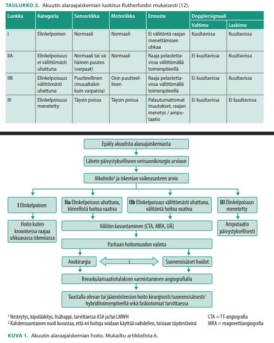
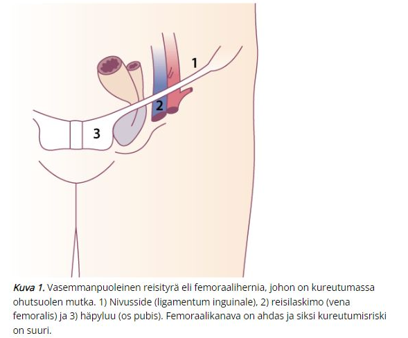
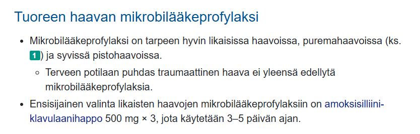
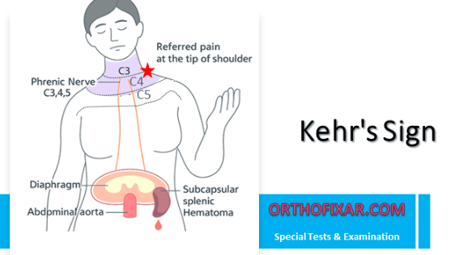
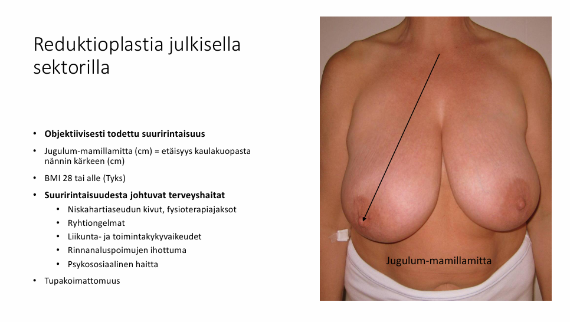
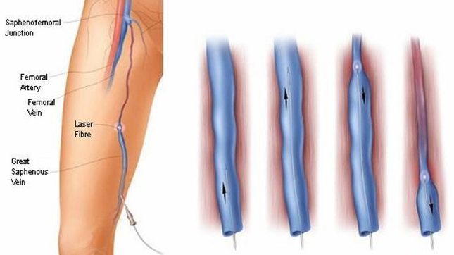
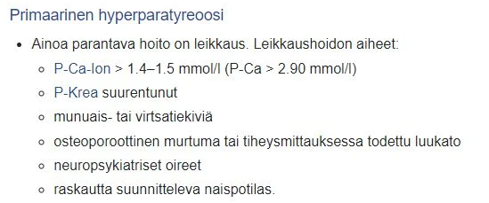

# 2024 (Apricus) 

Taas paljon vajavaisia kysymyksenasetteluita ja vaihtoehtoja. Jonkin verran myös aikaisempia tärppejä, joita ei nyt tässä yhteydessä käsitellä uudestaan. 

## Sappistaasin labrat

Ei vaihtoehtoja, mutta tässä sappistaasin labroista tärkeimmät: 

**Sappikivitautia epäiltäessä kannattaa määrittää tulehdus-, bilirubiini-, maksa- ja amylaasiarvot.**

- Sappikoliikissa yleensä viitealueella
- Akuutissa kolekystiitissä tulehdusarvot yleensä selvästi suurentuneet, joskus myös bilirubiini- ja maksa-arvot suurenevat lievästi
- **Sappitiekiviin (koledokolitiaasi) viittaavat selvemmin koholla olevat bilirubiini- ja maksa-arvot (erityisesti AFOS, Bil eli kolestaattinen (sappistaasi) kuva)**
- Kolangiitissa sekä tulehdus-, bilirubiini- että maksa-arvot (erityisesti AFOS, Bil eli kolestaattinen kuva) ovat selvästi suurentuneet

Sappikoliikissa ei siis ole vielä mitään merkittävää tulehdusta -> labrat normaalit 

-Akuutissa kolekystiitissä sappikoliikkia aiheuttava kivi ei poistu ductus cysticuksesta ja johtaa lopulta sappirakon tulehdukseen -> tulehdusarvot nousevat 
- Koledokolitiaasissa bilirubiini- ja maksa-arvot (ALAT, AFOS, GT) nousevat kolestaasin takia. Jos koledokolitiaasi ei väisty ja tila etenee kolangiitiksi, niin tulehdusarvot nousevat myös. 

Amyl nousisi pankreatiitissa 

- Sappipankreatiittia esiintyy noin 5 %:lla oireisista sappikivipotilaista
- Akuutti sappipankreatiitti syntyy, kun sappitiekivi kiilautuu Oddin sulkijalihakseen

## Mikä avanne muodostetaan Hartmannin leikkauksessa?

Ei vaihtoehtoja, mutta koita vastata ilman vinkkejä. 

  <button class="solution-button" data-label="Vastaus" data-hide-label="Piilota vastaus">
    Vastaus
  </button>
  

     Laskevan koolonin pääteavanne

Hartmannin leikkaus on usein käytetty päivystyksellisesti esim. perforoituneen divertikuliitin hoidossa. Leikkauksessa poistetaan sairastunut ja puhjennut suolen osa, jonka jälkeen proksimaalinen paksusuolen pää tuodaan avanteeksi ihon pinnalle.

Peräsuoli jää paikalleen ja suolen päiden yhdistäminen myöhemmin (tyypillisesti aikaisintaan puolen vuoden päästä) on usein mahdollista, kun potilas on toipunut päivystysleikkauksesta.

  

## Potilaalla colonca ja suoli poistettu ja tehty suojaava transversostooma. Suunnitteilla vielä sädehoito imusolmukemetastaasien takia. Milloin avanne suljetaan?

Ei vaihtoehtoja, mutta koita vastata ilman vinkkejä. 

  <button class="solution-button" data-label="Vastaus" data-hide-label="Piilota vastaus">
    Vastaus
  </button>
  

     Vasta adjuvanttiterapian jälkeen

Paksusuolen distaalisen osan poiston ja päiden liittämisen jälkeen usein tarvitaan liitoksesta proksimaalisesti rakennettu avanne (yleensä transversostooma) suojaamaan liitosta sen paranemiseen saakka -> yleensä poistetaan 2-3kk päästä sauman parannuttua. Jos onkologisissa tapauksissa suunnitellaan jatkohoitoja (sädehoito, adjuvanttikemoterapia), niin avanteen poisto tehdään tyypillisesti vasta hoitojen jälkeen.

Paksusuolen sekä peräsuolen poistaminen ei siis aina tarkoita pysyvää avannetta ja paksusuolisyövän leikkauksessa ei yleensä edes tarvita avannetta. Pysyvään paksusuoliavanteeseen (kolostomia, kolostooma) päädytään, kun peräaukko ja sen lihakset joudutaan poistamaan (esim. rectumsyövässä abdominoperineaalinen resektio eli rectumamputaatio)
  

## Mikä tyypillisin leikkaus ei-pienisoluisessa keuhkosyövässä?

- a. Keuhkon poisto
- b. Lohkon poisto
- c. Tuumorin poisto marginaalein 
- d. Keuhkonsiirto

  <button class="solution-button" data-label="Vastaus" data-hide-label="Piilota vastaus">
    Vastaus
  </button>
  

     b

Modernin kirurgian suuntaus on mini-invasiivisuus sekä keuhkokudoksen säästäminen. Valtaosa leikattavista keuhkosyövistä rajoittuu yhden keuhkolohkon alueelle, ja lohkonpoisto onkin edelleen keuhkosyöpäkirurgian perusleikkaus. Kansainvälisessä suosituksessa lohkonpoisto on edelleen ensisijainen vaihtoehto levinneisyysluokan I ja II taudissa normaalin leikkausriskin potilailla. 

a: Joskus keuhkonpoistokin on paikallaan. Perinteisesti pääkeuhkoputkeen, keuhkovaltimoon tai lohkorajan yli laajalti kasvavissa syövissä leikkaus on ollut keuhkonpoisto. Nykysuosituksena keuhkovaltimoon, keuhkoputkeen tai näihin molempiin kasvavissa syövissä on ensisijaisesti hiharesektio. Lohkonpoistoon liitetään pääkeuhkoputken tai valtimon resektio, ja jäljelle jäävän lohkon rakenteet liitetään proksimaalisesti katkaistuun keuhkoputkeen tai keuhkovaltimoon. Leikkaus on teknisesti monimutkaisempi, mutta leikkauskuolleisuus on pienempi ja pitkäaikaisennuste jopa parempi kuin keuhkonpoistossa. Lohkorajan ylittävissä syövissä keuhkonpoisto on usein vältettävissä tekemällä lohkonpoisto ja viereisen lohkon jaokkeenpoisto tai vaihtoehtoisesti lohkorajan molemmin puolin keuhkojaokkeiden poistot. 

c: Lohkoa säästävää kirurgiaa ja tällöin etenkin keuhkojaokkeen poistoa suositellaan suuremman leikkausriskin potilailla (keuhkojen heikentynyt toiminta, huono suorituskyky, muut sairaudet) levinneisyysluokan I syövissä ei-kirurgisten hoitojen sijasta sekä alle 2 cm:n mattalasimuutoksissa. Kahden tuoreen ison satunnaistetun tutkimuksen mukaan alle 2 cm:n syövissä pitkäaikaistulosten on osoitettu olevan jaokkeen poistolla vähintäänkin yhtä hyvät kuin lohkon poistossa. Nämä tutkimukset tulevat muuttamaan nykyisiä suosituksia alle 2 cm:n syöpien kirurgisesta hoidosta hyväkuntoisillakin potilailla.

d: Keuhkonsiirron aiheena on syövän sijasta pikemminkin loppuvaiheen keuhkosairaus, joka etenee muista hoidoista huolimatta ja jonka ennuste on huono. Yleisimpiä indikaatioita keuhkonsiirrolle ovat keuhkofibroosi, keuhkoahtaumatauti (COPD, chronic obstructive pulmonary disease) ja muut keuhkolaajentumataudit (mm. alfa1-antitrypsiinin puute), idiopaattinen keuhkoverenpainetauti ja kystinen fibroosi. 
  

## Potilaalla tänään tehty laparoskooppinen kolekystektomia. Nyt paineet putoaa ja takykardiaa. Vatsa aristaa painellen. Mikä todennäköisin komplikaatio?

Ei vaihtoehtoja, mutta huomioiden nopea kehittyminen (leikattu tänään) on todennäköisesti kyseessä on intra-abdominaalinen verenvuoto johtuen leikkaustraumasta johonkin suoneen. Tietysti voisi olla mikä tahansa muukin, kuten sappilekaasi tai suolitrauma ja näiden aiheuttama sepsis.  

## Tyrä leikattu 2 viikkoa sitten. Nyt samalla kohdalla pullotus, joka ei reponoidu. Ei aristava. Mikä vaivaa? 

- a. Kureutunut tyrä
- b. Uusiutunut tyrä
- c. Infektio 
- d. Serooma

  <button class="solution-button" data-label="Vastaus" data-hide-label="Piilota vastaus">
    Vastaus
  </button>
  

     d

Sopii seroomaan, joka on yleinen leikkauskomplikaatio, jossa leikkausalueelle kertyy kudosnestettä; yleistä 1–3 viikkoa postoperatiivisesti. Pullotus tuntuu, mutta ei kipua eikä punoitusta. Voi balloteerata palpoidessa. 

a: Kureutunut tyrä on palpaatioarka, eikä potilas saa sitä itse reponoiduksi kuten ennen

b: Tyrä ei tyypillisesti uusiudu näin nopeasti 

c: Infektio olisi myös aristava yleensä 
  

## Mitä tehdään uusiville paineoireita aiheuttaville kilpirauhaskystille?

Ei vaihtoehtoja, koita vastata ilman vinkkejä

  <button class="solution-button" data-label="Vastaus" data-hide-label="Piilota vastaus">
    Vastaus
  </button>
  

     Rf-hoito/Leikkaus

Paineoireita aiheuttava kysta voidaan tyhjentää aspiraatiolla. Toimenpideradiologi tyhjentää kystan ja täyttää ontelon joko etanolilla/polidokanolilla (pelkän tyhjennyksen jälkeen tilanne uusii todella usein ja nopeasti). Skleroterapia ei tosin poista uusiutumisriskiä. Tarkoitus on hoitaa oireettomaksi, ei hävittää kystaa kokonaan.

**Leikkaus voi joskus olla tarpeen, jos kysta oireilee (toistetusta) skleroterapiasta riippumatta jatkuvasti täyttymällä uudestaan. Voidaan koittaa aluksi toimenpiteenä radiofrekvenssiohoitoa.** Teho paras yksilokeroisissa puhtaasti kystisissä muutoksissa: suuret kystat voivat tarvita useampia käsittelyitä.

Kystat ovat hyvin yleisiä. Erilaisia kilpirauhaskyhmyjä on uä:llä tutkittuna ad 75% ihmisistä, naisilla enemmän. Näistä kystisiä on 15-25% ja benignejä 95%. 
  

## Paksu- ja peräsuolisyövän seurannassa käytettävä markkeri?

- a. CEA
- b. CA19-9 
- c. AFP
- d. CA-125 

  <button class="solution-button" data-label="Vastaus" data-hide-label="Piilota vastaus">
    Vastaus
  </button>
  

     a

CEA = Karsinoembryonaalinen antigeeni; osoitettiin ensin sikiön kolonin limakalvosta ja kolonkarsinoomakudoksista -> CEA-pitoisuus on korkeimillaan raskaana olevalla naisella noin 22. raskausviikolla. Pieniä määriä antigeenia syntetisoituu myös aikuisen paksusuolen limakalvossa, joten terveelläkin aikuisella on pieniä pitoisuuksia CEA:ta. Useimmiten CEA on koholla vasta kun syöpä on levinnyt, ei niinkään syövän varhaisvaiheissa. CEA-pitoisuus laskee nopeasti, mikäli primaaristi hoitotulos on ollut hyvä. 

CEA:n spesifisyys ja sensitivisyys syövän diagnostiikassa ja seulonnassa on alhainen, joten sitä voidaan käyttää vain syövän hoidon ja taudin kulun seurannassa. Syövän seurannassa pienenevä pitoisuus viittaa hyvään hoitovasteeseen, kun taas kahdessa perättäisessä näytteessä toistuva pitoisuuden suureneminen viittaa taudin uusiutumiseen. Jos pitoisuus toistuvissa määrityksissä suurenee edelleen, se on merkitsevä, vaikka CEA-arvo on vielä viitealueella

b: CA19-9 käytetään eniten haima-, maha-, maksa- ja sappitiesyöpien seurannassa. 

c: AFP (alfafetoproteiinin) paras käyttöaihe on primaarin maksakarsinooman tai itusolusyövän epäily sekä hoidon seuranta

d: CA-125 eli musiini 16 on ensisijaisesti munasarjasyövän merkkiaine
  

## Nissenin fundoplikaatio - mikä vaiva hoidettu? 

- a. Refluksitauti
- b. Ruokatorven akalasia
- c. Zenkerin divertikkeli
- d. Esofagusvarikset

  <button class="solution-button" data-label="Vastaus" data-hide-label="Piilota vastaus">
    Vastaus
  </button>
  

     a

Refluksitaudin kirurgisessa hoidossa yleisimmin käytetty fundoplikaatio-tyyppi on ns. Nissenin 360° mansetti, mutta jos ruokatorven motorinen toiminta on vahvasti heikentynyt, voidaan rakentaa osittainen posteriorinen (Toupet) tai anteriorinen (Dor) mansetti. Tehdään laparoskooppisesti. Fundoplikaation yleisimmät pitkäaikaisongelmat liittyvät vatsan turvottamiseen, ilmavaivoihin sekä kyvyttömyyteen röyhtäillä tai oksentaa. 

Fundoplikaatio on indikoitu, jos adekvaatti PPI-hoito ei auta (6kk hoito), potilas ei pysty/halua käyttää PPI/H2-salpaajia tai jos potilaalla on komplisoitunut erosiivinen esofagiitti, vaikea refluksitauti, suuri hiatushernia tai regurgitaatio vallitsevana oireena

b: Akalasiassa ruokatorven normaalia peristaltiikkaa ei millään hoidolla pystytä palauttamaan. Hoidossa pyritään parantamaan ruokatorven tyhjenemistä alasulkijaa löysentämällä. Dilataatio eli laajennus on akalasian perinteinen hoitokeino, minkä lisäksi nykyään voidaan käyttää myös botuliini-injektioita tai leikkausta. Akalasian tehokkain hoito on alasulkijalihaksen katkaisu eli Hellerin myotomia. Tähystystekniikalla laparoskopiateitse tehtävässä leikkauksessa lihaskerrokset avataan ruokatorven alaosan ja alasulkijan sekä mahalaukun yläosan kohdalta anteriorisesti limakalvoa avaamatta. Leikkaukseen yhdistetään aina myös osittainen fundoplikaatio, joka estää liiallisen refluksin.

c: Zenkerin divertikkeli eli faryngoesofageaalinen divertikkeli on ruokatorven umpipusseista yleisin, ja se syntynee nielun lihasten toimintahäiriön seurauksena. Nielemisen aikana yläsulkija ei relaksoidu tarpeeksi tai oikea-aikaisesti. Paine venyttää krikofaryngeuslihaksen yläpuolella ja takana keskiviivassa olevaa lihaksistoltaan heikompaa kohtaa. Aluksi oireet johtuvat sulkijan toimintahäiriöstä ja myöhemmin divertikkeliin retentoituvan ruoan regurgitaatiosta. Tärkein tutkimus on ruokatorven röntgenkuvaus.

Oireisen divertikkelin hoitona on leikkaus. Pienessä divertikkelissä riittää krikofaryngeuslihaksen myotomia, isommissa poistetaan myös divertikkeli. Toimenpide on mahdollista tehdä myös suun kautta tähystystekniikalla. 

d: Vuotavia ruokatorven suonikohjuja hoidetaan kumilenkkiligatuurilla, joilla saadaan 80–90 % vuodoista hallintaan. Endoskooppinen hoito on tarpeen, jos potilaalla on akuutti suonikohjurungon vuoto tai jos ruokatorven suonikohjuista kärsivän potilaan mahalaukussa on verta, eikä muuta vuotopaikkaa löydetä.

Mikäli vuoto jatkuu lääkityksestä huolimatta ja tähystys viivästyy tai endoskooppinen hoito ei onnistu, hoitona voidaan käyttää kardiaa komprimoivaa ballonkitamponaatiota (Sengstaken–Blakemoren tai Lintonin putki, ventrikkeliballongin paikka tarkistetaan röntgenkuvauksella) tai ruokatorven suonikohjun vuodon hoitoon tarkoitettua päällystettyä metalliverkkostenttiä, joka tamponoi vuodon.

  

## Akuutti alaraajaiskemia - mikä oire viittaa raajan elinkelpoisuuden menettämiseen

- a. raajan tunnottomuus ja plegia
- b. iskeeminen kipu
- c. alaraajan kutina 
- d. alaraaja tuntuu lämpimältä

  <button class="solution-button" data-label="Vastaus" data-hide-label="Piilota vastaus">
    Vastaus
  </button>
  

     a

Akuutin alaraajaiskemian hoidon kiireellisyys perustuu Rutherfordin luokitukseen (iskemian asteeseen). Erityisen tärkeää on tunnistaa Rutherford II, jossa raajan elinkelpoisuus on uhattu, mutta se voidaan vielä palauttaa. 

b: Iskeeminen kipu ei vielä viittaa elinkelpoisuuden menetykseen 

c: Kutina ei liity asiaan. 

d: Akuutissa alaraajaiskemiassa alaraaja on yleensä kylmä (6P-säännön poikilothermia)

  

## Mikä ei aiheuta akuuttia alaraajaiskemiaa?

- a. alaraajan embolia
- b. tromboosi
- c. keuhkoembolia 
- d. alaraajan ohitteen tukos

  <button class="solution-button" data-label="Vastaus" data-hide-label="Piilota vastaus">
    Vastaus
  </button>
  

     c

Akuutin alaraajaiskemian yleisimmät aiheuttajat ovat tromboosi ja alaraajan embolia. Myös ohitteet ovat alttiita tukoksille, jopa enemmän kuin normaalit suonet.

Keuhkoembolia ei suoraan aiheuta alaraajaiskemiaa, mutta voi tietysti pahentaa aikaisempaa kroonista iskemiaa, jos embolian aiheuttama hypoksemia on merkittävää.
  

## Pankreatiitissa antibiootin käyttö? (

- a. herkemmin alkoholipankreatiitissa kuin sappipankreatiitissa
- b. herkemmin sappipankreatiitissa kuin alkoholipankreatiitissa pankussa
- c. eijuuri koskaan käytetä
- d. käytetään aina

  <button class="solution-button" data-label="Vastaus" data-hide-label="Piilota vastaus">
    Vastaus
  </button>
  

     b

Akuutin pankreatiitin ensisijainen hoito on yleensä konservatiivinen ja tärkeintä on alkuvaiheen nesteytys, elektrolyyttihäiriöiden korjaaminen, varhaisessa vaiheessa p.o. ravitsemukseen siirtyminen ja kipulääkitys; vaikeissa taudeissa ulkusprofylaksia (PPI). 

Edes ab-hoitoa ei yleensä tarvita eikä suositella pankreatiitin infektiokomplikaatioiden ehkäisyyn (aloitetaan kuitenkin herkemmin sappipankreatiitissa ja varsinkin jos myös kolangiitti). Mikrobilääkkeistä ei ole hyötyä infektioiden ehkäisemisessä, eikä niitä tule käyttää, jos potilaalla ei ole toista infektiopesäkettä, kuten sepsistä tai kolangiittia.

Akuutti pankreatiitti on tyypillisesti steriili tulehdus, joka johtuu haimaentsyymien aktivoitumisesta haiman sisällä ja siitä aiheutuvasta autodigestiosta -> tämän takia antibiootit eivät ole erityisenkään tärkeitä rutiinisti. 
  

## Femoraalityrä, mitkä väittämät oikein? 

- a. vanhoilla naisilla tyypillinen
- b. leikataan usein
- c. kaikki oikein
- d. sijaitsee nivusligamentin kaudaalipuolella

  <button class="solution-button" data-label="Vastaus" data-hide-label="Piilota vastaus">
    Vastaus
  </button>
  

     c

a: Reisityrät iäkkäillä naisilla, nivustyrät miehillä (lateraaliset nuorilla ja mediaaliset iäkkäämmillä)

b: Koska tyräportti on pieni, niin kureutumisriski on suuri ja tämän takia lähes aina leikataan; voidaan korjata avoimesti tai tähystysteitse. Jälkimmäinen on suositeltavampi etenkin päivystystilanteessa, jotta kureutuneen kudoksen vitaliteetti voidaan varmistaa. Leikkauksessa tyräpussin sisältö palautetaan vatsaonteloon ja femoraalikanava suljetaan verkon avulla, tai jos kudoskuoliosta on seurannut infektiotilanne, ompelemalla.

d: Reisityrä työntyy nivustaipeeseen femoraalikanavaa pitkin. Femoraalikanava on nivussiteen (ligamentum inguinale) alla reisilaskimon (vena femoralis) ja häpyluun välissä oleva ahdas tila. Reisityrä onkin lähes aina pieni, enintään luumun kokoinen pullistuma nivustaipeen alaosassa tai mediaalisesti reiden tyvessä ja jää kliinisessä tutkimuksessa helposti huomaamatta. 

  

## Hydronefroosin hoito 

Ei vaihtoehtoja, mutta tässä tärkeimmät: 

Hydronefroosilla tarkoitetaan munuaisen kollektiosysteemin (munuaisallas ja kaliksit) dilataatiota. Jos dilataatiota todetaan myös virtsanjohtimessa, voidaan käyttää termiä hydroureteronefroosi.

- Tyypillisiä kliinisiä löydöksiä ja oireita kivun ohella ovat koputus- ja tärinäarkuus selässä, virtsamäärän väheneminen, plasman kreatiniinipitoisuuden suureneminen, elektrolyyttihäiriöt ja virtsan korkea pH (heikentynyt H+-eritys virtsaan). Pahoinvointia ja oksentelua voi ilmetä etiologiasta riippuen.
- Hydronefroosin aiheuttajat voidaan jakaa virtsankulun esteen sijainnin perusteella rakon yläpuolisiin, rakkotason ja rakon alapuolisiin aiheuttajiin. Lisäksi virtsateiden ulkopuoliset syyt voivat aiheuttaa hydronefroosia.

**Hydronefroosi voidaan todeta ultraäänitutkimuksella, mutta jos tilan syy ei ole muuten ilmeinen (esim. virtsaumpi), syyn selvittämiseksi tehdään yleensä tietokonekerroskuvaus (TT), johon voidaan tarvittaessa liittää urografiavaihe.**

- Hydronefroosin syytä voidaan selvittää ruiskuttamalla varjoainetta esimerkiksi nefrostooman kautta tai alateitse virtsanjohtimeen kuvauskatetrilla (anterogradinen/retrogradinen pyelografia). 

Hydronefroosi voidaan laukaista asettamalla polikliinisesti tai leikkaussalissa **virtsanjohdinstentti** (ns. JJ-stentti). 

- Radiologi voi laukaista hydronefroosin myös asettamalla kyljestä tai selästä nefrostooman tai potilaalle voidaan asettaa alatiekatetri, jos kyseessä on virtsaummen aiheuttama tilanne
- Päivystyksellisiä tilanteita, joissa hydronefroosi pitää laukaista välittömästi yleensä nefrostoomalla tai JJ-stentillä, ovat pyonefroosi eli märkäinen (septinen) munuaisallastulehdus sekä vakava munuaisten vajaatoiminta elektrolyyttihäiriöineen.
- Oleellista hoidossa on hydronefroosin altistavan perussyyn selvittäminen ja sen hoito. Mikäli hydronefroosin syy on kirurgisesti hoidettavissa esimerkiksi pyeloplastia pyeloureteraalisen junktion stenoosissa tai eturauhasen höyläys liikakasvun aiheuttamassa molemminpuolisessa hydronefroosissa, tulisi toimenpide tehdä elektiivisesti akuutin tilanteen rauhoituttua. Joskus on kuitenkin tyydyttävä pysyvään JJ-stentti- tai nefrostoomahoitoon parantumattomissa sairauksissa, hyvin iäkkäillä tai huonokuntoisilla potilailla.
- Jos munuaisfunktio ei hydronefroosin laukaisun jälkeen normalisoidu (obstruktiivinen uropatia), potilas tulee lähettää nefrologille.
  - Hydronefroosin kesto ja aste vaikuttaa munuaisvaurion kehittymiseen. Alle 7 vuorokautta kestävä hydronefroosi ei yleensä aiheuta pysyvää munuaisvauriota aiemmin terveellä potilaalla. Kaksi viikkoa kestävässä hydronefroosissa 70 % munuaisfunktiosta yleensä palautuu 3–6 kuukauden aikana ja neljä viikkoa kestävässä taas 30 %. Kuusi viikkoa kestäneessä täydellisessä hydronefroosissa munuaisen toiminta ei enää käytännössä palaudu.

## Yleisin ERCP:n komplikaatio on

- a. perforaatio
- b. verenvuoto
- c. pankreatiitti ´
- d. kolangiitti

  <button class="solution-button" data-label="Vastaus" data-hide-label="Piilota vastaus">
    Vastaus
  </button>
  

     c

ERCP:hen (endoskooppinen retrogradinen kolangiopankreatografia; toimenpide, jossa sivulle katsovalla duodenoskoopilla voidaan tutkia ja hoitaa sappi- ja haimatiehyen sairauksia läpivalaisulaitteen avulla) liittyviä komplikaatioita ovat 

haimatulehdus (2-5%, joissain lähteissä 3,5–9,7 %)

kolangiitti (1 %)

sfinkterotomian jälkeinen verenvuoto (1 %)

tiehyen tai suolen puhkeama (alle 1 %)

  

## Todennäköisin maksan pahanlaatuinen tuumori 

- a. HCC
- b. kolangioca
- c. metastaasi
- d. joku (ei wikissä)

  <button class="solution-button" data-label="Vastaus" data-hide-label="Piilota vastaus">
    Vastaus
  </button>
  

     c

Maksan yleisin pahanlaatuinen muutos on metastaasi (n. 90% maligniteeteista on metastaaseja). Yleisin maksan primaarinen syöpä on hepatosellulaarinen karsinooma (HCC) ja toiseksi yleisin on maksan sisäisistä sappiteistä lähtenyt kolangiokarsinooma. 

Maksan maksan pesäkemuutokset ovat useimmiten hyvänlaatuisia. Parantuneiden kuvantamismenetelmien ansiosta maksasta löydetään paikallismuutoksia jopa 20 %:lta tutkituista. Heistä viidesosalla muutos on pahanlaatuinen.

Yleisiä hyvänlaatuisia pesäkemuutoksia ovat fokaalinen rasvoittuminen (ei usein lasketa), yksittäiset kystat, hemangioomat (yleisin solidi tuumori) sekä fokaalinen nodulaarinen hyperplasia (FNH). Riippuen lähteestä hemangioomat voivat olla suorastaan yleisin maksan pesäkemuutos, joissain taas kystat ovat hieman yleisempiä kuin hemangioomat. 
  

## Virtsaamistiheyden ja sen etiologian selvittäminen, mikä paras 

- a. DAN-PSS
- b. IPSS
- c. IIEF 
- d. virtaamispäiväkirja

  <button class="solution-button" data-label="Vastaus" data-hide-label="Piilota vastaus">
    Vastaus
  </button>
  

     d

Virtsaamislista on objektiivinen (kunhan vain se täytetään oikein) ja lääkäri näkee heti jatkotutkimusten tarpeellisuuden. Virtsaamispäiväkirjaa potilas täyttää 2–3 vuorokauden ajalta, kirjaa kellonajan, jolloin käy virtsalla, ja mittaa virtsan tilavuuden yksinkertaisesti esimerkiksi tavaratalosta ostamallaan jauhokannulla. Kaikki "noin" -mittalaitteet (kahvikupit, lasit ja jogurttipurkit) saisi unohtaa, että saataisiin objektiivinen luku. Kannun kyljestä voidaan suoraan mitta-asteikolta lukea tilavuus millilitroina. 

Yövirtsauskerrat on syytä merkitä selkeästi, esim. rengastamalla mainitut kellonlyömät, sillä lääkäri ei voi tietää, millainen on kunkin potilaan yö. Leipomotyöntekijä aloittaa varmasti työnsä siihen aikaan, kun tiskijukka alkaa nukkua. Virtsauslistoista on helppo nähdä, mikä on rakon maksimaalinen kertakapasiteetti. 

Jos potilas käy virtsalla enemmän kuin 8 kertaa vuorokaudessa, puhutaan pollakisuriasta

a: DAN-PSS-1-kyselyllä (Danish Prostatic Symptom Score 1) pääasiassa selvitetään eturauhasen liikakasvun oireiden vaikeusastetta. Mittaa paitsi oireiden vaikeutta, myös niiden aiheuttamaa haittaa potilaalle.

b: Toinen yleisesti käytetty BPH:n oireiden vaikeusastetta mittaava kysely on on IPSS (International Prostate Symptom Score). DAN-PSS-1 vaikuttaa olevan ekstensiivisempi ja herkempi kuin IPSS. 

c: Erektiohäiriöpotilaan anamneesissa on hyvänä apuna kansainvälinen kyselylomake (International Index of Erectile Function). 
  

## Mikä on Marjolinin ulkus?

Ei vaihtoehtoja, mutta koita vastata ilman vinkkejä

  <button class="solution-button" data-label="Vastaus" data-hide-label="Piilota vastaus">
    Vastaus
  </button>
  

     SCC krooniseen haavaan

Okasolusyöpä voi joskus tulla aikaisemmin vaurioituneeseen ihoon, kuten vanhaan arpeen, haavaan joka ei parannu kunnolla tai krooniseen tulehdukselliseen ihotautiin. Tällöin sitä kutsutaan Marjolinin haavaksi. 

Kasvaa hitaasti, mutta prognoosi on huono. Diagnosoidaan koepalalla. Hoitona on kirurgia, mutta uusiutuu usein (20-30%). 

  

## Puukon viillosta 5 cm lihakseen ylettyvä haava, 7h vanha, mitä teet?

Ei vaihtoehtoja. Haavan sulkeminen ja antibioottiprofylaksian tarve riippu siitä onko haava arvioitava puhtaaksi vai likaiseksi ja millä sijainnilla se on. 

- Hermo-, jänne- ja lihasvammat tulee hoitaa lähipäivinä tai kirurgin arvion mukaan, viimeistään 3 viikon kuluessa. Jänteiden tutkiminen kämmenvammoissa. 
- Esim. illalla tapahtunut sormen viiltohaava ja koukistajajänteen katkeaminen: heti haavan puhdistus ja ihon atraumaattinen sulku 5–0-langalla sekä potilaan ohjaaminen seuraavaksi aamuksi käsikirurgiseen yksikköön

## Mitä Kehrin oire tarkoittaa? 

Ei vaihtoehtoja, mutta koita vastata ilman vinkkejä 

  <button class="solution-button" data-label="Vastaus" data-hide-label="Piilota vastaus">
    Vastaus
  </button>
  

     Palleaärsytys -> hartiasärky
     
Ulkusperforaatiossa kipu tuntuu aluksi epigastriumissa tai oikean kylkikaaren alla, mutta leviää nopeasti koko vatsan alueelle. Myös hartiakipua saattaa esiintyä merkkinä palleaärsytyksestä (Kehrin oire)

Muita tilanteita:

Laparoskopian jälkeinen hartiakipu

Pernan repeäminen -> kipu vasempaan hartiaan (joskus klassisesti Kehrin merkki yhdistetty vain tähän tilanteeseen)

Sappikoliikki -> kipu oikeaan hartiaan 

  

## Mitä blefaroplastia tarkoittaa? 

Ei vaihtoehtoja, mutta koita vastata ilman vinkkejä

  <button class="solution-button" data-label="Vastaus" data-hide-label="Piilota vastaus">
    Vastaus
  </button>
  

     Silmäluomileikkausta
     
Tyypillisesti tarkoitetaan yläluomen leikkausta. Ensisijaisesti voidaan **korjata lippaluomi** eli dermatochalasis, joka tarkoittaa yläluomen ihoylimäärää +/- rasvaa. Laskeutuu silmäluomen päälle ja voi peittää näkökenttää, aiheuttaen näköhaittaa tai väsyneen ilmeen. Leikkauksessa poistetaan yläluomen alueelle muodostunut ylimääräinen ihopoimu ja tarvittaessa muotoillaan alla olevaa rasvaa.
     
Raskas yläluomi aiheuttaa väsyneen ilmeen, mutta näkökentän eteen laskeutuessaan lippaluomipoimu aiheuttaa myös toiminnallisen ongelman. Tällöin tilanne rinnastetaan sairaudeksi, jolloin leikkaus voidaan toteuttaa julkisessa sairaanhoidossa. Julkisella yleisinä yläluomen kirurgian kriteereinä voidaan pitää: 

Toiminnallinen näkökykyhaitta (kompensatorinen otsajännitys voi esim aiheuttaa estolääkitystä vaativan migreenin)

MRD-1 mitta <2mm (MRD = Margin-reflex distance. Iho peittää näkökenttää tulemalla alle 2 mm:n päähän mustuaisen valoheijasteesta/optiselta akselilta)

  

## Mikä on tärkein prognostinen tekijä, joka ennustaa melanooman metastasointia ja kertoo siten eniten ennusteesta? 

Ei vaihtoehtoja, mutta koita vastata ilman vinkkejä.

  <button class="solution-button" data-label="Vastaus" data-hide-label="Piilota vastaus">
    Vastaus
  </button>
  

     Breslow'n mitta
     
Mitta epidermiksen granulaarisolukerroksen (stratum granulosum) pinnasta syvimpiin melanoomasoluihin. Jos ei invaasiota, niin ei myöskään ilmoiteta Breslow'n mittaa. In situ-vaiheessa ei siis vielä ole riskiä metastasoinnille.

Breslow'n mitta määrittää melanooman hoidollisessa inkiisiossa vaadittavat marginaalit. 

  

## Akuutti kolekystiitti, mikä leikkaustapa

- a. endoskopia
- b. laparoskopia
- c. avoleikkaus 
- d. ei leikkausta

  <button class="solution-button" data-label="Vastaus" data-hide-label="Piilota vastaus">
    Vastaus
  </button>
  

     b
     
Laparoskooppinen kolekystektomia (lap.chole) on akuutin kolekystiitin ensisijainen hoitokeino. Avoleikkaukseen joudutaan joskus konvertoimaan, mutta ei tyypillisesti. 
  

## Kuinka kauan laparoskopian jälkeen ilma näkyy vapaassa vatsaontelossa

Ei vaihtoehtoja, mutta koita vastata ilman vinkkejä 

  <button class="solution-button" data-label="Vastaus" data-hide-label="Piilota vastaus">
    Vastaus
  </button>
  

     Muutaman päivän

Laparoskopian jälkeen intra-abdominaalinen kaasu häviää n. 3 vrk:ssa 

Taas laparotomian jälkeen ilmaa usein ad 1vk operaatiosta, tämänkin jälkeen voi olla pieniä määriä nähtävissä. Vapaata ilmaa voi olla näkyvissä jopa 3 vk kohdalla laparotomiasta. 
  

## Potilaalla peniksen tyvessä laattamainen kova alue, mitä epäilet?

- a. penissyöpä
- b. kysyt käyristyykö penis erektiossa
- c. ahdas esinahka

  <button class="solution-button" data-label="Vastaus" data-hide-label="Piilota vastaus">
    Vastaus
  </button>
  

     b

Peyronien taudissa voidaan tyypillisesti tuntea siittimessä kovettuman. 

Peyronien tauti etenee vaiheittain:

Alkuvaihe eli akuutti inflammatorinen vaihe: Arpikudosta muodostuu ja oireena esiintyy usein erektionaikainen kipu ja tunnusteltavissa oleva patti tai kovettuma jo ennen käyristymisen ilmaantumista
- Aiheuttaa kipua erityisesti erektioissa, ajan kuluessa kipu helpottaa (kipuvaihe eli alkuvaihe saattaa kestää useita kuukausia) 

Kroonisessa fibroottisessa vaiheessa siittimessä selkeä kovettuma, joka kalkkeutuu ja aiheuttaa siittimen käyristymisen (käyristyy kovettuman suuntaan; useimmiten plakki on dorsumissa -> käyristyy ylöspäin, mutta plakki voi muodostua minne vain)

Ei ole tehokasta lääkehoitoa (injisoitava kollagenaasi poistunut markkinoilta), akuutissa vaiheessa tulehduskipulääkkeitä kivunhoidossa ja PDE5:n estäjät, jos potilaalla samanaikaisesti erektiohäiriö. Ensisijainen hoitokeino on operatiivinen, mutta mahdollinen oikaisuleikkaus tehdään vasta, kun kipuvaihe on ohi ja tilanne on ollut stabiili vähintään 3 kk. Useimmat potilaat pystyvät yhdyntään, jolloin kirurginen hoito ei ole tarpeen
  

## Potilaalla ortostaattista hypotensiota, mikä lääke eturauhasen liikakasvuun?

Ei vaihtoehtoja, mutta koita vastata ilman vinkkejä

  <button class="solution-button" data-label="Vastaus" data-hide-label="Piilota vastaus">
    Vastaus
  </button>
  

     5-ARI (esim. dutasteridi)

Lievä- ja keskivaikeaoireisten komplisoitumattomien BPH-potilaiden virtsaamisoireita hoidetaan ensisijaisesti lääkehoidolla, joka on tyypillisesti alfasalpaaja ja/tai 5-alfareduktaasin estäjä (5-ARI). 

Alfasalpaajat eli α1-reseptorin salpaajat (esim. tamsulosiini tai alfutsosiini) vaikuttavat rentouttamalla prostaattisen virtsaputken ja virtsarakon kaulan sileää lihaksistoa. Ne lievittävät nopeasti (vrt. 5-ARI:t jotka hitaammin) oireita, lisäävät virtsasuihkun huippuvirtaamaa ja vähentävät jäännösvirtsan tilavuutta. Ne kuitenkin myös salpaavat verisuonien alfareseptoreita ja siten laskevat verenpainetta ja erityisesti heikentävät verisuonien supistumista vasteena seisomaan nousemiselle, mikä pahentaa ortostaattista hypotensiota. 

5-ARI:t (esim. finasteridi tai dutasteridi) taas vaikuttavat eturauhasen liikakasvuun estämällä testosteronin metaboloitumista dihydrotestosteroniksi (DHT), jolloin seerumin DHT:n pitoisuus pienenee. Tämä vaikutus ilmenee hitaasti ja tämän takia 5-ARI:t lievittävät oireita hitaammin kuin alfasalpaajat. Ne taas kuitenkaan eivät vaikuta suoraan verisuoniin, jonka takia ortostaattisen hypotension riski ei käytännössä nouse. 
  

## 10-vuotta sitten operoitu sitten rektumsyöpä, nyt keuhkoissa joku tarkkarajainen tiivistymä. 

Ei vaihtoehtoja, mutta todennäköisesti kysytty keuhkotiivistymän etiologiasta (esim. **onko primaari keuhkokasvain vai rektumsyövän metastaasi**). 

  <button class="solution-button" data-label="Vastaus" data-hide-label="Piilota vastaus">
    Vastaus
  </button>
  

     Primaari syöpä

Yksittäinen keuhkotuumori on usein primääri keuhkosyöpä vaikka potilaalla olisi aiempi syöpä. Metastaasit ilmenevät tyypillisesti multippeleina ja ilmenevät tyypillisesti periferiassa. 

  

## Radikaalisti sädehoidettu prostataca. Nadir-PSA 2.5 ja nyt PSA 0,25. Mitä teet? 

Ei vaihtoehtoja, mutta koita vastata ilman vinkkejä. 

  <button class="solution-button" data-label="Vastaus" data-hide-label="Piilota vastaus">
    Vastaus
  </button>
  

     Lähete ESH

Jos PSA-arvo nousee 2 ug/l alimman sädehoidon jälkeisen arvon (nadir-psa; nadir = alin piste (zenithin vastakohta)) yli, niin eturauhassyöpä katsotaan uusineeksi (määritelmä koskee myös potilaita, jotka ovat saaneet hormonaalista hoitoa). Kun potilas siirtyy perusterveydenhuollon seurantaan, tulee potilasasiakirjoihin kirjata erikoissairaanhoitoon lähettämisen raja-arvo. 

Vrt. radikaaliin prostatektomiaan, jossa tauti katsotaan uusineeksi, jos PSA arvo nousee ollenkaan mitattavaksi leikkauksen jälkeisessä seurannassa. Sädehoidossa PSA ei yleensä katoa mittaamattoman matalaksi ja se saattaa vaihdella mittausten välillä, toisin kuin radikaalissa prostatektomiassa. 
  

## Palovamma kiulusta, tulee pari pv vamman jälkeen näyttämään, mitä teet?

Ei vaihtoehtoja, mutta koita vastata ilman vinkkejä 

  <button class="solution-button" data-label="Vastaus" data-hide-label="Piilota vastaus">
    Vastaus
  </button>
  

     Ag-sidos+ktrl

Jos kyseessä on lievä palovamma ja oletat, että se ei tarvitse leikkaushoitoa -> aloita hopeahoito (mepilex ag tmv.) ja kontrolloi tilanne PTH:ssa 2-5vrk kohdalla syvenemisen totamiseksi. Jos kontrollissa toteat merkittävän syvän vamman, joka ei todennäköisesti tule paranemaan itsestään, niin ESH-lähete. 
  

## Just eläköitynyt nainen, käynyt plastikon arviossa reduktioplastiaan, plastikko kieltäytynyt, miksi?

Ei vaihtoehtoja, joten olen tähän keksinyt mahdolliset: 

- a. potilaan ikä liian korkea 
- b. potilaan bmi 27
- c. potilas tupakoi puoli askia per pv 
- d. jugulum-mamillamitta 40cm 

  <button class="solution-button" data-label="Vastaus" data-hide-label="Piilota vastaus">
    Vastaus
  </button>
  

     c

Leikkaushoidon aiheellisuus arvioidaan yksilöllisesti. Jos leikkaus arvioidaan aiheelliseksi (oireet ja objektiivisesti todettu suuririntaisuus suhteessa muuhun kehoon), niin  leikkaukseen pääsyn ehtoina ovat **tupakoimattomuus ja painoindeksi alle 28** (Ainakin Tyksissä; joissain paikoissa, varsinkin muissa Pohjoismaissa alle 30). Ylipainoisia potilaita kehotetaan ensin laihduttamaan, jolloin leikkauskomplikaatioiden ja anestesian riskit ovat vähäisemmät ja rintojen lopullinen leikkaustulos on pysyvämpi. Tupakointi heikentää leikkaushaavan paranemista ja altistaa infektioille. Jos potilas tupakoi, lähettävän lääkärin tulisi ohjata hänet lopettamaan tupakointi ja tarjota tukea (ryhmä, lääkkeet) ennen lähetteen tekemistä.

a: Yläikärajaa rintojen pienennysleikkaukselle ei ole. Hyvin nuorten naisten kohdalla on suositeltavaa odottaa murrosiän kehityksen päättymistä. Pääsääntöisesti pienennysleikkauksia tehdään siis yli 18-vuotiaille, mutta rintojen liikakasvun äärimuodossa voidaan leikkausta harkita alle 18-vuotiaalle.

d: Jugulum-mamillamitta tarkoittaa kaulakuopan ja nännin välistä mittaa rinnankokoa mitattaessa. On kuitenkin syytä muistaa jugulum-mamillamittaa käytettäessä, että se kertoo ainoastaan rintojen laskeutumisen asteen ja etenkin voimakkaan laihtumisen jälkeen laskeutuneet rinnat voivat olla volyymiltaan hyvinkin pienet. Yli 31cm jugulum-mamillamitta alkaa olemaan jo todella suuri ja antaa jo vahvaa aihetta reduktioplastialle. 

Taulukko 1  rintojen reduktioplastiassa käytettävää Sosiaali- jaterveysministeriön laatimaa pisteytysjärjestelmää kiireettömän leikkaushoidon perusteisiin. Myöskään potilasta, joka ei saa vaadittua 50 pistettä täyteen, ei välttämättä suoraan käännytetä pois. Tässä tilanteessa poikkeavasta hoitopäätöksestä lääkärin on tehtävä kirjallinen perustelu potilaan saamista hyödyistä.

  

## Mikä oikein tyriä koskien?

Ei vaihtoehtoja, mutta vastauksen arveltu olevan: "Vatsaontelon sisältö pääsee faskia-aukosta subkutaanitilaan", joka on kylläkin oikein. 

Tyrällä tarkoitetaan vatsaontelon sisällön purkautumista vatsaontelon ulkopuolelle vatsaontelon seinämän  pitävässä rakenteessa olevan synnynnäisen tai hankitun aukon, ns. tyräportin, kautta. Useimmiten tyrä on vatsaontelon ulkopuolella oleva peritoneumpussi ja aukko on faskia-aukko. 

## Potilaalla lipoomaksi sopiva muutos, jonka koko on arviolta n. 4x2x3 cm. Mitä teet?

- a. poistan itse
- b. lähetän esh
- c. otat näytteen
- d. joku muu

  <button class="solution-button" data-label="Vastaus" data-hide-label="Piilota vastaus">
    Vastaus
  </button>
  

     a

Mikäli pehmytkydoskasvain on mobiili, pehmeä, hitaasti kasvanut, ihonalainen ja alle 5 cm:n läpimittainen, se on hyvin todennäköisesti hyvänlaatuinen. Sen voi tällöin poistaa itse TK-lääkärinä tai potilaan niin halutessa jäädä seurantalinjalle. 

Jos muutos olisi kliinisesti poikkeava eli <5cm, mutta ei mobiili tai nopeakasvuinen, niin voitaisiin tehdä kaikukuvaus ja sen perusteella jatkaa. Jos UÄ:ssä muutos olisi ihonalainen ja hyvänlaatuinen, niin se voitaisiin poistaa TK:ssa, jos se vaikuttaisi helposti poistettavalta. Pahanlaatuisuuden merkkien ollessa läsnä UÄ:ssä tehtäisiin lähete plastiikkakirurgille. 

b. Jos hyvänlaatuisen muutoksen kriteerit eivät täyty ja muutos on kliinisesti pahanlaatuinen (kuten tässä, koska kasvanut nopeasti ja on >5cm), niin ei voi jäädä pelkälle seurantakannalle, vaan tulee tehdä lähete plastiikkakirurgille.

c: Jos epäilisit pehmytkudostuumorin olevan maligni (eli sarkooma), niin niistä ei saa ottaa biopsioita, vaan lähetetään ESH. 

  

## Potilas kertoo peniksensä käyristyvän erektiossa, mistä kyse?

Ei vaihtoehtoja, mutta koita vastata ilman vinkkejä 

  <button class="solution-button" data-label="Vastaus" data-hide-label="Piilota vastaus">
    Vastaus
  </button>
  

     Peyronien tauti

Peyronien tauti etenee vaiheittain:

Alkuvaihe eli akuutti inflammatorinen vaihe: Arpikudosta muodostuu ja oireena esiintyy usein erektionaikainen kipu ja tunnusteltavissa oleva patti tai kovettuma jo ennen käyristymisen ilmaantumista
- Aiheuttaa kipua erityisesti erektioissa, ajan kuluessa kipu helpottaa (kipuvaihe eli alkuvaihe saattaa kestää useita kuukausia) 

Kroonisessa fibroottisessa vaiheessa siittimessä selkeä kovettuma, joka kalkkeutuu ja aiheuttaa siittimen käyristymisen (käyristyy kovettuman suuntaan; useimmiten plakki on dorsumissa -> käyristyy ylöspäin, mutta plakki voi muodostua minne vain). Peyronien taudissa voidaan tyypillisesti tuntea siittimessä kovettuman. 

Ei ole tehokasta lääkehoitoa (injisoitava kollagenaasi poistunut markkinoilta), akuutissa vaiheessa tulehduskipulääkkeitä kivunhoidossa ja PDE5:n estäjät, jos potilaalla samanaikaisesti erektiohäiriö. Ensisijainen hoitokeino on operatiivinen, mutta mahdollinen oikaisuleikkaus tehdään vasta, kun kipuvaihe on ohi ja tilanne on ollut stabiili vähintään 3 kk. Useimmat potilaat pystyvät yhdyntään, jolloin kirurginen hoito ei ole tarpeen
  

## Mikä on basaliooman poiston tavoiteltu marginaali? 

  <button class="solution-button" data-label="Vastaus" data-hide-label="Piilota vastaus">
    Vastaus
  </button>
  

     5 mm (makroskooppinen)

Pienen basaliooman voi poistaa terveyskeskuksessa ja hoitaa alusta loppuun itse. Hoito on ensisijaisesti 5mm makroskooppisilla marginaaleilla poisto veneviillosta. Tulee muistaa varmistaa PAD-vastaus ja puhtaat marginaalit. Jos sait koko muutoksen poistettua PAD:n mukaan ja leikkeessä on terveet marginaalit, niin hoito oli siinä. Seurantaakaan ei tarvitse, jos marginaalit olivat riittävät. Jos kyseessä on ollut suuren uusiutumisriskin (high grade) basaliooma tai ei-kirurgisesti hoidettu basaliooma, seuranta suunnitellaan harkinnan mukaan hoitavassa yksikössä. Jos basaliooma on leikkauksessa poistettu epätäydellisesti, pitää uusiutumisen ehkäisemiseksi suorittaa joko arven poistoleikkaus tai tilanteen mukaan ei-kirurginen hoito. Pelkkä seuranta ei ole näissä tapauksissa hyväksyttävää. 

Basalioomasta ei oteta ohutneulabiopsiaa. Muutoksen poisto kokonaisuudessaan on paras. Jos poisto ei onnistu, niin koepalaksi riittää 3–5 mm:n stanssipala, mutta jos kyseessä on pieni, kliinisesti selvä basaliooma esimerkiksi vartalolla, kannattaa tuumori poistaa kerralla kokonaan riittävin marginaalein. 
  

## Basaliooma, voiko metastasoida?

Ei vaihtoehtoja, mutta koita vastata ilman vinkkejä 

  <button class="solution-button" data-label="Vastaus" data-hide-label="Piilota vastaus">
    Vastaus
  </button>
  

     Kyllä, mutta on todella harvinaista

Insidenssi vaihtelee 0.0028%-0.55%. Tyvisolusyöpä on siis hyvin mukava syöpä. 
  

## Lapsen appendisiitti, mikä on totta

- a. ei ole yleisin lapsen akuutin vatsan aiheuttaja
- b. lapsen CRP käyttäytyy taudissa eri tavalla kuin aikuisilla
- c. diagnosoidaan usein TT:llä
- d. hoidetaan useammin konservatiivisesti kuin aikuisilla

  <button class="solution-button" data-label="Vastaus" data-hide-label="Piilota vastaus">
    Vastaus
  </button>
  

     b
     
Tulehdusarvoja (leukosyyttiluku ja CRP-pitoisuus) voidaan käyttää appendisiitin todennäköisyyden arvioimisessa. Normaali leukosyyttiluku ja CRP-pitoisuus ei täysin poissulje appendisiittia, mutta molempien ollessa normaalialueella on appendisiitti hyvin epätodennäköinen (varsinkin aikuisilla). N. 1/100 aikuispotilaasta leuk ja CRP normaalit vaikka appendisiitti ja n. 6/100 lapsista leuk ja CRP normaalit, koska lasten immunologia hieman erilainen kuin aikuisilla.

a: Appendisiitti on yleisin kirurgisen akuutin vatsan syy lapsilla

c: Lapsilla TT:tä vältetään säteilyn takia. Ensisijainen on UÄ, ja tarvittaessa MRI, ei TT

d: Konservatiivinen hoito (antibiootit) ei ole lapsilla ensisijaista. Lapset pääsääntöisesti leikataan. Joitakin aikuispotilaita on viime aikoina hoidettu konservatiivisesti ab-hoidolla, jos komplisoitunut appendisiitti on poissuljettu TT:llä. On kuitenkin jo näyttöä siitä, että lastenkin komplisoitumattomia tauteja (komplisoitumista ei tosin voi poissulkea UÄ:llä vaan vaatii vähintään MRI:n tai TT:n) voitaisiin hoitaa konservatiivisesti, mutta käytäntö ei ole yleisessä käytössä. 

Komplisoitumatonta appendisiittia (ja jos ei ole sen riskitekijöitä) ei tarvitse leikata välittömästi, vaan voidaan odottaa virka-aikaan pääsääntöisesti
  

## Milloin lippaluomileikkaus julkisella puolella

- a. potilaalla oireita, BMI 30 tai alle, ei tupakoi
- b. oireina näköhäiriöt, yläluomi painaa ripsien tyveen
- c. kosmeettinen haitta
- d. joku (ei wikissä)

  <button class="solution-button" data-label="Vastaus" data-hide-label="Piilota vastaus">
    Vastaus
  </button>
  

     b

Dermatochalasis eli lippaluomi tarkoittaa yläluomen ihoylimäärää +/- rasvaa. Laskeutuu silmäluomen päälle ja voi peittää näkökenttää, aiheuttaen näköhaittaa tai väsyneen ilmeen. Hoitona on leikkaus (blefaroplastia). Lippaluomen yläluomileikkauksessa poistetaan yläluomen alueelle muodostunut ylimääräinen ihopoimu ja tarvittaessa muotoillaan alla olevaa rasvaa.

Raskas yläluomi aiheuttaa väsyneen ilmeen, mutta näkökentän eteen laskeutuessaan lippaluomipoimu aiheuttaa myös toiminnallisen ongelman. Tällöin tilanne rinnastetaan sairaudeksi, jolloin leikkaus voidaan toteuttaa julkisessa sairaanhoidossa. Julkisella yleisinä yläluomen kirurgian kriteereinä voidaan pitää: 

Toiminnallinen näkökykyhaitta (kompensatorinen otsajännitys voi esim aiheuttaa estolääkitystä vaativan migreenin)

MRD-1 mitta <2mm (MRD = Margin-reflex distance. Iho peittää näkökenttää tulemalla alle 2 mm:n päähän mustuaisen valoheijasteesta/optiselta akselilta)

a: Enemmänkin esim. rintojenpienennysleikkauksen kriteerit (BMI-rajana joissain paikoissa 30, joissain 28) 

c: Pelkkä kosmeettinen haitta ei ole aihe julkisen puolen leikkaukselle. Tarvitsee olla oireita. 

  

## 54-vuotiaan miehen PSA 0,25, ei mitään oireita, mutta tuseeraten eturauhasen vasemmalla puolella kova resistenssi, miten jatkot?

- a. pyydät myös vapaan PSA:n määritystä ja, jos se on matala lähetät urolle jatkoselvityksiin
- b. lähetät suoraan jatkoselvityksiin
- c. ei tarvetta jatkotoimille
- d. joku

  <button class="solution-button" data-label="Vastaus" data-hide-label="Piilota vastaus">
    Vastaus
  </button>
  

     b

Eturauhassyöpää voidaan epäillä toistetusti poikkeavan PSA-pitoisuuden tai poikkeavan eturauhasen tunnustelulöydöksen perusteella. Eturauhassyöpä todetaan n. kolmasosalla potilaista, joilla eturauhasessa tuntuu kyhmy. **Eturauhasessa tuntuva uusi kyhmy on urologin konsultaation aihe riippumatta PSA-pitoisuudesta.** Normaali eturauhasen tunnustelulöydös ei poissulje eturauhassyöpää.

a: Näin voisi toimia, jos palpaatiolöydös olisi normaali ja PSA olisi lievästi koholla. Jos PSA on 2-15µg/l, niin lasketaan automaattisesti vapaa-PSA/kokonais-PSA-suhde, joka auttaa eturauhassyövän diagnostiikassa. Syöpäsolut tuottavat sitoutunutta PSA:a -> suhde laskee (Jos suhde <10%, on riski syövälle yli 50%; Jos suhde on >25%, niin riski alle 10%).

c: Epäilyttävä tuseerauslöydös -> aihe jatkoselvityksille 
  

## Mikä/Mitkä suonet hoidetaan useimmiten alaraajojen laskimoiden vajaatoiminnassa termoablaatiolla

- a. pinnalliset laskimot
- b. syvät laskimot
- c. laskimohaarat
- d. vena saphena magna & parva

  <button class="solution-button" data-label="Vastaus" data-hide-label="Piilota vastaus">
    Vastaus
  </button>
  

     d

Termoablaatiossa kohteena oleva pinnallinen päärunko (yleensä vena saphena magna tai parva) kanyloidaan ultraääniohjauksessa. Hoitokatetri viedään ultraääniohjauksessa 1–2 cm safenofemoraalisen tai safenopopliteaalisen junktion distaalipuolelle (turvamarginaali syvään laskimoon).

Hoidettavan laskimon ympärille injisoidaan tumesenssi-puudutus.Tumesenssi muodostaa lisäksi suojan laskimon ja ihon sekä muiden kudosten välille, jolloin termoablaation vaikutusten leviäminen ympäröiviin kudoksiin estyy.

Peruutellessa suonta takaisinpäin se suljetaan joko laserablaatiolla tai radiofrekvenssioablaatiolla. 

  

## Kolarissa ollut nuori mies, jolla syke 120, RR 90/50, pieni ilmarinta ja nestettä/verta perikardiumissa, miten toimit päivystäjänä?

- a. soitan thx-kirurgille, pleuradreeni ja valmistelu leikkaukseen
- b. adrenaliinia ja tehoseuranta
- c. soitan thx-kirurgille ja aloitan itse hätätoimenpiteen
- d. joku

  <button class="solution-button" data-label="Vastaus" data-hide-label="Piilota vastaus">
    Vastaus
  </button>
  

     c

Potilaalla on todennäköisesti tamponaatio (hemoperikardium estää sydämen normaalin pumppaustoiminnan). Hoito riippuu tilanteesta: potilaan voinnista ja erityisesti siitä, missä ollaan töissä ja mitä resursseja on käytössä. Optimitilanteessa kokematon ei joutuisi tekemään hätätoimenpiteitä eikä ainakaan ilman välitöntä tukea. 

Henkeä uhkaavassa, hemodynaamiseen sokkiin johtaneessa tamponaatiossa on viipymättä tehtävä sydänpussinesteen tyhjennys joko perkutaanisesti kaikukuvaus- tai läpivalaisukontrollissa tai kirurgisesti. Vaaran merkkejä ovat matala verenpainetaso, viileä periferia, pullottavat kaulalaskimot, tajunnantason heikkeneminen ja levottomuus. Ennen kirurgista hoitoa sokkinen potilas voidaan yrittää stabiloida perikardiumpunktiolla eli -senteesillä. 

Punktiota ei suositella, jos sydämen edessä oleva nestekertymä on läpimitaltaan alle 10 mm tai jos kertymä on lokeroitunut perikardiumin adheesioiden takia. Perdikardiumpunktion komplikaationa voi sattua harvoin sepelvaltimon (1 %) tai rintavaltimon perforaatio, punktio sydämen lokeroihin (1 %) tai ilma- tai veririnta (0,5 %). Vielä harvinaisempia komplikaatioita ovat maksan tai keuhkon perforaatio ja purulentti perikardiitti (0,3 %). Kaikukuvauksen rutiininomainen käyttö vähentää perikardiosenteesin komplikaatioita.

a: Pieni ilmarinta ei todennäköisesti ole potilaan epästabiilin hemodynamiikan taustalla. Jos kyseessä taas olisi paineilmarinta (näkyisi kyllä radiologisesti), niin silloin sen hoito olisi hätätoimenpiteellisesti aiheellista. 

b: Adrenaliini ja seuranta ei tule hoitamaan potilaan tamponaatiota, vaan tämä hoitolinja johtaisi kuolemaan. 

  

## 25-v raskautta suunnittelevalla naisella yli viitealueen kalsium (1,50) ja vasemman puolen kilpirauhasadenooma, mikä ensisijainen hoito

- a. leikkaus ennen raskautumista
- b. lääkehoito
- c. leikkaus vasta raskauden jälkeen

  <button class="solution-button" data-label="Vastaus" data-hide-label="Piilota vastaus">
    Vastaus
  </button>
  

     a

**Paratyreoidektomia ei ole vasta-aiheinen primaarin hyperparatyreoosin (PHPT) hoitokeino, jos potilas suunnittelee raskautta; se on oikeastaan leikkausindikaatio!**

  

## Potilastapaus 

Nuorella miehellä kipeytyneet kivekset ja penis, ollut aikaisemminkin, mutta usein helpottanut ab-kuurilla. Ei ole aikaisemmin otettu virtsanäytettä. Mikä todennäköinen diagnoosi ja hoito?

- a. krooninen prostatiitti akutisoitunut, aloitetaan fluorokinoloni
- b. krooninen prostatiitti akutisoitunut, otetaan virtsanäyte, aloitetaan NSAID ja tamsulosiini, jos virtsanäyte negatiivinen
- c. krooninen prostatiitti akutisoitunut, pahenee helposti, joten lähete päivystykseen

  <button class="solution-button" data-label="Vastaus" data-hide-label="Piilota vastaus">
    Vastaus
  </button>
  

     a

Kroonisessa prostatiitissa oireet ovat samat kuin akuutissa prostatiitissa, mutta lievempiä ja toistuvia (erityisesti talviaikaan). 

Kroonisessa prostatiitissa U-Kemseul ja BaktVi ovat yleensä negatiiviset. Krooninen prostatiitti on siis yleensä nonbakterielli etiologialtaan (vain. 10% virtsanäytteissä bakteereita). Kroonisesta nonbakteriellistä eturauhastulehduksesta käytetään usein nimitystä miehen krooninen lantion kiputila (chronic pelvic pain syndrome, CPPS, tyypin 3 prostatiitti). Syy ei aina selvä ja usein jää idiopaattiseksi; tärkeää sulkea pois ainakin eturauhassyöpä (voidaan tarvittaessa ottaa eturauhasbiopsia), vaikka potilas olisikin alle 50v. 

Tulee siis ottaa virtsanäyte ja varmistaa, että kyseessä on nonbakterielli tulehdus. Sen parantavaa hoitoa ei tunneta, mutta ensilinjan lääkkeitä ovat: tulehduskipulääkkeet (NSAID), alfasalpaajat (esim. tamsulosiini), 5-alfareduktaasin estäjät (finasteridi ja dutasteridi; erityisesti jos suurentunut eturauhanen), tarvittaessa trisykliset lääkkeet (esim. nortriptyliini; hyviä monissa kroonisissa kipuoireyhtymissä). 

a: Mikrobilääkkeistä voi olla hyötyä ja joillakin antibiooteilla on osoitettu esiintyvän sytokiinivälitteistä anti-inflammatorista vaikutusta, joka saattaa selittää niiden oireita lievittävän vaikutuksen; kannattaa harkita, jos _oireet esiintyvät ensimmäistä kertaa_ (varsinkin jos todetaan pyuriaa) tai tietysti jos todetaan bakteereita virtsanäytteessä.

c: Ei ole aihetta päivystyslähetteelle. 

Kuvan hierontatesti viitaaa siihen, että otetaan kaksi virtsanäytettä (PPMT, pre and post massage test); ns. fraktioitu virtsanäyte. Ensimmäisestä tutkitaan sakka ja tehdään bakteeriviljely. Tämän jälkeen eturauhasta hierotaan usean minuutin ajan ja otetaan heti uusi alkuvirtsanäyte (jälkihierontanäyte, 10–20 ml virtsasuihkun alusta). Kroonisessa eturauhastulehduksessa ilman bakteerietiologiaa (tyyppi 3) hierontanäytteet ovat steriilejä, mutta tyypin 3a eturauhastulehduksessa esiintyy valkosoluja jälkihierontanäytteessä (> 10/nk), kun taas tyypissä 3b ne puuttuvat. Pyuria, johon ei liity bakteerikasvua, hoidetaan kerran 1–2 kk:n pituisella mikrobilääkekuurilla. Jos tästä ei ole apua, mikrobilääkekuureja ei kannata toistaa.

  

## Pehmytkudosinfektion hoidon kulmakivi

- a. ylipainehappihoito
- b. nekroottisen kudoksen laaja poisto kirurgisesti
- c. laajakirjoinen ab esim. meropeneemi + klindamysiini

  <button class="solution-button" data-label="Vastaus" data-hide-label="Piilota vastaus">
    Vastaus
  </button>
  

     b

Kuoliota aiheuttavien pehmytkudostulehdusten hoidon tärkeimmät osiot: 

1. Eksploratiivinen leikkaushoito (tärkein) ja tietysti sepsiksen ja mahdollisen septisen sokin tukihoito
2. Laajakirjoinen iv-antibioottihoito
3. Ylipainehappihoito

Leikkaushoitoa ei voi korvata mikrobilääke-, ylipainehappi- tai muulla hoidolla. Kirurginen hoito on suoraviivaista: ihoavausta jatketaan, kunnes iho muuttuu terveeksi ja ihonalainen rasva ei enää irtoa kevyesti lihaskalvosta; kaikki kuollut kudos ja märkäkertymät poistetaan huolellisesti. Kaikki huono kudos 5 - 10 mm terveyskudosmarginaalilla infektion rajaamiseksi. Päälle kompressisidokset ja seuraava haavan tarkistus <24 tunnin toimenpiteestä; jos todetaan uusia kuolioalueita tai märkäkertymiä on tehtävä viipymättä uusintaleikkaus. 

a. Ylipainehappihoidon (HBO): lisää leukosyyttien toimintaa, tukahduttaa bakteerien kasvua, tehostaa ab:n vaikutuksia ja parantaa kudosparantumista. Ei kuitenkaan ole läheskään tärkein hoito. 

c: Ilman kirurgista hoitoa ei ab tule auttamaan. 
  

## Mihin melanooma metastasoi ensimmäisenä? 

Ei vaihtoehtoja, mutta tässä tärkeimmät melanooman metastasoimisesta: 

- Leviää aluksi alueellisiin imusolmukkeisiin. Niitä imusolmukkeita, jotka vastaanottavat ensimmäisenä suoraan kasvainalueelta tulevan imunesteen ja sen mukana kulkevat mahdolliset kasvainsolut, kutsutaan vartijasolmukkeiksi. Noin joka viidennellä melanoomapotilaalla voidaan todeta vartijasolmukkeen mikrometastaasi, mikä on jatkohoidon ja seurannan suunnittelussa huomioitava epäedullinen ennustetekijä.
  - Ennen imusolmukkeisiin pääsyä primaarituumorista irroneita solukertymiä eli satelliittileesioita kutsutaan eri nimillä: 
    - Mikrosatelliittimetastaasit = syöpäsolut nähdään primäärituumorin vieressä (eivät koske siihen) mikroskoopilla
    - Satelliittimetastaasit = syöpäsoluja on levinnyt alle 2cm päähän primäärituumorista
    - In-transit-metastaasit = syöpäsoluja on levinnyt yli 2cm päähän mutta ei vielä imusolmukkeisiin

Ihon ja imusolmukkeiden ulkopuolisista rakenteista melanoomien yleisimpiä etäisiä metastasointipaikkoja ovat keuhkot, maksa, luut ja aivot

## Mitä tarkoittaa gradus 4 sarkooma

Ei vaihtoehtoja, mutta ehkä haettu vain simppeliä määritelmää: 

- **Huonosti erilaistunut eli korkean pahanlaatuisuusasteen sarkooma**
  - Hyvin erilaistuneet kasvaimet (gradus 1 ja 2) ovat käytännössä matalan pahanlaatuisuusasteen kasvaimia, huonosti erilaistuneet kasvaimet (gradus 3 ja 4) puolestaan korkean pahanlaatuisuusasteen kasvaimia
  
Tuumorien gradus siis tyypillisesti kuvailee tuumorin erilaistumisastetta. Graduksen noustessa tuumorin erilaistuminen huononee. 

## Poisteettu 3cm adenooma nousevasta kolonista, jossa lievää dysplasiaa. Miten seurataan?

- a. Ei seurantaa
- b. Kontrollikolonoskopia, mutta ei parin vuoden sisään 
- c. Seurataan tiheästi mahdollisen syövän muodostumisen vuoksi
- d. Joku

  <button class="solution-button" data-label="Vastaus" data-hide-label="Piilota vastaus">
    Vastaus
  </button>
  

     b

Adenoomien seurannasta on olemassa tarkat suositukset, joiden perusteellista osaamista ei vaadita. Pääsääntöisesti voi muistaa, että seuranta, jos  adenooma >1cm, high grade dysplasia tai muu riskiä kohottava histologia (esim. sahalaitaisuus tai villööttisuus), saatiin vain osittainen poisto tai potilaalla on polypoosi.  

Edenneen adenooman löytyminen ennustaa suurentunutta riskiä sairastua kolorektaalisyöpään, minkä vuoksi poiston täydellisyyden varmistamisen jälkeen tehdään 3 vuoden kuluttua vielä uusintatähystys. 

a: Seurantaa tarvitaan nyt, koska muutos on >1cm. Pienen riskin muutoksissa potilas voidaan palauttaa takaisin paksusuolisyövän seulontaprosessiin 6v kuluttua. 

c: Ei tarvitse tiheää seurantaa, kolmen vuoden päästä riittää. Mikäli tähystyksessä todetaan polyyppi, mutta poisto jää puutteelliseksi, tulee kolonoskopia uusia kolmen kuukauden kuluessa.

  

## Potilaalla meleenaa ja Hb 84, mikä todennäköisin vuodon alkuperä? 

- a. yläGI
- b. alaGI 
- c. 50-50 
- d. joku

  <button class="solution-button" data-label="Vastaus" data-hide-label="Piilota vastaus">
    Vastaus
  </button>
  

     a

Meleenan (mustien ulosteiden) tulisi herättää epäily ylä-GI-vuodosta (veri ehtii hajoamaan ja ulosteen väri muuttuu mustaksi). Hemorrhagia ex ano (kirkas punainen vuoto) tulisi taas herättää epäilyn ala-GI-vuodosta. Meleena voi joskus johtua ala-GI-vuodostakin (esim. ohutsuolesta tai proksimaalisesta paksusuolesta), mutta yleensä aiheuttaja on ylä-GI-vuoto. 
  

## DM1, munuaisten vajaatoiminta, haava varpaassa. Reidessä 30x30 punainen ja kipeä alue.

- a. ihotautilääkärille
- b. erikoissairaanhoitoon (epäily faskian infektiosta)
- c. seurantaan osastolle, antibiootti
- d. joku

  <button class="solution-button" data-label="Vastaus" data-hide-label="Piilota vastaus">
    Vastaus
  </button>
  

     b

Haava varpaassa on voinut toimia infektioporttina. Reiden laaja kivulias eryteema diabetesta sairastavalla tulisi herättää pelon siitä, että kyseessä voisi mahdollisesti olle nekrotisoiva faskiittii ja potilas vaatii päivystysluonteista arviota. 

a: Ihotautilääkäri ei ole faskiitin hoitaja. 

c: Perusterveydenhuollon vuodeosasto ei ole sovelias paikka mahdollisen nekrotisoivan pehmytkudosinfektion hoidolle. 
  

