# 2025 (Calidus)

Paljon vanhoja tärppejä taas; ei niitä tässä yhteydessä uudestaan. Plastiikan suhteen enemmän uusia. 

## Potilas sairastaa metastasoitunutta ventrikkelikarsinoomaa. Ohutsuolessa metastaaseja, koolon siisti. Potilas hyötyisi todennäköisimmin

- a. Ohutsuoliavanteesta
- b. Paksusuoliavanteesta
- c. Ohutsuoliresektiosta ja ohutsuolen yhdistämisestä paksusuoleen

  <button class="solution-button" data-label="Vastaus" data-hide-label="Piilota vastaus">
    Vastaus
  </button>
  

     c

Etäpesäkkeiset mahasyövät (M1) ovat useimmiten kuratiivisen hoidon ulkopuolella, kuten myös osa paikallisesti edenneistä syövistä. Lisäksi oheissairaudet ja yleiskunto voivat muodostua esteeksi radikaalikirurgialle.

Tukosoiretta voidaan hoitaa joko asettamalla stentti endoskooppisesti tukoskohtaan tai tekemällä palliatiivinen resektio tai operatiivinen ohitus (gastrojejunostomia). Stenttihoito tulee kyseeseen, jos potilas on huonokuntoinen ja hänellä on vain muutama kuukausi elinaikaa. **Hyväkuntoiselle potilaalle resektio on paras vaihtoehto, jos kasvain ei ole kiinnittynyt retroperitoneaalisesti.** Palliatiivisena toimenpiteenä totaaligastrektomia on huono, ja se voi jopa lyhentää elinaikaa.
  

## Mikä ei ole tyypillinen kivessyövän oire/löydös?

- a. kasvain kiveksessä
- b. kasvain kiveksen yläpuolella
- c. kipu
- d. kiveksen suureneminen

  <button class="solution-button" data-label="Vastaus" data-hide-label="Piilota vastaus">
    Vastaus
  </button>
  

     b

Kasvain tuntuu tyypillisesti kiinteänä tai kumimaisena resistenssinä kiveksen sisällä. Kiveksen päällä tuntuva massa voi olla spermatoseele, epididymiitti tai joskus varikoseele. 

a: Palpaatiossa kiveksessä tunnettavaa kyhmyä tulee pitää pahanlaatuisena, kunnes se on osoitettu hyvänlaatuiseksi. Kivespussin ultraäänitutkimus on hyvä ja luotettava tutkimus. Mikäli ultraäänitutkimus viittaa vahvasti kiveksen maligniteettiin, on syytä tehdä levinneisyystutkimuksena vartalon tietokonekerroskuvaus (TT). Koepalan ottoa kiveskasvaimesta kivespussin läpi ei suositella tuumorisolujen leviämisen riskin vuoksi. Primaarihoitona niin seminoomissa kuin ei-seminoomissakin on radikaali orkiektomia, jossa nivusviillosta poistetaan kives ja funikkeli.

c: Kivessyöpä on yleensä kivuton, mutta kipuilu ei ole harvinaista. 

d: Yleisin syy hoitoon hakeutumiseen on toisen kiveksen suureneminen. Vaikka potilas tavallisesti havaitsee itse kiveksen suurentumisen, hoitoon hakeutuminen viivästyy usein varsin paljon.
  

## Mikä ei ole tyypillinen virtsarakkosyövän oire/löydös?

Ei vaihtoehtoja, mutta tässä virtsarakkosyövän tyypillisimmät oireet: 

- Yleisin uroteelisyövän oire on verivirtsaisuus, jota on ainakin 85 %:lla rakkosyöpäpotilaista. Verivirtsaisuus voi olla makroskooppista eli silminnähtävää tai mikroskooppista eli virtsakokeen paljastamaa.
- Noin kolmanneksella rakkokasvainpotilaista on ärsytysoireita, kuten kivuliaisuutta virtsatessa, tiheä- ja yövirtsaisuutta sekä virtsapakon tunnetta.

## Mikä ei ole virtsatiekivitaudin löydös?

- a. mikroskop. hematuria
- b. makroskop. hematuria
- c. krea koholla
- d. joku

  <button class="solution-button" data-label="Vastaus" data-hide-label="Piilota vastaus">
    Vastaus
  </button>
  

     c
     
Jos näistä pitäisi valita, niin c olisi sopivin, koska kreatiniini nousee harvoin yksittäisen kiven vuoksi, vaikka olisikin merkittävä tukos, koska toinen munuainen pystyy kompensoimaan hyvin. Jos molemmissa munuaisissa on obstruktio tai potilaalla on vain yksi toiminnallinen munuainen, niin silloin kreakin nousisi merkittävästi. 

a-b: Mikroskooppinen (harvoin makroskooppinen) hematuria todetaan 90 %:lla

d: Muita tyypillisiä löydöksiä: Kova, koliikkimainen kipu, joka säteilee kylkikaaresta vinosti alavatsalle, nivustaipeeseen ja sukuelimiin. Usein virtsaamiskipua, jos kivi sijaitsee alaureterissa. Usein pahoinvointia ja oksentelua. Munuaisten koputus- ja palpaatioarkuutta voi ilmetä. Potilaan on vaikea pysyä paikallaan (vrt. peritoniitti: potilas lepää mieluiten paikallaan).
  

## Mikä ei ole tyypillinen munuaissyövän löydös? 

- a. hematuria
- b. tulehdusarvojen nousu
- c. elektrolyyttihäiriö
- d. kuume

  <button class="solution-button" data-label="Vastaus" data-hide-label="Piilota vastaus">
    Vastaus
  </button>
  

     c

Munuaissyövät ovat kylläkin yleensä oireettomia ja suurin osa löytyy sattumalta vatsan kuvantamistutkimuksissa.

Mahdollisia oireita ovat kuitenkin selkä- ja kylkikipu, hematuria, metastaasien oireet, yleisoireet (tulehdusarvojen nousu ja kuume); hypersedimentaatio, anemia ja mikroskooppinen verivirtsaisuus ovat tavallisia löydöksiä virtsatutkimuksissa. 

Kaikukuvaus on suositeltavin seulontatutkimus epäiltäessä munuaissyöpää. Laboratoriotutkimukset: La, PVKT, Krea, AFOS ja U-KemSeul. Kasvainlöydös varmistetaan tavallisesti vartalon varjoainetehosteisella tietokonetomografialla (TT). Histologinen varmistus biopsialla tulee ottaa aina ennen ablatiivisen (radiofrekvenssi- tai kryoablaatio) tai onkologisen hoidon aloitusta. Kudosnäytteiden ottaminen munuaiskasvaimista on yleistynyt, koska ennustetta sekä mahdollisen leikkauksen tai muun hoidon hyötyjä ja haittoja joudutaan punnitsemaan yhä tarkemmin.

Munuaissyöpä syntyy tubulusepiteelin solujen muuttuessa kumuloituvien geenimutaatioiden kautta pahanlaatuisiksi. Munuaissyövän tärkeimmät histologiset alatyypit ovat **kirkassoluinen karsinooma (75 %), papillaarinen karsinooma (10 %) ja kromofobinen karsinooma (5 %)**

Tärkein riskitekijä on tupakointi. Muita riskitekijöitä ovat lihavuus ja korkea verenpaine. Myös perinnöllisillä tekijöillä on vaikutusta.
  

## PSA 2, millä vapaan PSA:n arvolla on merkittävä eturauhassyövän riski?

- a. Eturauhassyövän riski on merkittävä vapaasta PSA:sta riippumatta 
- b. Kun suhde on >25% 
- c. Kun suhde on <10%
- d. Eturauhassyövän riskiä ei ole, koska kokonais-PSA on niin matala 

  <button class="solution-button" data-label="Vastaus" data-hide-label="Piilota vastaus">
    Vastaus
  </button>
  

     d (ehkä c)

Huonosti sanoitettu vaihtoehto d (yksiselitteinen "ei ole"; eturauhassyöpää ei pysty poissulkea PSA-arvolla). Todennäköisesti kuitenkin on haettu sitä, että 
Vapaan PSA:n osuuden pieneneminen auttaa diagnostiikassa (mitataan automaattisesti labrasta riippuen silloin jos PSA on 2.5-10 tai TYKSLabissa jopa kun 2-15. **Eturauhassyöpäriskiä arvioitaessa kokonais-PSA on selvästi tärkeämpi ja pelkästään pieni vapaan PSA:n osuus ei ole aihe lisätutkimuksiin, jos kokonais-PSA on normaali (kuten nyt tässä).**

c: Kokonais-PSA-pitoisuuden ollessa alle 3 µg/l (ns. seulontanegatiivinen) on vapaan PSA:n osuuden merkitys ollut epäselvä, mutta ilmeisesti vapaa PSA kertoo eturauhassyövän riskistä myös kokonais-PSA-arvon ollessa alle 3 µg/l. Vapaan PSA:n osuuden kliininen merkitys on kuitenkin pienentynyt magneettikuvauksen ja muiden menetelmien käytön yleistyessä. 

Jos suhde on välillä 4-10 <10%, on riski syövälle yli 50%. Jos suhde on >25%, niin riski alle 10%. 
  

## Priapismi hoito:

- a. punktio + etilefriini
- b. punktio + sildenafiili
- c. joku
- d. joku

  <button class="solution-button" data-label="Vastaus" data-hide-label="Piilota vastaus">
    Vastaus
  </button>
  

     a

Lääkäri saa priapismin laukeamaan punktoimalla toisen paisuvaiskudoksen paksulla, esim. 21G:n neulalla, aspiroimalla siitä 100–200 ml tummaa laskimoverta, puristamalla samalla siittimen vartta ja ruiskuttamalla paisuvaiseen adrenergista lääkettä, tavallisimmin etilefriinihydrokloridia (Effortil), jonka kerta-annos on 5–10 mg. Vaihtoehtoisina lääkkeinä paisuvaiseen voidaan injisoida adrenaliinia 0,5–1,0 ml (1:1 000) tai noradrenaliinia 10–20 µg. 

Lääkeinjektio voidaan tarvittaessa uusia puolen tunnin kuluttua edellisestä injektiosta. Lääke tulee ruiskuttaa hitaasti paisuvaiskudokseen. Potilaan pulssia ja verenpainetta tulee seurata injektion aikana ja sen jälkeen noin puolen tunnin ajan. On huomioitava, että siitin ei veltostu heti lääkeinjektion jälkeen, vaan yleensä kestää useita tunteja, ennen kuin siitin saavuttaa normaalin pehmeyden. 

Jos priapismi ei laukea kahden injektion jälkeen, potilas tulisi lähettää urologiseen yksikköön hoitoon. Priapismin kirurgisessa hoidossa corpus cavernosumin ylipaineinen veri pyritään ohjaamaan joko corpus spongiosumiin tai suoraan suureen laskimoon. Winterin sunttileikkauksessa pistoveitsellä tai prostatabiopsianeulalla tehdään yhteys corpus cavernosumin ja terskan paisuvaiskudoksen välille niin, että veri pääsee poistumaan corpus spongiosumin kautta. Distaalisen suntin osoittautuessa riittämättömäksi joudutaan tekemään avoleikkaus, jossa tehdään fisteli paisuvaisten välille niiden proksimaaliosaan tai yhdistetään paisuvainen suoraan laskimoon.
  

## Katetrointi, mikä pitää paikkansa?

- a. Katetri työnnetään kokonaan virtsarakkoon
- b. Katetri on tarpeeksi syvällä kun virtsaa alkaa tulemaan katetrista
- c. Balongin täytön kuuluu tehdä kipeää
- d. Riittää että vain virtsaputken pään puuduttaa geelillä koska muuten virtsaputkessa ei ole tuntoa

  <button class="solution-button" data-label="Vastaus" data-hide-label="Piilota vastaus">
    Vastaus
  </button>
  

     a

b: Kun virtsaa alkaa purkautua, katetria tulee työntää vielä n. 5 cm ennen kuin pallo täytetään, jotta tämä tapahtuu varmasti rakossa eikä virtsaputkessa

c: Balongin täyttö EI saa sattua. Mikäli pallo täytetään virtsaputken tai eturauhasen alueella, potilas tuntee yleensä kipua. 

d: Mikäli ei käytetä hydrofiilipäällysteistä veteen kostutettavaa katetria, pitää virtsaputki täyttää ennen katetrointia puuduttavalla ja liukastavalla geelillä. Miehelle sitä tarvitaan 20 ml, kun taas naiselle riittää muutama millilitra. Erityisesti miehelle geeli pitää ruiskuttaa tasaisen hitaasti, jotta se leviää myös ulkoisen sulkijan läpi takavirtsaputken alueelle. 
  

## Eturauhasen hyvänlaatuinen liikakasvu ja hankalat oireet (suuri eturauhanen, hankalat virtsaamisoireet). Mistä lääkityksestä potilas hyötyisi eniten?

Ei vaihtoehtoja, mutta koita vastata ilman vinkkejä 

  <button class="solution-button" data-label="Vastaus" data-hide-label="Piilota vastaus">
    Vastaus
  </button>
  

     5-ARI (dutasteridi tai finasteridi)

5-alfareduktaasin estäjät vaikuttavat eturauhasen liikakasvuun estämällä testosteronin metaboloitumista dihydrotestosteroniksi (DHT), jolloin seerumin DHT:n pitoisuus pienenee. Tämä johtaa eturauhasen koon pienenemiseen ja oireiden lievittymiseen. Myös rakon ulosvirtauskanavan ahtauma pienenee eturauhasen koon pienentyessä. 

Myös alfasalpaajat (tamsulosiini tai alfutsosiini) ovat hyödyllisiä ja ne  vaikuttavat selvästi nopeammin kuin 5-alfareduktaasin estäjät, mutta ne eivät pienennä eturauhasen kokoa. 

Usein näitä lääkkeitä käytetään yhdessä, jolloin lääkkeiden teho paranee ja saadaan oirelievitystä 5-ARI:n pienentävää vaikutusta odotellessa. 
  

## Missä yhteydessä ei tarvita jäännösvirtsan mittausta?

- a. Miehen tiheävirtsaisuus
- b. Miehen vti-epäily
- c-d. Jotain (ei muistettu tärppeihin)

  <button class="solution-button" data-label="Vastaus" data-hide-label="Piilota vastaus">
    Vastaus
  </button>
  

     C-D

a: Hyvin tyypillinen syy mitata jäännösvirtsa (esim. eturauhasperäinen tyhjenemishäiriö mahdollinen -> kerääntymisoireet, kuten yövirtsaaminen ja pollakisuria)

b: Miehen VTI:n taustalla on usein joku syy, esim. juuri tyhjenemishäiriöt

Tilanteita, joissa ei tarvittaisi jäännösvirtsan mittausta on mm. nuorella naisella epäilty VTI ilman virtsaumpioireita (hoitona antibiootti ilman sen suurempia selvittelyjä). 
  

## Mikä ei ole tyypillinen rakon overflow-oire?

Ei vaihtoehtoja, mutta tässä overflowsta: 

Ylivuotovirtsankarkailu (overflow urinary incontinence) on tyypillisesti yöaikaan tapahtuvaa virtsankarkaamista, joka liittyy virtsarakon akuuttiin tai krooniseen tyhjenemishäiriöön eli virtsaumpeen (virtsa-retentio)

- On siis kroonista retentiota ja lopulta ylitäyttymistä -> ylitäyden rakon paine ylittää virtsaputken paineen ja virtsaa tihkuu ulos
- Miehillä mekaaninen este voi esim. olla suurentunut eturauhanen, mutta usein miehilläkin taustalla on jostain syystä heikentynyt virtsaamisheijaste (esim. hermoston sairaus tai vamma, virtsarakon seinämälihaksen arpeutuminen, leikkauksen jälkitila)
- Naisilla mekaaninen este on harvinainen (voi joskus olla esimerkiksi lantion alueen kasvain tai raskaus) ja naisella tilanne syntyy yleensä rakon supistushäiriöstä, jonka aiheuttaa esimerkiksi voimakas antikolinerginen lääkitys, ääreishermon sairaus tai vamma (esim. cauda equina oireyhtymä) tai sentraalinen neurologinen sairaus (esim. MS-tauti). 

Tyypillisiä oireita ovat siis mm:

- jatkuva tiputteluvuoto
- heikko virtsasuihku ja pienet virtsamäärät
- tunne, ettei rakko tyhjene 
- vatsan/suprapubisen alueen täyteyden tunne
- suuri jäännösvirtsa 

## Vuorokauden nesteen tarve, kun palovamma rintakehällä, käsissä ja yläselässä 70kg henkilöllä

Ei vaihtoehtoja, mutta koita vastata ilman vinkkejä 

  <button class="solution-button" data-label="Vastaus" data-hide-label="Piilota vastaus">
    Vastaus
  </button>
  

     7500 (tai 4200) 

Modifioitu parklandin kaava: 3ml x paino (kg) x TBSA (%) = arvioitu vuorokauden nesteentarve

Arvioidaan, että potilaalla on vain rintakehän (eikä abdomenin eli puolikas yläkehon etuosasta) ja yläselän (ei alaselän  eli puolikas selästä) palovamma, joten voidaan sanoa, että rule of nines perusteella on yhteensä näiden suhteen 18% palovamma-alue. Jos molemmat yläraajat ovat palaneet kokonaan, niin siitäkin tulee 18% eli yhteensä potilaalla on 36% palanut (jos vain kädet toiselta puolelta, niin sitten olisi 2% eli yhteensä 20%). 

3ml x 70 x 36 = 7560 ml (jos pelkät kädet eikä koko yläraajat niin sitten 3ml x 70 x 20 = 4200). Tästä 50% annetaan ensimmäisen 8h aikana vamman aiheutumisesta ja loput seuraavan 16h aikana. Ringerillä jos ei ole hemodynaamisesti merkittävää vuotoa (lapsilla lisäksi G5-korjausneste rajallisempien maksan glykogeenivarastojen vuoksi)

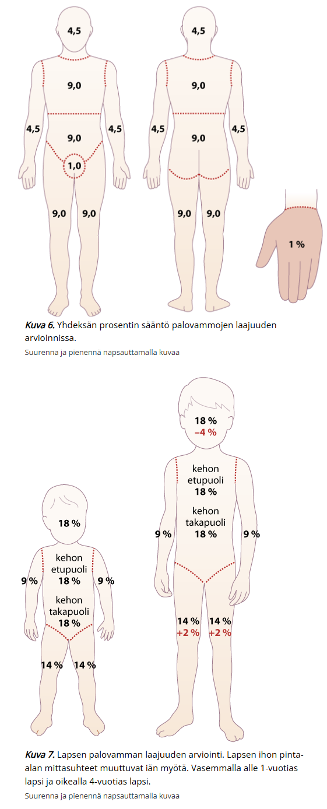
  

## Eskarotomia

Ei vaihtoehtoja, tässä aiheesta: 

Syvän palovamman alueelle muodostuu panssarimainen, joustamaton kudos, eskar. Sirkulaarinen eskar raajojen alueella voi johtaa alla olevan kudoksen verenkierron salpaantumiseen ja iskemiaan, jolloin raajan elinkelpoisuus voi olla uhattuna. Rintakehän alueella eskar voi johtaa hengitystiepaineiden nousuun ja potilaan ventilaation huononemiseen. Vatsan alueella eskar voi aiheuttaa vatsaontelon sisäisen paineen nousun ja johtaa suoli-iskemiaan ja munuaistoiminnan huononemiseen.

- Jos nesteytys, kivunhoito, raajojen kohoasento yms ei auta, niin tarvitaan eskarotomia, jossa syvä palanut kudos halkaistaan
- Eskarotomiat voidaan tehdä vuodeosasto-olosuhteissa tai teho-osastolla, kunhan on varauduttu verenvuodon hoitamiseen esimerkiksi diatermialla. Syvissä lihaskalvoon asti ulottuvissa palovammoissa ja sähköpalovammoissa tarvitaan usein myös faskiotomiat, ja nämä on syytä tehdä leikkaussalissa yleisanestesiassa.

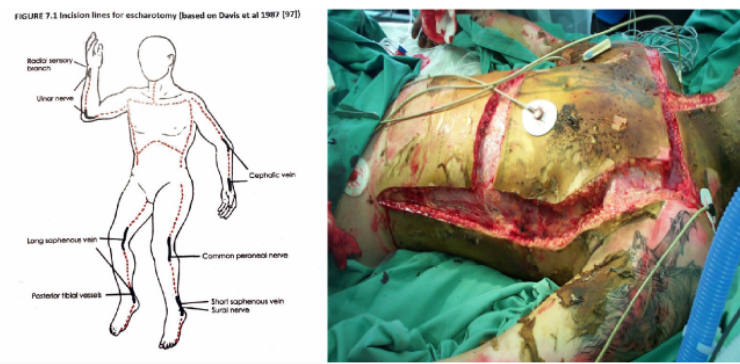

## Potilastapaus 

Lääketieteen opiskelija kastellut lääkärintakkinsa bensalla ja sytyttänyt sen tuleen näyttäessään kurssikavereille pikku showta. Palovammoja rintakehällä, käsivarsissa ja yläselässä. Palovamma pohjalta vaalea, ei kapillaarireaktiota, ei tuntoa. Palovamman syvyyden arviointi:

- a. 1
- b. 2A
- c. 2B
- d. 2C
- e. 3

  <button class="solution-button" data-label="Vastaus" data-hide-label="Piilota vastaus">
    Vastaus
  </button>
  

     e

  

## Sama kundi, kuinka suuri on palovamman pinta-ala? 

- a. 57% 
- b. 36% 
- c. 20% 
- d. 18%

  <button class="solution-button" data-label="Vastaus" data-hide-label="Piilota vastaus">
    Vastaus
  </button>
  

     b
     

  

## Sama kundi, vaikeuksia hengityksessä. Rintakehä tunnoton ja paksuuntunu. Intuboitu, mutta ei vaikuta auttavan. Mikä toimenpide seuraavaksi?

- a. Pleuradreeni
- b. Eskarotomia 
- c. Torakotomia 

  <button class="solution-button" data-label="Vastaus" data-hide-label="Piilota vastaus">
    Vastaus
  </button>
  

     b

Syvän palovamman alueelle muodostuu panssarimainen, joustamaton kudos, eskar. Sirkulaarinen eskar raajojen alueella voi johtaa alla olevan kudoksen verenkierron salpaantumiseen ja iskemiaan, jolloin raajan elinkelpoisuus voi olla uhattuna. Rintakehän alueella eskar voi johtaa hengitystiepaineiden nousuun ja potilaan ventilaation huononemiseen. 

Potilaan ventilaatio ei toimi intubaatiosta huolimatta, koska panssari estää rintakehän liikettä -> tarvitaan eskarotomia. 

Eskarotomiat voidaan tehdä vuodeosasto-olosuhteissa tai teho-osastolla, kunhan on varauduttu verenvuodon hoitamiseen esimerkiksi diatermialla. Syvissä lihaskalvoon asti ulottuvissa palovammoissa ja sähköpalovammoissa tarvitaan usein myös faskiotomiat, ja nämä on syytä tehdä leikkaussalissa yleisanestesiassa.

  

## Potilaalla mobiili ihonalainen patti, n. 2cm. Puristaessa pattia sieltä tulee mönjää. Mitä teet?

- a. poistan itse 
- b. otan biopsian
- c. lähete plastikkakirurgille
- d. jotain

  <button class="solution-button" data-label="Vastaus" data-hide-label="Piilota vastaus">
    Vastaus
  </button>
  

     a

Todennäköisesti kyseessä on aterooma (epidermaalikysta). Kyseessä on ihon taliretentiokysta, joka muodostuu laajentuneesta talirauhasesta tai karvatupesta, jonka tiehyt on mennyt umpeen. 

Rauhallisen vaiheen aterooman hoito on poisto veneviillon kautta ja tämä toimenpide kuuluu yleislääkärin tehtäviin. Haava suljetaan, koska alueella ei rauhallisessa tilanteessa ole infektiota. Jos kyseessä on infektoitunut aterooma (abskessi), niin se poistetaan inkisiolla ja haava jätetään auki (harkinnan mukaan voi laittaa kumiliuskan tai Sorbact®- nauhaa); antibiootti aloitetaan myös. 

  

## Babysitter-proseduuri 

Ei vaihtoehtoja tai kysymyksenasettelua, mutta tässä aiheesta: 

Kasvohermohalvaus (CN VII pareesi) voi johtua monesta syystä: 

- Bellin pareesi (eli idiopaattinen)
  - Potilaat (yli 16–18 v) hyötyvät mahdollisimman nopeasti (mielellään alle 48–72 t:ssa) aloitetusta suun kautta annetusta glukokortikoidista (prednisoloni 60 mg × 1/vrk 5 vrk:n ajan, minkä jälkeen annosta pienennetään 10 mg/vrk; hoidon kesto yhteensä 10 vrk) 
- Tapaturma 
- Kasvaimet ja niiden kirurgia 
- Infektiot (borrelioosi -> molemminpuolisessa halvauksessa epäile ensisijaisesti syyksi borrelioosia; varicella zoster -> aiheuttaa ns. Ramsay Huntin oireyhtymän (kasvohalvaus + vyöruusu)
  - Borrelioosin hoitona mikrobilääkitys myöhäisoireiden ehkäisemiseksi
  - Varicellan hoitona  glukokortikoidi (kuten Bellin pareesissa, 10 vrk) ja valasikloviiri suun kautta 1 g × 3/vrk 7 vrk:n ajan
- Synnynnäinen (Möbiuksen oireyhtymä) 
- Perinnöllinen (Meretojan tauti)

Kasvohermohalvauksen hoidon tavoitteena on auttaa potilasta toiminnallisissa ja esteettisissä ongelmissa sekä estää halvauksesta aiheutuvia haittoja. Kasvohermohalvauksen seurauksena silmäluomia ei pysty sulkemaan ja silmä jää auki aiheuttaen silmän kuivumista, mikä voi pysyvästi vaurioittaa silmää. Ongelmat syömisessä, juomisessa ja puhumisessa vaikeuttavat elämää, ja kasvojen ulkonäön muuttuminen heikentää elämänlaatua ja aiheuttaa sosiaalista ja henkistä haittaa.

Kirurgiset hoidot voidaan jakaa staattisiin ja toiminnallisiin korjausleikkauksiin

- Staattisilla toimenpiteillä pyritään vähentämään halvauksesta johtuvia haittoja, mutta ne eivät palauta toimintaa kuten toiminnalliset korjausleikkaukset.
- Staattisista toimenpiteistä yleisin on yläluomen kulta- tai platinapainon asettaminen, joka auttaa mekaanisesti yläluomea sulkeutumaan. 

Toiminnalliset kirurgiset korjaukset voidaan jakaa hermokorjauksiin ja lihaskorjauksiin.

- Suoria hermokorjauksia voidaan käyttää silloin, kun kasvohermo on katkennut tai vaurioitunut vamman tai leikkauksen seurauksena.
- Korjaus voi olla välitön (1-7pv) eli hermon katkenneet päät ommellaan mikroskooppisesti yhteen tai katkenneen hermon päiden väliin ommellaan muualta tuotu hermosiirre. Myös **hermotranspositiota eli toimivan hermon kytkentää vioittuneeseen hermoon voidaan käyttää (mm. masseterhermon kytkentä kasvohermoon).**
- Lihaskorjauksia käytetään silloin, kun kasvojen lihakset ovat pysyvästi hermotuksen puuttumisen vuoksi vaurioituneet.

**Babysitter-toimenpiteessä jokin lähistöllä oleva toimiva hermo (yleensä masseter, voi olla myös hypoglossus) kiinnitetään distaalisiin kasvohermohaaroihin ja näin saadaan suhteellisen nopeasti takaisin hermotusta kasvolihaksiin**

- Jos odotettaisiin cross-face nerve graftin tai jonkun muun pidemmän korjauksen saapumista alueelle, niin sillä välillä lihakset olisivat jo ehtineet atrofioitua, joten tarvitaan jokin keino hermottaa lihaksia (baby sitting), kunnes pitkät graftit (vanhemmat) saapuvat paikalle 

Hyvä selitys leikkauksesta: https://youtu.be/IQaegIcds9o?si=LLAPDIp6AcXy2ZZL

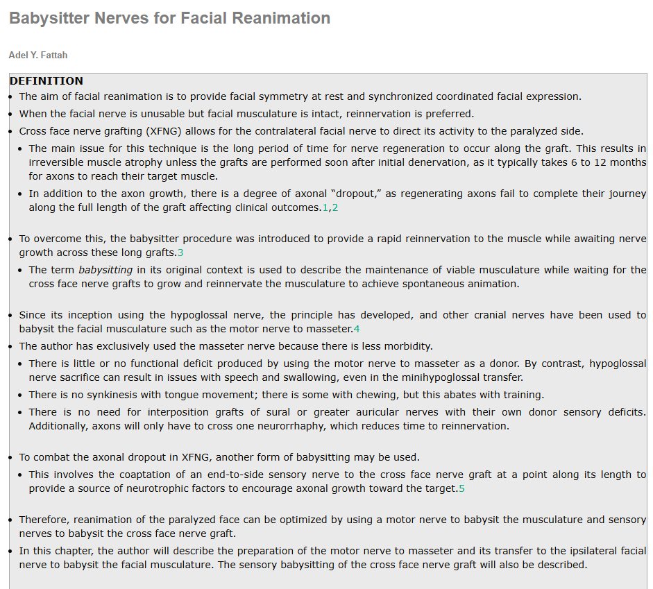
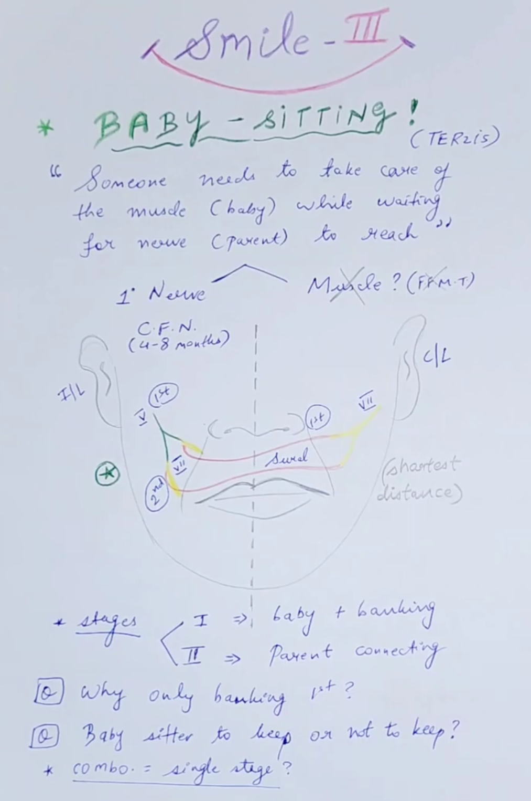

## 60v potilas löytynyt ulkoa. Ruumiinlämpö 36°C. Ranteen puoliväliin asti paleltumaoireita, tyyliin tunto ja motoriikka alentunut, sormet vaaleat. Mikä hoito aloitetaan?

- a. iloprosti
- b. liuotus ja jotain 
- c. kolme muuta vaihtoehtoa

  <button class="solution-button" data-label="Vastaus" data-hide-label="Piilota vastaus">
    Vastaus
  </button>
  

     a tai b 

Riippu vähän miten tilanne arvioidaan tai se on kuvattu kysymyksessä (ehkä unohdettu jotain tärppiä kirjoitettaessa). Potilaalla on todennäköisesti jotain vuototaipumusta (ehkä alkoholisti, kallonsisäinen vamma hyvin mahdollinen yms.), jolloin iloprosti on liuotusta parempi. 

Paleltumien hoidosta: 

Hypotermia korjataan ennen paikallisten paleltumavammojen hoitoa. Hypotermisen potilaan perifeeristen ruumiinosien liikuttelua on vältettävä, sillä kylmä veri voi sydämeen päästessään aiheuttaa rytmihäiriöitä.

Paleltuman paras hoito on nopea sulatus 40–42 °C vedessä 15–30 min:n ajan tai kunnes paleltuneelle alueelle ilmaantuu verenkiertoa. Kipulääkityksenä ibuprofeeni 600mg x3 ja sulatuksen jälkeen voimakkaan kivun hoidon tarve todennäköistä (vahvat opioidit). Lämmityksen jälkeenkin jatkuva tunnottomuus, veriset rakkulat ja dopplersignaalin puuttuminen viittaavat vaikeaan paleltumavammaan ja vaatii sairaalahoitoa (2.–4. asteen paleltumavammat kuuluvat sairaalahoitoon). Sulattamisen jälkeen rakkuloiden poisto on tärkeää.

Alkuvaiheen hoitoon kuuluvat myös ASA 100 mg × 1 ja enoksapariini 40 mg × 1 noin kuukauden ajan. 

Välitön angiografia on indisoitu, jos paleltumavamma on vaikea ja sen syntymisestä on kulunut alle 48 t (mieluummin alle 24 t) eikä tutkimukselle ole vasta-aiheita. Jos angiografiassa todetaan selvä tukos, on annettava valtimonsisäistä alteplaasi-liuotushoitoa (actilyse), jonka on osoitettu vähentävän amputaatioriskiä. Jos liuotushoito on vasta-aiheinen tai ei todeta liuotuskohteita, on vasodilataattori-infuusio (iloprosti 6h/vrk 3vrk ajan) hyvä vaihtoehto. Molemmat tarvitsevat valvonta/tehohoito tasoista hoitoa sairaalassa. 

Nekroosin annetaan demarkoitua muutaman viikon-kuukauden ajan ennen operatiivista hoitoa (Paleltuma jouluna — amputaatio juhannuksena” — oikeasti 1-2k). Kostea kuolio on kuitenkin revidoitava tulehdusvaaran takia. 

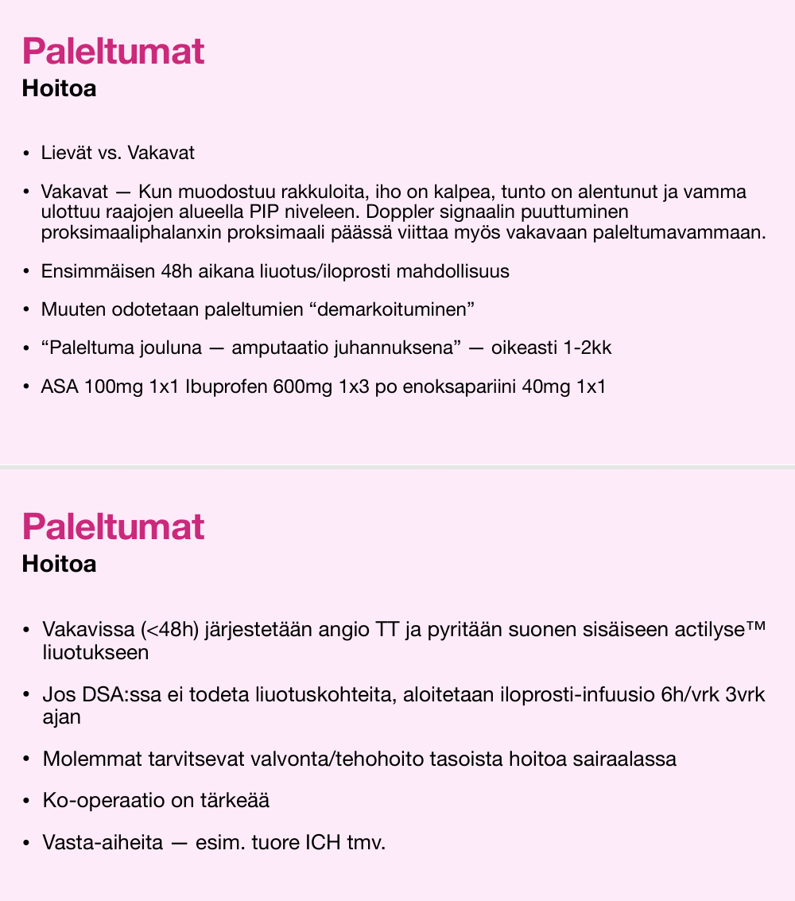
  

## Taustalla diabetes, nyt punoittava ja turvonnut jalka. Tulehdusarvot matalat. Mistä kyse? 

Ei vaihtoehtoja, koita vastata ilman vinkkejä

  <button class="solution-button" data-label="Vastaus" data-hide-label="Piilota vastaus">
    Vastaus
  </button>
  

     Charcot 

Punoittavaa, kuumoittavaa ja turvonnutta jalkaa on diabetesta sairastavalla pidettävä Charcot’n jalkana, kunnes toisin osoitetaan. 

Charcot'n jalka eli neuro-osteoartropatia (neuropaattinen osteoartropatia) syntyy diabeettisen neuropatian seurauksena. Akuutti Charcot muistuttaa septistä niveltulehdusta tai ruusua, ja prosessi johtaa nivelten tuhoutumiseen, jalkaholvin romahtamiseen ja epämuodostumiin. Charcot'n jalan perimmäiset syntymekanismit ovat toistaiseksi epäselvät. Luuta hajottavien solujen, osteoklastien, lisääntynyt aktiviteetti johtaa vähitellen luiden ja nivelten paikalliseen luhistumiseen. Laukaiseva tekijä voi olla nilkan nyrjähdys, haava, leikkaus tai infektio, jonka aiheuttama poikkeuksellisen voimakas tulehdusvaste saa aikaan luun ja nivelten tuhoutumisen. 

CRP ja lasko ovat normaalit, AFOS voi olla suurentunut. 

Huolimatta runsaasta niveltuhosta oireet ovat usein neuropatian vuoksi vähäisiä. 

Röntgenmuutokset näkyvät myöhäisvaiheessa. Tyypillinen on TMT-nivelten tuhoutumisesta johtuva keinutuolijalka. Diagnoosi varmistetaan tarvittaessa magneettikuvauksella. 

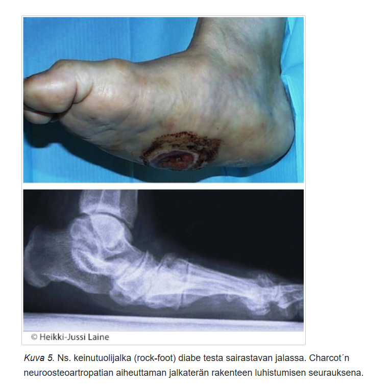
  

## Komplisoitumaton Charcot, ensilinjan hoito

Ei vaihtoehtoja, koita vastata ilman vinkkejä 

  <button class="solution-button" data-label="Vastaus" data-hide-label="Piilota vastaus">
    Vastaus
  </button>
  

     Immobilisaatio 3-9kk

Hoitona potilaan jalka immobilisoidaan joko kipsillä tai ortoosilla ja kyynärsauvojen avulla; alkuvaiheessa jalkaan kohdistuvan kuormituksen täydellinen poistaminen on ensiarvoisen tärkeää. 
  

## Potilas kaatunut joku aika sitten. Sen yhteydessä loukannut reittä ja huomannut siinä tyyliin 3cm mobiilin, alustaansa kiinnittymättömän patin. Mitä teet tk:ssa?

- a. Poistan itse
- b. Plastiikkakirurgin konsultaation 
- c. Kiireellinen lähete
- d. Poistan, mikäli haittaa potilasta

  <button class="solution-button" data-label="Vastaus" data-hide-label="Piilota vastaus">
    Vastaus
  </button>
  

     d

Ei maligneja piirteitä, sopii lipoomaan. Voidaan poistaa terveyskeskuksessa, jos potilas niin toivoo. 

  

## Ihomuutos poistettu, paljastunut melanoomaksi, Breslow 1.2. PAD:ssa ei riittävät marginaalit. Erikoissairaanhoidossa

- a. Re-ekskisio
- b. Re-ekskisio ja vartijaimusolmuketutkimus
- c. Sytostaatit
- d-e. jotain 

  <button class="solution-button" data-label="Vastaus" data-hide-label="Piilota vastaus">
    Vastaus
  </button>
  

     b

Jos patologi vastaa kyseessä olevan melanooma, potilas ohjataan kirurgiseen jatkohoitoon ja varmistetaan, että hoito toteutuu ilman viivytystä. Suurelle osalle primaarimelanoomapotilaista tehdään arpialueen resektio (poiston laajuus riippuu tuumorin sijainnista ja melanooman paksuudesta (Breslowin luokitus)) sekä vartijasolmuketutkimus. Muita rutiinimaisia kuvantamis- tai laboratoriotutkimuksia ei tehdä leikkausvaiheessa eikä myöhemmin seurannan aikana.

Hyvin pinnalliset melanoomat (Breslow ≤ 2 mm) poistetaan 1 cm:n terveen kudoksen marginaalilla. Syvemmissä melanoomissa poistetun melanooma-alueen arpi tai biopsoitu melanooma poistetaan 2 cm:n marginaalein ja ihonalainen rasva faskiatasolle saakka.

a: Melanooman vartijaimusolmuketutkimus tehdään, kun Breslow'n mitta on vähintään 1mm (tai 0.8-1mm, jos muita aktiivisuuden merkkejä esim. ulseraatiota tai mitooseja tai potilas on keskimääräistä nuorempi (<40-50v))

c: Ei vielä viitteitä leviämisestä. Jos melanooma on paikallisesti niin levinnyt, että arvioidaan, ettei sen poisto ole kirurgisesti mahdollinen, niin voidaan aloittaa lääkitys esim immuno-onkologisella lääkkeellä tai BRAF-mutatoituneessa melanoomassa BRAF/MEK estäjillä pienentämään melanoomaa leikkauskelpoiseksi. Tällöin puhutaan neoadjuvanttihoidosta. Yksittäisiä distaalisia etäpesäkkeitäkin voidaan tapauskohtaisesti hoitaa kirurgisesti (samoin jos melanooma on levinnyt vain paikallisiin imusolmukkeisiin)

  

## Mihin Suomessa on keskitetty laajojen palovammojen hoito?

Ei vaihtoehtoja, mutta koita vastata ilman vinkkejä 

  <button class="solution-button" data-label="Vastaus" data-hide-label="Piilota vastaus">
    Vastaus
  </button>
  

     HUS (Jorvi)

Laajojen palovammojen hoito on keskitetty Suomessa HUSin palovammakeskukseen

Jokaisessa laajan päivystyksen sairaalassa tulee kuitenkin olla valmius vaikeastikin loukkaantuneen palovammapotilaan hoitamiseen ensimmäisen 24–72 tunnin ajan vamman sattumisesta
  

## Potilaalla oikean rinnan ylälateraalipuolella joku pieni möykkynen, mitäs seuraavaksi kuuluu tehdä?

Ei vaihtoehtoja, koita vastata ilman vinkkejä 

  <button class="solution-button" data-label="Vastaus" data-hide-label="Piilota vastaus">
    Vastaus
  </button>
  

     MGR+PNB

Rintasyövän kolmoisdiagnostiikka: kliininen tutkimus, mammografia (ja UÄ jatkotutkimuksena tai raskaana oleville/nuorille ensisijaisena) ja biopsia (ensisijaisesti paksuneulabiopsia). Jos yksikin diagnostiikan osa viittaa pahanlaatuisuuteen, rinnan muutosta ei saa jäädä seuraamaan, vaan se tulee poistaa. 
  

## Potilaalla dm2 ja vitusti kaikkea muuta, oiskohan ollut että nyt pari kk ollut haava jalkapohjassa tai varpaassa tai jossain, abi korkea, mikä pitää paikkansa?

Vastaukseksi arveltu: "Mediaskleroosi nostaa ABI arvoja, tarve varvaspainemittaukselle", joka on oikein. 

Mediaskleroosi (Mönckebergin skleroosi, MAC) on vanhemmilla ihmisillä yleinen arterioskleroosin muoto, jolle on tyypillistä verisuonen seinämän median kalsifikaatio. 

- Viime vuosina MAC:n rooli ASO-taudin (alaraajojen ahtauttava valtimotauti) taustalla on kuitenkin noussut esiin; ennen ajateltiin olevan käytännössä kliinisesti merkityksetön löydös, joka vain häiritsee ABI-mittausta (skleroosi estää normaalin puristumisen mittauksen aikana -> virheellisen korkeat ABI-arvot) ja saattoi tulla esille mammografioissa kuvantaessa
  - Häiritsee hemodynamiikkaa jäykistämällä suonen seinämää -> pulssipaine kasvaa ja lisää afterloadia -> vasemman kammion kuormitus lisääntyy. Häiritsee myös vasodilataatiokykyä ja myös altistaa trombooseille. Pitkälle edetessään voi myös ahtauttaa suonen luumenia yksinään/ voimistaa ateroskleroosin ahtauttavaa muutosta (inward remodelling) 

Tärkeimmät mediaskleroosin riskitekijät ovat ikääntyminen, diabetes ja munuaisten vajaatoiminta. 

Mediaskleroosin takia diabeetikoiden ABI-mittauksiin ei voi luottaa liikaa ja tarvittaessa tulee mitata varvaspaineet (mediaskleroosi ei affisioi pieniä varpaiden suonia oikein). 

- Lähteestä vaihdellen ABI >1.3-1.4 viittaa mediaskleroosiin (ehkä useimmiten ajatellaan >1.4) 
- Varvaspainemittauksessa kriittisen alaraajaiskemian (CLI) diagnoosin raja-arvo on 30 mmHg. Joissain lähteissä raja-arvo diabeetikoilla ja haavapotilailla on 50 mmHg. Varvaspaineet ilmoitetaan absoluuttisina arvoina eikä suhteena olkapaineisiin. 

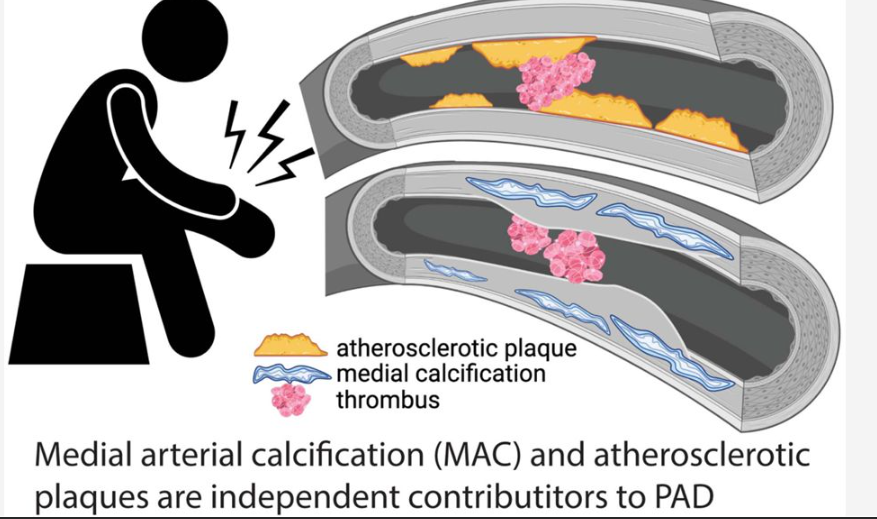

## Laskimovajaatoiminnan C-luokitus

Ei vaihtoehtoja, tässä laskimovajaatoiminnan luokittelusta: 

Laskimovajaatoiminnan vaikeusaste voidaan kuvata tarkasti CEAP-luokitusta (CEAP = kliinis-etiologis-anatomis-patofysiologinen luokitus) käyttäen. Yleensä kuitenkin vain turvaudutaan C-osioon eli kliiniseen luokitukseen:

- C1-C3 komplisoitumaton (ei ihomuutoksia)
- C4-C6 komplisoitunut (ihomuutoksia)

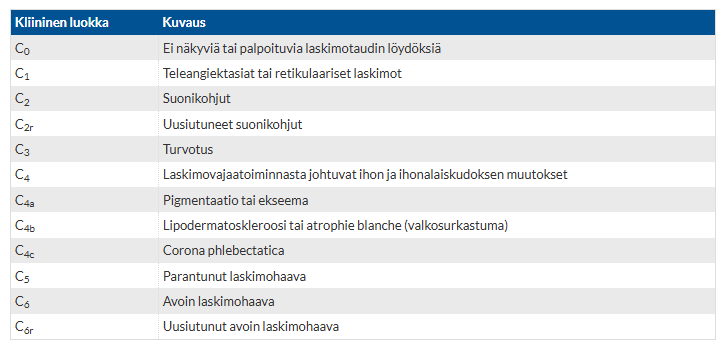
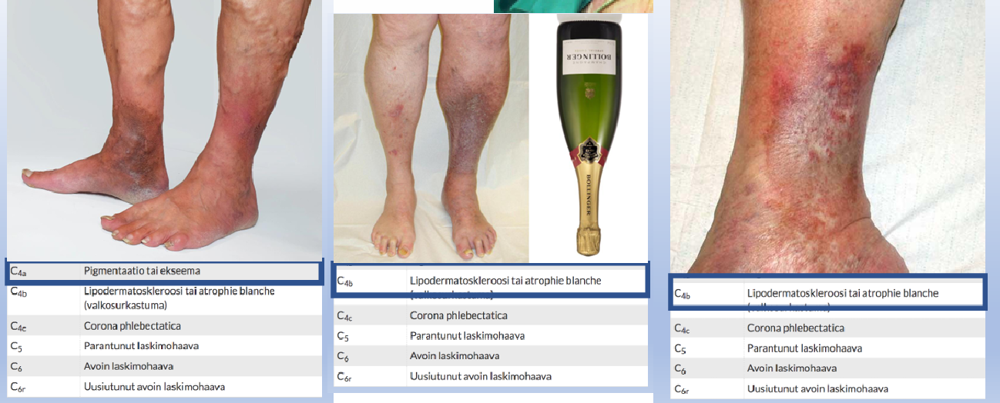

## Potilastapaus 

27v ollut Turkissa kauneusleikkauksissa. Tehty 450cc rintaimplantit, abdominoplastia ja rasvansiirto takamukseen. Nyt potilas huonovointinen ja kuumeinen, epäilyksenä bakteerisepsis. Rinnan palpoiden aristamattomat, ei kuumotusta ja yhtä isot. Vatsan leikkausarvessa aukile, mutta muuten siisti vatsan alueen status. Oikea pakara isompi kuin vasen, on myös kova ja aristava. Leuk 23, CRP 200. Mikä on infektiofokus? 

- a. Pakara 
- b. Rinnat
- c. Vatsa
- d. Virtsatieinfektio

  <button class="solution-button" data-label="Vastaus" data-hide-label="Piilota vastaus">
    Vastaus
  </button>
  

     a

Todennäköisesti kyseessä on postoperatiivinen infektio gluteusalueella, koska muut leikkausalueet ovat siistit. 
  

## Dermatofibrooma

Olet poistanut potilaalta ihomuutoksen 5mm marginaalein ja PAD-lausunnossa marginaalit siistit 1mm. Lausunnon mukaan kyseessä oli dermatofibrooma. Mikä on oikein muutoksen suhteen? 

- a. Muutos tarvitsee seurantaa
- b. Kyseessä on syövän esiaste 
- c. Muutos on hyvänlaatuinen
- d. Tarvitaan re-ekskisio 

  <button class="solution-button" data-label="Vastaus" data-hide-label="Piilota vastaus">
    Vastaus
  </button>
  

     c

Dermatofibrooma eli histiosytooma on hyvin yleinen hyvänlaatuinen ihokasvain, jossa dermiksen fibroblastit eli sidekudossolut proliferoituvat yleisimmin ihotrauman tai hyönteisen piston jälkeisenä reaktiona.

Dermatofibroomia nähdään useimmin raajojen ääreisosissa, reisissä ja selässä 3–10 mm:n kokoisina muutoksina. Dermatofibrooma voi olla ihon värinen, vaaleanpunainen, ruskea tai jopa sinertävä. Usein sen reunoilla on tummempi pigmentti ja se kuoppautuu puristettaessa (pinch-oire)- Dermatofibrooma tuntuu arpimaisen kiinteältä tai jopa kovalta. Muutos voi olla ihontasoinen tai nousta koholle ihon pinnan tasosta.

Tumma dermatofibrooma voi muistuttaa melanoomaa. Jos diagnoosista ei ulkonäön ja tunnustelun perusteella voi olla varma, muutos on parasta poistaa histologista tutkimusta varten. Hoito (ekskisio tai jäädytys) ei kuitenkaan ole tarpeen lääketieteellisistä syistä, koska kyseessä on hyvänlaatuinen muutos. 

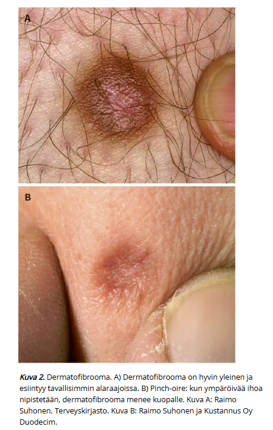
  

## Potilastapaus 

23-vuotias lääketieteenopiskelija tulee vastaanotolle ja toteat hänellä tulehtuneen ja kivuliaan paiseen pakaravaossa. Potilaalla on karvainen takamus ja hän istuu suuren osan päivästään. Mitä teet ensisijaisesti?

- a. lähete kirurgialle 
- b. punktoit tyhjäksi
- c. inkiisio ja tyhjennys 
- d. seuranta 
- e. suosittelen karvojen poistoa

  <button class="solution-button" data-label="Vastaus" data-hide-label="Piilota vastaus">
    Vastaus
  </button>
  

     c

Kyseessä on pakaravaon absessi, joka voi kehittyä sinus pilonidalikseksi, joka on hankittu sairaus, jossa ihokarvat, hilse tai vaatteiden nöyhtä aiheuttavat ihonalaisen onkalon pakaravakoon. Sille tärkein altistava tekijä on syvä ja karvainen pakaravako. Tämän vuoksi se on miehillä noin neljä kertaa yleisempi kuin naisilla.

Arviolta noin 60 % potilaista paranee absessin hoidon jälkeen, mutta 40 %:lle kehittyy sinus pilonidalis.

Pelkän pakaravaon absessin ensisijainen hoito on absessin avaaminen ja tyhjennys. Absessi avataan kunnolla, märkä poistetaan ja samalla olisi poistettava karvat ja débris, jota absessiontelossa on. Jos karvat jätetään märkäonteloon, on sinus pilonidaliksen kehittyminen todennäköistä. 

Jälkihoitona ovat suihkutus ja pakaravaon karvojen ajelu sekä siteen vaihdot. 

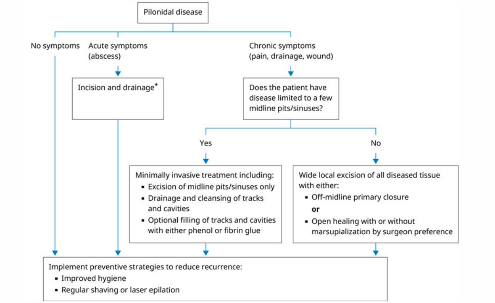
  

## Potilastapaus 

Potilaalla DM2, spinaalistenoosi, ASO-tauti. Kokee alaraajoissa yöllistä leposärkyä, puutumista ja kihelmöintiä. ADP +, ATP +. Mistä oireet johtuvat? 

- a. Spinaalistenoosi
- b. Perifeerinen neuropatia 
- c. Kriittinen iskemia 

  <button class="solution-button" data-label="Vastaus" data-hide-label="Piilota vastaus">
    Vastaus
  </button>
  

     b

Yöllinen kihelmöinti ja puutuminen ovat tyypillisiä diabeettiselle neuropatialle. 

a: Spinaalistenoosin kipu ja oireet ei tyypillisesti ole pahimpia yöllä maatessa, vaan enemmänkin kävellessä/seistessä/ekstensiossa ja oireita helpottaa etunoja-asento. 

c: Jalkapulssit tuntuvat, joten merkittävä ASO-tauti on poissuljettu.
  

## Potilaalla C6-laskimovajaatoiminta. Mitä tämä tarkoittaa? 

- a. Potilaalla komplisoitumaton laskimovajaatoiminta
- b. Potilaalla turvotusta alaraajoissa
- c. Potilalla avoin laskimoperäinen säärihaava 

  <button class="solution-button" data-label="Vastaus" data-hide-label="Piilota vastaus">
    Vastaus
  </button>
  

     c

a: C1-C3 = komplisoitumaton 

b: Turvotus = C3

  

## Mikä on oikein oireettomasta bakteriuriasta? 

- a. Esiintyy kaikilla kestokatetrisilla
- b. Ei tarvitse hoitaa
- c. Hyvin yleistä hoitokodeissa
- d. Kaikki oikein

  <button class="solution-button" data-label="Vastaus" data-hide-label="Piilota vastaus">
    Vastaus
  </button>
  

     d

a: Pitkäaikasesti katetroiduilla lähes kaikilta löytyy bakteereita virtsasta. 

b: Oireettoman bakteriurian hoito turhaan ilmeisesti lisää oireisten virtsatieinfektioiden ilmaantuvuutta. Oireetonta bakteriuriaa on syytä etsiä ja hoitaa vain raskaana olevilta naisilta. 

c: Ympärivuorokautisessa hoidossa olevalta vanhukselta otetaan virtsaviljely käytännössä vain silloin, kun kliinisen tilanteen perusteella on jo tehty päätös hoitaa VTI:tä. Oireettoman bakteriurian yleisyyden takia virtsaviljely ei antaisi tarvittavaa tietoa, jos ei olisi selkeitä oireita. 
  

## Mikä ei aiheuta vanhalle miehelle virtsaumpea? 

- a. Rankka urheilusuoritus
- b. Sympatomimeettiset (nuha) lääkkeet
- c. Anestesia
- d. Virtsatietulehdus

  <button class="solution-button" data-label="Vastaus" data-hide-label="Piilota vastaus">
    Vastaus
  </button>
  

     a

b: Nuhalääkkeinä käytettävät oraaliset dekongestatin (esim. pseudoefedriini) voivat aiheuttaa sympatomimeettisen vaikutuksensa kautta virtsaumpea. 

c: Leikkauksen jälkeen virtsaumpi on melko tavallinen ilmiö. Sitä on todettu eri tutkimuksissa yleiskirurgiassa 4–24 %:lla potilaista. Ummen syynä on anestesia-aineiden suora vaikutus sekä keskushermostoon että perifeerisiin ganglioihin ja leikkauskivun aiheuttama suora reflektorinen esto. Spinaalipuudutus, nukutusaineet sekä leikkauksen jälkeisen kivun hoidossa käytettävät lääkkeet sekä lamaavat virtsausheijastetta että häiritsevät rakon täyttymisen aistimista. 

d: Infektion aiheuttama turvotus voi aiheuttaa tukoksen tai heikentää rakon lihaksia. 
  

## Kivessyövän levinneisyyskuvantaminen? 

- a. Vartalon MRI
- b. Vartalon TT 
- c. Vatsan ja keuhkojen natiivirtg
- d. PET-TT

  <button class="solution-button" data-label="Vastaus" data-hide-label="Piilota vastaus">
    Vastaus
  </button>
  

     b

Ensisijainen kivessyövän kuvantamistutkimus on kivespussin kaikukuvaus. Jos syöpä todetaan, niin TT tehdään levinneisyystutkimuksena kaikille potilaille, koska sen herkkyys etäpesäkkeiden osoittamisessa on hyvä.
  

## Mikä ei ole kroonisen nonbakteriellin prostatiitin tyypillinen oire? 

- a. Kiveskipu
- b. Peniskipu
- c. Tihentynyt virtsaamistarve
- d. Pyuria

  <button class="solution-button" data-label="Vastaus" data-hide-label="Piilota vastaus">
    Vastaus
  </button>
  

     d

Tyypillistä on juuri sukuelinten kivut ja tihentynyt virtsaamistarve ja kirvely virtsatessa. Pyurian (valkosoluja virtsassa) perusteella krooninen nonbakterielli prostatiitti (CPPS, tyypin 3 prostatiitti) voidaan jakaa kahteen alatyyppiin: 

Tyyppi 3a = Tulehduksellisessa alatyypissä potilailla on valkosoluja eturauhasen eritteessä, virtsassa tai siemennesteessä

Tyyppi 3b =  Ei-tulehduksellisessa tyypissä tulehdussoluja ei todeta 

Tyypillisesti, kun CPPS:ssä otetaan virtsanäyte, niin se on steriili ja valkosoluja ei todeta. Sen jälkeen voidaan hieroa eturauhasta ja tutkia virtsa uudestaan (PPMT, pre and post massage test). Hierominen usein aiheuttaa pyurian ja tämän perusteella CPPS voidaan jakaa toiseen luokkaan.

Pyuria ei siis tyypillisesti ole todettavissa ilman eturauhasen hieromista, jonka takia vastaus on pyuria. Pyuria ei sinänsä myöskään ole oire, vaan löydös. 
  

## Uroteelisyövän keskeisin kuvantamismenetelmä? 

- a. Kontrastiton TT
- b. MRI 
- c. Kolmivaihe-TT
- d. UÄ

  <button class="solution-button" data-label="Vastaus" data-hide-label="Piilota vastaus">
    Vastaus
  </button>
  

     c

Uroteelisyövän ensisijainen ja tärkein kuvantamismenetelmä on virtsaelinten kolmivaiheinen varjoainetehosteinen tietokonetomografia, eli CT-urografia. Rakkosyövän suhteen virtsarakon tähystys eli kystoskopia on tärkein tutkimus, mutta ylävirtsateiden kuvantaminen kaikututkimuksella tai yleisemmin TT-urografialla tehdään kaikille potilaille

a: Kontrastiton TT akuuttien virtsatiekivien tutkimisessa¨

d: UÄ kyllä usein tehdään, mutta TT on tärkeämpi.
  

## Potilastapaus 

Potilaalla alkaa olemaan näköongelmia, koska luomi laskee silmän päälle. Ei yläluomen ihoylimäärää, kulmakarva supraorbital ridgen ylärajan päällä. MDR1-mitta levossa 1mm, maksimaalisessa luomen kohotuksessa otsa neutraloituna 5mm. Mikä korjaus potilaalle? 

- a. Levatorlihaksen lyhennys 
- b. Blefaroplastia 
- c. lateral kantopeksia
- d. otsan kohotus
- e. kulmakarvan kohotus 

  <button class="solution-button" data-label="Vastaus" data-hide-label="Piilota vastaus">
    Vastaus
  </button>
  

     a

Tässä kuvataan ptoosia eli riippuluomea. Jos se on ns. seniili (vuosien aikana kehittynyt levatorin venymisestä johtuva), niin sen hoito on leikkaus. Yksi leikkausvaihtoehto on levatorin lyhennys eli resektio, jossa riippuva yläsilmäluomi korjataan lyhentämällä sen levator-lihasta.

b: Lippaluomen korjaus. Potilaalla ei yläluomen ihoylimäärää, joka viittaisii lippaluomeen.

c: Yksi ektropiumin mahdollisista korjausleikkauksista.

d: Kulmakarvat ovat ainakin miehillä normaalisti supraorbital rimin ylärajalla, naisilla ehkä normaalisti hieman korkeammalla. Jos kulmakarvan roikkuminen aiheuttaisi ptoosin, olisi tila ns. "brow ptosis" ja sen hoitona voi olla avoin kulmakarvan kohotus, sisäinen browpeksia tai otsan kohotus. 

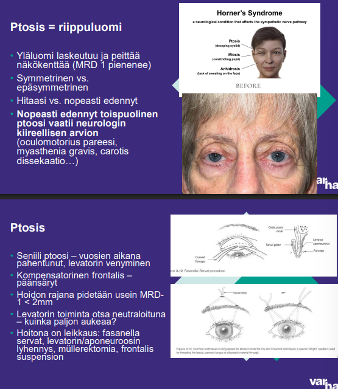
  

## Potilastapaus 

Koira purrut potilasta aikaisemmin tänään kasvoihin, nyt potilas tullut päivystykseen. Otsan rypistys onnistuu, silmien sulkeminen/avaaminen normaalia. Oikea alahuuli roikkuu, huulien puristaminen pussausasentoon vaikeaa, mutta muuten alakasvojen motoriikka normaalia. Mikä on terävän hermovaurion ensisijainen korjaus? 

- a. Cross-facial nerve graft 
- b. Vaurioituneen hermon eksploraatio ja korjaus 
- c. Joku staattinen korjaus 
- d. Kasvolihasten kuntoutus ja leikkaus mahdollisesti myöhemmin

  <button class="solution-button" data-label="Vastaus" data-hide-label="Piilota vastaus">
    Vastaus
  </button>
  

     b

Kasvohermon alemmat haarat, kuten marginal mandibular voi olla vaurioitunut ja aiheuttaa suupielen roikkumista.  Terävä vamma – katkeaminen, trauma, iatrogeeninen -> välitön korjaus (1-7pv) tai babysitter (joko cross-nerve graft, hypoglossus tai masseter). 

a: Suora korjaus on ensisijainen, jos se on mahdollinen. Babysitter ja cross-facial nerve graftit parempia jos vamma tapahtui hetki sitten ja/tai suora korjaus ei ole mahdollista. 

c: Staattiset korjauksen korjaavat kasvojen asentoa ja lievittävät halvauksen haittoja, mutta ne eivät korjaa hermovauriota. 

d: Tylpässä vammassa usein alkuvaiheessa seuranta, mutta välitöntä korjausta harkitaan tässäkin tilanteessa (konsultoi herkästi)
  

## Potilastapaus 

Potilaalla 5v sitten aivoinfarkti, jonka seurauksena tullut oikean puolen facialispareesi ja juominen ei ole onnistu, koska oikea puoli roikkuu. Mikä korjaus aiheellinen? 

- a. Babysitter
- b. Oikean suupielen staattinen nosto 
- c. Ylähuulen kultapaino
- d. Botuliinitoksiini-injektio

  <button class="solution-button" data-label="Vastaus" data-hide-label="Piilota vastaus">
    Vastaus
  </button>
  

     b

Tässä vaiheessa 5v vaurion jälkeen hermo-lihasyhteys on menetetty pysyvästi (reinnervaatiota ei enää tapahdu). 

a: Dynaamiset ratkaisut kuten "babysitter“ (masseteric–facial anastomoosi) eivät enää toimi, koska menetettyjen lihasten motoriset yksiköt ovat surkastuneet

c: Gold plate on tarkoitettu ylemmän silmäluomen sulkupuutteeseen, ei suupielen roikkumiseen.

d: Botuliinitoksiini voi tasapainottaa virheasentoa vastakkaisella puolella, mutta se ei korjaa roikkuvaa puolta eikä juomisen ongelmaa.
  

